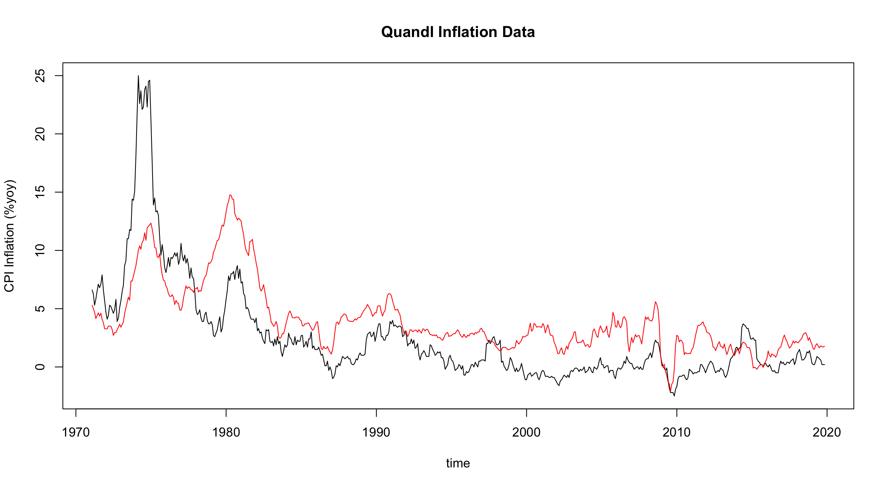

<h2>Assignment Introduction</h2>

In the final project, you'll be asked to use some external packages to create an R processing pipeline that gets data, cleans it, analyzes it, and present results. In this assignment, we're going to work with some of those packages to get familiar with them.

For the remainder of this assignment, I'll refer to [**the package list**](./final_project_packages.md).

<h2>Part 1: Reading Package Docs</h2>

<h3>Description</h3>

As we learned in the first week of class, you can access R function documentation using syntax like `?function`. This documentation typically contains a description of the function's purpose, a list of parameters, and the function signature. In addition, many package authors include examples, small blocks of code using the package's functionality that you can copy, paste, and run directly.

In this part of the assignment, I'd like you to practice reading and running these examples. Please copy one example of each of the following functions from its documentation. I encourage you to try running these yourself, but you do not need to include the output in your submission.

- `ymd_hms()` from the `{lubridate}` package
- `str_extract()` from the `{stringr}` package
- `setnames()` from the `{data.table}` package
- `map_dbl()` from the `{purrr}` package
- Two functions from the "Data Retrieval and Transformation" section of **the package list**
    - NOTE: must be from two different packages
- Two functions from the "Math and Statistics" section of **the package list**
    - NOTE: must be from two different packages
- Two functions from the "Visualization, Presentation, and Reporting" section of **the package list**
    - NOTE: must be from two different packages

<h3>Submission</h3>

Upload a file to the **Programming Assignment 2** dropbox on D2L with a name like *firstname_lastname_assignment2pt1.R*. This file should contain 10 sections, one for each of the functions above. Please copy one example per function into your script, and use the format given in the example below:

```{r echo = TRUE, eval = FALSE}
#==============================================================================#
# package: data.table
# function: setnames

# Example:
DT <- data.table(a=1:2,b=3:4,c=5:6) # compare to data.table
try(tracemem(DT))                  # by reference, no deep or shallow copies
setnames(DT,"b","B")               # by name, no match() needed (warning if "b" is missing)
#==============================================================================#
#==============================================================================#
# package: stats
# function: cor

# Example:
cor(1:10, 2:11) # == 1
#==============================================================================#
```

<h2>Part 2: Getting and Cleaning Data</h2>

<h3>Description</h3>

As you wade further into the world of data science, you'll hear this said often: [most of a data scientist's time is spent getting and cleaning data](http://blog.revolutionanalytics.com/2014/08/data-cleaning-is-a-critical-part-of-the-data-science-process.html). Let's practice that crucial activity.

In the second half of this assignment, we'll be working with data from the St. Louis Federal Reserve ([FRED](https://fred.stlouisfed.org/)).

Using the resources I've provided below, your goal is to download two series: Japanese inflation (YOY percent change) and U.S. inflation (YOY percent change).

Then you'll join them into a single `data.frame` and plot them against each other on a line plot using R's base plotting system.

- Brief R + `{quantmod}` + FRED tutorial: https://www.quantmod.com/documentation/getSymbols.FRED.html
- Tutorial on creating line plots in R's base plotting system: http://www.harding.edu/fmccown/r/

<h3>Submission</h3>

Upload a file to the **Programming Assignment 2** dropbox on D2L with a name like *firstname_lastname_assignment2pt2.R*. In the example script below, I've filled in the pieces needed to pull the U.S. data. Your task is to fill out the rest of this script so that it produces a plot comparing Japan and the U.S.

You need to complete all of the following steps, indicated by the phrase `### FILL THIS IN ###` in the example script below:

- Add the command to pull the Japanese inflation data (https://fred.stlouisfed.org/series/FPCPITOTLZGJPN)
- Rename the columns of the Japanese data so that the inflation series is called "JPN_INF_YOY"
- Add the Japanese data to the `merge()` command to create a single dataset for plotting
    - please look at the documentation for `?merge`
- set the plot type to line (hint: see `?graphics::plot`)
- set the plot title to "Inflation Data"
- set the plot y-axis label to "CPI Inflation (%yoy)"
- set the plot x-axis label to "time"
- add the U.S. data to the plot with `lines(type = "l")`
    - use the `col` argument within `lines()` to set the color of this line to "red"

```{r quandlData, eval = FALSE, echo = TRUE, message = FALSE, warning=FALSE}
# Load dependencies
library(quantmod)

# Get Data
usaDF <- as.data.frame(
    quantmod::getSymbols(
        Symbols = "FPCPITOTLZGUSA"
        , src = "FRED"
        , auto.assign = FALSE
    )
)
usaDF["Date"] <- as.Date(row.names(usaDF))

jpnDF <- as.data.frame(
    quantmod::getSymbols(
    ### FILL THIS IN ###
    )
)
jpnDF["Date"] <- as.Date(row.names(jpnDF))

# rename columns
names(usaDF) <- c("USA_INF_YOY", "Date")
names(jpnDF) <- ### FILL THIS IN ###

# Combine the two data.frames with merge()
mergedDF <- merge(
    x = usaDF,
    y = ### FILL THIS IN ###,
    by = "Date"
)

# Plot the two series
plot(
    x = mergedDF$Date,
    y = mergedDF$JPN_INF_YOY,
    type = ### FILL THIS IN ###,
    main = ### FILL THIS IN ###,
    xlab = ### FILL THIS IN ###,
    ylab = ### FILL THIS IN ###
)

lines(
    x = ### FILL THIS IN ###,
    y = ### FILL THIS IN ###,
    type = "l",
    col = ### FILL THIS IN ###
)

legend(
    x = "topright"
    , col = c("black", "red")
    , legend = c("JPN", "USA")
    , lty = c(1, 1)
)
```

If this works correctly, you should see a plot similar to this:

<center></center>

<h2>I Believe In You</h2>

<center></center>

<br><br><br>
