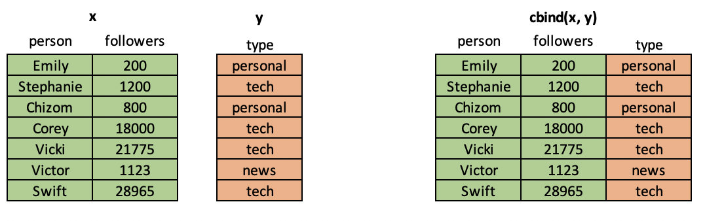
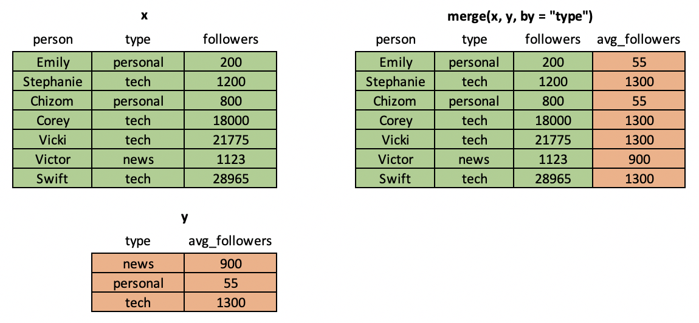
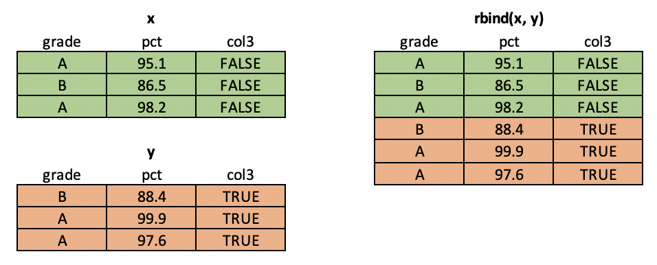
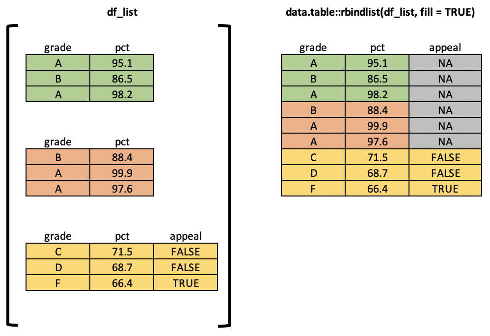
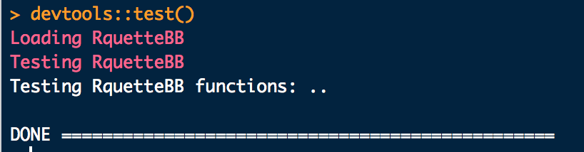

```{r setOpts, echo = FALSE}
knitr::opts_chunk$set(
  eval = TRUE
  , echo = TRUE
  , warning = FALSE
  , message = FALSE
)
```

This document contains code that is too long to display in the slides.

You should use this supplement to follow along and try executing the example code yourself.

# Variables and Namespaces

When you execute a statement like `x <- 5` in R, you are creating an **object** in memory which holds the numeric **value** 5 and is referenced by the **variable name** "x".

If you later ask R to do something like `y <- x + 2`, it will search sequentially through a series of **namespaces** until it finds a variable called "x". Namespaces can be thoguht of as collections of labels pointing to places in memory. You can use R's `search()` command to examine the ordered list of namespaces that R will search in for variables.

```{r namespaces}
# Check the search path of namespaces
search()

# use ls() to list the objects in one of those namespaces
ls("package:stats")
```

# Dollarstore Calculator Math

```{r simpleMath1}
# Addition with "+"
4 + 5

# Subtraction with "-"
100 - 99

# Multiplication with "*"
4 * 5

# Division with "/"
15 / 3

# Exponentiation with "^"
2^3

# Order of Operations
4 * 5 + 5 / 5

# Control with parentheses
4 * (5 + 5) / 5
```

# Data Structures

## Vectors

- Because R was designed for use with statistics, most of its operations are [vectorized](http://www.cs.cornell.edu/courses/cs1112/2016sp/Exams/exam2/vectorizedCode.pdf)
- You can create vectors a few ways:

```{r vectors_pt1}
# Ordered sequence of integers
1:5

# Counting by 2s
seq(from = 0, to = 14, by = 2)

# Replicate the same values
rep(TRUE, 6)

# Concatenate multiple values with the "c" operator
c("all", "of", "the", "lights")

# Watch out! Mixing types wil lead to silent coercion
c(1, TRUE, "hellos")

# Some functions, when applied over a vector, return a single value
is.numeric(rnorm(100))

# Others will return a vector of results
is.na(c(1, 5, 10, NA, 8))

# Vectors can be named
batting_avg <- c(
  youkilis = 0.300
  , ortiz = 0.355
  , nixon = 0.285
)
print(batting_avg)

# You can combine two vectors with c()
x <- c("a", "b", "c")
y <- c("1", "2", "3")
c(x, y)
```

## Lists

Vectors are the first multi-item data structure all R programmers learn. Soon, though, you may find yourself frustrated with the fact that they can only hold a single type. To handle casses where you want to package multiple types (and even multiple objects!) together, we will turn to a data structure called a `list`.

|Capabilities                        |Vectors |Lists   |
|:----------------------------------:|:------:|:------:|
|Optional use of named elements      |&#x2714;|&#x2714;|
|Support math operations like mean() |&#x2714;|        |
|Hold multiple types                 |        |&#x2714;|
|Hold multiple objects               |        |&#x2714;|


```{r lists_pt1}
# Create a list with list()
myList <- list(
  a = 1
  , b = rep(TRUE, 10)
  , x = c("shakezoola", "mic", "rulah")
)

# Examine it with str()
str(myList)
```

## Factors

Imagine that you want to build a model of the relationship between resource wealth and quality-of-life outcomes like life expectancy. You got out to the World Bank to grab some data, and the dataset you get includes a column called "region" with values like "Africa", "European Union", and "South America". How can you use this variable in a model or for generating region-by-region summary stats? This is where R's **factor type** comes in.

```{r factorVar1}
regions <- c("Africa", "European Union", "South America", "South America", "European Union")
region_fac <- as.factor(regions)

str(regions)
str(region_fac)
```

What does it mean for `region` to be a factor? Essentially, a factor is a categorical variable. R uses a cool trick to save memory when storing factors...internally, R will convert factor values to integers and then keep aroudn a single table the tells it, e.g., that 1 = "Africa", 2 = "European Union", etc..

```{r factorVar2}
# Check it out! R has assigned integer values to the "region_fac" variable
as.integer(region_fac)

# But you can also access the character values if you want
as.character(region_fac)

# For more, see:
str(region_fac)
levels(region_fac)
```

## Data Frames

Vectors and lists are crucial data structures in R, but you may find that they're difficult to work with in model training and other data science tasks. It is now time to introduce a third foundational data structure: the data frame.

Data frames are tables of data. Each column of a data frame can be a different type, but all values within a column must be the same type.

<center></center>

```{r dataFrame}
# Create a data frame!
myDF <- data.frame(
    time_period    = c(1, 2, 3, 4, 5)
    , temperature  = c(25.6, 38.7, 31.4, 40.0, 29.20)
    , station      = c("A", "B", "A", "A", "B")
    , is_gov_owned = c(TRUE, FALSE, TRUE, TRUE, FALSE)
)

# Check out the structure of this thing
str(myDF)
```

R comes with some sample data sets you can experiment with. Let's load the `mtcars` data.frame and test out some new commands!

```{r dateFrame2}
# Load the mtcars data frame
data("mtcars")

# Check out its structure
str(mtcars)

# View the top 10 rows
head(mtcars, n = 10)

# View the bottom 10 rows
tail(mtcars, n = 10)
```

# Logical Operators

Often in your code, you'll want to do/not do something or select / not select some data based on a logical condition (a statement that evaluates to TRUE or FALSE). Here are some examples of how to construct these statements in R.

```{r logicalCond1}
# "and" logic is expressed with "&"
TRUE & TRUE   # TRUE
TRUE & FALSE  # FALSE
FALSE & FALSE # FALSE
-5 < 5 & 3 > 2 # TRUE

# "or" logic is expressed with "|"
TRUE | TRUE    # TRUE
TRUE | FALSE   # TRUE
FALSE | FALSE  # FALSE
3 < 8 | 8 > 19 # TRUE
```

The most common operators used to generate logicals are `>`, `<`, `==`, and `!=`

```{r logicalCond2}
# "equality" logic is specified with "=="
3 == 3   # TRUE
4 == 4.1 # FALSE

# "not" logic is specified with !. In a special case, != signifies "not equal"
!TRUE            # FALSE
!FALSE           # TRUE
! (TRUE | FALSE) # FALSE
4 != 5           # TRUE

# "greater than" and "less than" logic are specified in the way you might expect
5 < 5  # FALSE
6 <= 6 # TRUE
4 > 2  # TRUE
3 >= 3 # TRUE
```

You can use vectors of logicals (TRUE and FALSE) to subset other objects. As a general rule, when you put a vector on the left-hand side of a logical condition like `==` or `>`, you will get back a vector as a result.

```{r logicalCond3}
vehicleSizes <- c(1, 5, 5, 2, 4)

# Create a logical index. Note that we get a VECTOR of logicals back
bigCarIndex <- vehicleSizes > 4

# Taking the SUM of a logical vector tells you the number of TRUEs.
sum(bigCarIndex)

# Taking the MEAN of a logical vector tells you the proportion of TRUEs
mean(bigCarIndex)
```

# Subsetting

## Subsetting Vectors

**Subsetting** is the act of retrieving a portion of an object, usually based on some logical condition (e.g. "all elements greater than 5"). In R, this is done with the `[` operator.

```{r subset_vecs}
myVec <- c(
    var1 = 10
    , var2 = 15
    , var3 = 20
    , av4 = 6
)

# "the first element"
myVec[1]

# "second to fourth element"
myVec[c(2, 3, 4)]

# "second to fourth elements"
myVec[2:4]

# "the element named var3"
myVec["var3"]

# "the elements named var1 and var3"
myVec[c("var1", "var3")]

# "third element, then the fourth one repeated twice"
myVec[c(3, 4, 4)]
```

## Subsetting Lists

Lists, arbitrary collections of (potentially heterogeneous) R objects, are subsetted a bit differently than vectors. If you use `[` with a list, you are guaranteed to get back another list. If you use `[[`, you will get back an object in its natural form (whatever it would look like if it wasn't in the list). You can also use `$` to access named elements.

```{r subsettingLists}
# Set up a sample list object
someList <- list(
    country = "DEU"
    , region  = "EU"
    , econ_stats = list(
        gdp_growth = 1.5
        , rm10y    = 2.75
        , DAXmonthly = c(1000, 1100, 1050, 1200, 1500)
    )
)

# Examine the list structure
str(someList)

# Grab the country name
country1 <- someList[["country"]]
country2 <- someList$country

class(country1)
class(country2)
identical(country1, country2)

# Grab the economic stats as a list within a list
germanyStats <- someList["econ_stats"]
class(germanyStats)

# Grab the numeric vector of stock prices
daxPrices <- someList$econ_stats$DAXmonthly
class(daxPrices)

# Another way to parse down the list for stock prices
someList[["econ_stats"]][["DAXmonthly"]]
```

## Subsetting Data Frames

Data frames are the workhorse data structure of statistics in R. The best way to learn data frame subsetting is to just walk through the examples below:

```{r subsetDF}
# Create a data frame
someDF <- data.frame(
    conference  = c("Big East", "Big Ten", "Big East", "ACC", "SEC")
    , school_name = c("Villanova", "Minnesota", "Marquette", "Duke", "LSU")
    , wins        = c(18, 14, 19, 24, 12)
    , ppg         = c(71.5, 45.8, 66.9, 83.4, 58.7)
)

# Grab the wins column (NOTE: will give you back a vector)
someDF[, "wins"]
someDF[["wins"]]

# Grab conference and wins columns
someDF[, c("conference", "wins")]

# Grab the first 3 rows and the two numeric columns
someDF[1:3, c("wins", "ppg")]
```

## Using Logical Vectors

So far, we've seen how to subset R objects using numeric indices and named elements. These are useful approaches, but both require you to know something about the contents of the obejct you're working with.

Using these methods (especially numeric indices like saying *give me columns 2-4*) can make your code confusing and hard for others to reason about. Wherever possible, I strongly recommend using logical vectors for subsetting. This makes your code intuitive and more flexible to change.

```{r logicalSubsetting}
# Some data frame
playerDF <- data.frame(
    playerName   = c("Rajon Rondo", "Paul Pierce", "Kevin Garnett", "Ray Allen", "Big Baby")
    , position   = c("PG", "SF", "PF", "SG", "C")
    , apg        = c(14.2, 3.5, 4.6, 5.0, 0.7)
    , ppg        = c(4.8, 31.0, 24.6, 33.2, 12.3)
    , fg_percent = c(-.062, 0.48, 0.63, 0.80, 0.51)
)

# "Give me a data frame with all Rondo and KG's stats"
nameIndex <- playerDF$playerName %in% c("Rajon Rondo", "Kevin Garnett")
nameIndex
class(nameIndex)
playerDF[nameIndex,]

# "Give me apg for players who averaged more than 20 ppg"
playerDF[playerDF$ppg > 20, c("playerName", "apg")]

# "Give me stats for all the guards""
guardIndex <- grepl("G", playerDF$position)
print(guardIndex)
playerDF[grepl("G", playerDF$position)]

# "Give me stats for players who were guards OR show above 50% from the field"
playerDF[grepl("G", playerDF$position) | playerDF$fg_percent > 0.5,]
```

# Controlling Program Flow

## If-Else

Soon after you start writing code (in any language), you'll inevitably find yourself saying "I only want to do this thing if certain conditions are met". This type of logic is expressed using [if-else syntax](https://en.wikipedia.org/wiki/Conditional_(computer_programming))

```{r ifElse1}
DAY <- "SATURDAY"
print(DAY)

# If it's Monday, print 2 Gauss facts. Otherwise, print 1
if (DAY == "MONDAY"){
    print("message 1")
    print("message 2")
} else {
    print("other message")
}
```

What if you want to express more than two possible outcomes? For this, we could use R's `else if` construct to nest conditions. Note that conditional blocks can have any number of "else if" statements, but only one "else" block.

```{r ifElse2}
# Try to think through what this will do before you run it yourself:
if (4 > 5){
    print("3")
} else if (6 <= (5/10)) {
    print("1")
} else if (4 + 4 + 4 == 12.0001) {
    print("4")
} else {
    print("2")
}
```

## For Loops

One of the most powerful characteristics of general purpose programming languages is their ability to automate repetitive tasks. When you know that you want to do something a fixed number of times (say, squaring each item in a vector), you can use a `for` loop.

```{r forLoop}
# Create a vector
x <- c(1,4,6)

# Print the square of each element one at a time
print(1^2)
print(4^2)
print(6^2)

# BETTER: Loop over the vector and print the square of each element
for (some_number in x){
    print(some_number^2)
}
```

## While Loops

For loops are suitable for many applications, but they can be too restrictive in some cases. For example, imagine that you are writing a simple movie search engine and you want to tell R "look through an alphabetized list of movies and tell me if you find Apocalypse Now". A `for` loop can certainly do this, but it will keep running over ALL movies...long after it finds Ace Ventura! This is a great place to use a `while` loop.

Here is the `for` loop implementation:

```{r whileLoop1}
movies <- c(
    "ace ventura"
    , "apocalypse now"
    , "return of the jedi"
    , "v for vendetta"
    , "zoolander"
)
MOVIE_TO_SEARCH_FOR <- "apocalypse now"

# Naive for loop implementation
i <- 1
for (movie in movies) {
    if (movie == MOVIE_TO_SEARCH_FOR) {
        print(paste0(i, ": found it!"))
    } else {
        print(paste0(i, ": not found"))
    }
    i <- i + 1
}
```

And here is the `while` loop implementation. Notice that this one stops checking once it finds what it wants. In this case, it's more efficient to use a `while` loop to solve this problem.

```{r whileLoop2}
movies <- c(
    "ace ventura"
    , "apocalypse now"
    , "return of the jedi"
    , "v for vendetta"
    , "zoolander"
)
MOVIE_TO_SEARCH_FOR <- "apocalypse now"

# Faster while loop implementation
KEEP_SEARCHING <- TRUE
i <- 1
while (KEEP_SEARCHING){

    # Check this element
    if (movies[i] == MOVIE_TO_SEARCH_FOR) {
        print(paste0(i, ": found it!"))
        KEEP_SEARCHING <- FALSE
    } else {
        print(paste0(i, ": not found"))
        i <- i + 1
    }

    # If we've reached the end, break out. Otherwise, increment the counter
    if (i == length(movies)){
        print("Done searching. This movie isn't in the list")
        KEEP_SEARCHING <- FALSE
    }
}
```

# Functions

R is a [functional programming language](http://adv-r.had.co.nz/Functions.html). To write powerful, concise code, you'll need to master the use and creation of functions. 

> "If you find yourself copying and pasting the same code more than twice, it's time to write a function."
> - Hadley Wickham

```{r functionExample}
# Function to return only the numbers smaller than 10
nums <- c(1, 3, 4, 8, 13, 24)

getLittleNumbers <- function(some_numbahs){
    lil_ones <- some_numbahs[some_numbahs < 10]
    return(lil_ones)
}

getLittleNumbers(nums)
```

## Positional and Keyword Arguments

When you call a function with arguments in R, you can provide those arguments two ways:

* "positional" = based on the order
* "keyword" = matching a specific argument by name

```{r exampleFunction}
someFunction <- function(x, y, z){
  print(paste0("x: ", x))
  print(paste0("y: ", y))
  print(paste0("z: ", z))
}
```

If you don't use the `=` sign in the function call, all argument values are matched positionally. The first value is assigned to the first argument, the second to the second, and so on.

```{r allPositional}
someFunction(4, 8, 10)
```

If you pass all keyword arguments, you can pass them in any order. All of the function calls below have the same result.

```{r allKeyword}
someFunction(x = 1, y = -1, z = 3)
someFunction(x = 1, z = 3, y = -1)
someFunction(z = 3, y = -1, x = 1)
```

If you pass a mix of positional and keyword, all of the keyword arguments are matched first. Once they've all been matched, the positional values are assigned to the remaining unmatched arguments in order. 

```{r mixArgs}
someFunction(10, 100, x = -5)
```

## Required Arguments

- R functions take 0 or more arguments...basically named variables that the function uses to do it's work
- Take a look at `?sqrt`. You'll see that it takes one argument, named `x`. You can pass any vector of numeric values to this argument and `sqrt()` will return the square root of each element
- In this case, we'd say `x` is a *required argument* of `sqrt()`

```{r requiredArgs, error = TRUE}
# Take the square root of a vector of numbers
sqrt(x = c(1, 4, 9, 16, 25))

# Note that calling this function without the argument will throw an error!
sqrt()
```

## Default Argument Values

- For more complicated functions, passing values to each argument can get burdensome
- To handle this, R allows function authors to specify *default values*. These are values that certain arguments will take automatically unless you decide to overwrite them
- Example: look at `?rnorm`. You'll see that this function's signature reads `rnorm(n, mean = 0, sd = 1)`. 

```{r normalDraw}
# 100 random draws from a normal distribution w/ mean 0 and standard deviation 1
rand_nums <- rnorm(n = 100)

# 100 random draws from a normal distribution w/ mean 4.5 and standard deviation 1
rand_nums <- rnorm(n = 100, mean = 4.5)
```

## Functions That Return Stuff

As you've seen in previous examples, the R special word `return` tells a function to "give back" some value. When you execute an expression like `x <- someFunction()`, that function's return value (an R object) is stored a variable called "x".

Unlike in some other programming languages, R allows you to use multiple `return` values inside the body of a function. The first time that the code inside the function reaches a `return` value, it will pass that value back out of the function and immediately stop executing the function.

```{r returnExample}
# simple function + print debugging
simpFunction <- function(n){
    print("first print")
    if (n > 5){
      return(TRUE)
    }
    
    print("second print")
    if (n < 5){
      return(FALSE)
    }
    
    print("third print")
    return("TRALSE")
}

simpFunction(100)
simpFunction(5)
```

## Functions That Return Nothing

Not all functions have to return something! Sometimes you may want to create a function that just has some side effect like creating a plot, writing to a file, or print to the console.

These are called "null functions" and they're common in scripting languages like R. By default, these functions return the R special value `NULL`.

```{r nullFunc}
printSentence <- function(theSentence){
    words <- strsplit(
      x = theSentence
      , split = " "
    )
    for (word in words){
        print(word)
    }
}

# Assigning to an object is irrelevant...this function doesn't return anything
x <- printSentence("Hip means to know, it's a form of intelligence")
x
```

## Scoping

Remember when we talked about namespaces and how R searches for objects? It's time to extend that logic to functions...which is where things get a bit weird and hard to understand.

R uses a search technique called [lexical scoping](https://en.wikipedia.org/wiki/Scope_(computer_science)#Lexical_scoping).

Let's define a function that takes a single input, named `y`.

```{r sampleFunction}
someFunc <- function(y){
    return(x^2)
}
```

```{r cleanUpX, eval = TRUE, echo = FALSE}
if (exists("x")) {
    rm(x)
}
```

When you try to call this function in a clean environment, it throws an error. This is because the code inside the function is looking for something called `x`.

```{r cannotFindX, eval = FALSE}
someFunc(y = 5)

### Error in someFunc(y = 5) : object 'x' not found
```

If you define `x` in the global environment and try again, the function won't throw an error...but does its result make sense?

```{r tryAgain}
x <- 4
someFunc(y = 5)
```

What happened here? When R ran the statement `x ^ 2` inside the function `someFunc()`, it went searching for the value of `x`. It first looked around in the function's local environment, but all it found there was a `y` (the argument you passed in). Next, it went "up a level" in to the global environment. It found `x` there and used that.

In practice, this is very dangerous. Functions should always be self-contained, which means they should only reference objects passed in to them or made available via libraries. Relying on data in the global environment can lead to strange outcomes. Notice that now, the output of `someFunc()` is the same no matter what we pass it!

```{r sameOutput}
someFunc(1)
someFunc(8)
someFunc(20)
```

It would be better to re-write the function to take in `x`.

```{r rewriteSomeFunc}
someFunc <- function(x){
    return(x^2)
}
```

With this re-write, now the function will use the `x` in its local environment (the one that was passed in), and not look at the one in the global environment.

```{r useLocalEnv}
someFunc(x = 5)
```

Because the function's local environment is its own independent thing, calling the function `someFunc()` does not alter the value of `x` in the global environment.

```{r callThatThing}
print(x)

someFunc(x = 10)

print(x)
```

## Looping with lapply

R's `*apply` family of functions are a bit difficult to understand at first, but soon you'll come to love them. They make your code more expressive, flexible, and parallelizable (more on that final point later). One of the most popular is `lapply()` ("list apply"), which loops over a thing (e.g. vector, list) and returns a 1-level list. Let's try it out:

```{r listLapply}
# Create a list
studentList <- list(
  kanye = c(80, 90, 100)
  , talib = c(95, 85, 99)
  , common = c(100, 100, 99)
)

# Better way with lapply
grades <- lapply(studentList, mean)
```

## Looping with sapply

You've seen how to loop over a vector/list and get back a list of function results. This may not be appropriate for some settings. Remember that you cannot execute statistical operations like `mean()` over a list. For that, we'd probably prefer to have a *vector* of results. This is where R's `sapply()` ("simplified apply") comes in. `sapply()` works the same way that `lapply()` does but returns a vector. Try it for yourself:

```{r sapplyExample}
# Get some data
data("ChickWeight")
weights <- ChickWeight$weight

# Loop over and encode "above mean" and "below mean"
the_mean <- mean(weights)
meanCheck <- function(val, ref_mean){
    if (val > ref_mean){
        return("above mean")
    }
    if (val < ref_mean){
        return("below mean")
    }
    return("equal to the mean")
}
check_vec <- sapply(
    X = weights
    , FUN = function(x){
        meanCheck(val = x, ref_mean = the_mean)
    }
)
```

## Looping with apply

When analyzing real-world datasets, you may want to use the same looping convention we've been discussing, but apply it over many items and the get some summary (such as the median) of the results. This is where R's `apply()` function comes in!

`apply()` allows you to loop over the rows or columns of a data frame and execute an arbitrary function. The code below holds some examples of what can be accomplished with `apply()`.

```{r applyExample}
# Get some data
data("ChickWeight")

# Calculate column-wise range
cwRanges <- apply(
    X = ChickWeight
    , MARGIN = 2
    , FUN = function(x){
        range(as.numeric(x))
    }
)

# Calculate row-wise range
rwRanges <- apply(
    X = ChickWeight
    , MARGIN = 1
    , FUN = function(blah){
        range(as.numeric(blah))
    }
)
```

# Using External Packages

This example shows some interesting data visualizations you can make using `{data.table}`, `{quantmod}`, and `{rbokeh}`.

Install these packages:

```r
install.packages(c("data.table", "quantmod", "rbokeh"))
``

```{r makePlots, echo = TRUE, eval = TRUE, message = FALSE, warning = FALSE}
# Load dependencies
library(data.table)
library(quantmod)
library(rbokeh)

# Get data and plot it
quantmod::getSymbols('CPIAUCSL', src = 'FRED')
cpiDT <- data.table::data.table(
    CPIAUCSL
    , keep.rownames = TRUE
)

# Plot it!
rbokeh::figure(
    data = cpiDT
    , title = "U.S. CPI"
    , ylab = "Index (1982-1984 = 100)"
    , xlab = "date"
) %>% ly_lines(x = cpiDT$index, y = cpiDT$CPIAUCSL, color = "blue")
```

## Sourcing Helper Functions

In the examples so far, I've been defining functions and using them in the same breath. As your projects grow in complexity, you will find this really tedious and hard to keep track of.

An alternative that many intermediate R programmers turn to is defining one or more `helperfuns.R` scripts to store custom functions and then using `source()` at the top of their run scripts to make those functions available in the main program.

Let's create two scripts.

**script 1: helperfuns.R**

```{r helperFun}
# Define some arbitrary custom function
myFunction <- function(n){
    if (n <= 5){
        return(n^2)
    } else {
        return(n^3)
    }
}
```

**script 2: run_script.R**

```{r runScript}
# uncomment the line below to source in the helper functions file
#source("helperfuns.R")

# Apply that function over some data
le_stuff <- sapply(c(1:20), myFunction)

# Plot the result
plot(x = 1:20, y = le_stuff)
```

# Debugging

## Print Debugging

As you've probably already learned, writing code involves a never-ending process of trying this, fixing errors, trying other things, fixing new errors, etc. The process of identifying and fixing errors/bugs is called **debugging**.

The simplest way to debug an issue in your code is to use **print debugging**. This approach involves forming expectations about the state of the objects in your environment at each point in your code, then printing those states at each point to find where things broke.

```{r printDebugging}
# This function is supposed to sum all the numbers in a vector that are greater than 10
# but it's breaking with a weird error. Let's use print debugging to dig into it
sumBigNums <- function(aVector){
    running_sum <- 0
    for (num in aVector){
        if (num >= 10){
            running_sum <- running_sum + num
        }
    }
    return(running_sum)
}

# This should return 45...hmmmmmm
some_vector <- c(11, 20, 5, 9.5, 10, 14)
sumBigNums(some_vector)

# Let's refactor this function (change the code) and print the status at each stage
sumBigNums <- function(aVector){
    running_sum <- 0
    for (num in aVector){
        # Grab the sum before we hit this number
        sum_before <- running_sum
        
        # If the number if greater than 10, increase the sum
        if (num >= 10){
            running_sum <- running_sum + num
        }
        
        # print new state of the environment
        msg <- paste0("num: ", num, " | before: ", sum_before, " | after: ", running_sum)
        print(msg)
    }
    return(running_sum)
}

# Run the code again and look at the output...it looks like we added the number
# 10 to the count even though it isn't greater than 10! We need to change
# the code to say "num > 10", not ">="
sumBigNums(some_vector)
```

# Working with Files

## File Paths

Whenever you find yourself reading data into R or writing data out of it, you will need to work with file paths. File paths are just addresses on your computer's file system. These paths can either be *relative* (expressed as steps above/below your current location) or *absolute* (full addresses). 

All relative paths in R are relative to your **working directory**, a single location that you can set and reset any time in your session.

```{r setwdExample, eval = FALSE, echo = TRUE}
# Check and then change the current working directory
print(getwd())
sandbox_repo <- file.path(Sys.getenv("HOME"), "repos", "sandbox")
setwd(sandbox_repo)

# Reference a file with a full path
myDF <- read.csv(
    file = file.path(
        sandbox_repo
        , "data"
        , "some_data.csv"
    )
)

# Reference a file with a relative path
myDF <- read.csv(file = "./data/some_data.csv")
```

R provides a few other utilities for working with file paths and directory structures.

* `file.path()`: create a filepath from multiple parts
* `file.exists()`: returns `TRUE` is a file exists and  `FALSE` if it doesn't
* `list.files()`: get a character vector with names of all files found in a directory
* `dir.exists()`: returns `TRUE` is a directory exists and  `FALSE` if it doesn't
* `dir.create()`: create a new directory

```{r moarFilez, eval = FALSE, echo = TRUE}
# List all the files in some directory and put the list in a vector
docs_dir <- file.path(
    Sys.getenv("HOME")
    , "some_folder"
    , "docs"
)
theFiles <- list.files(path = docs_dir)

# Create a directory if it doesn't exist
slide_dir <- file.path(docs_dir, "slides")
if (!dir.exists(slide_dir)) {
    dir.create(slide_dir)
}

# Check if a file exists
report_file <- file.path(docs_dir, "report.xlsx")
myFileExists <- file.exists(report_file)
```

## Downloading files from the internet

To download files hosted on the internet, you can use `download.file()`.

```{r, eval = FALSE, echo = TRUE}
download.file(
  url = "https://raw.githubusercontent.com/jameslamb/teaching/main/mu_rprog/sample-data/iris.csv"
  , destfile = "iris.csv"
)
```

## CSV

CSV stands for "comma-separated values". This format is a really common to share small, tabular datasets because it is just a text file, and can be ready by many different types of programs. R has several options for reading this type of file.

* `read.csv()`: base R function for reading CSVs into a `data.frame`
* `data.table::fread()`: super-fast CSV reader that creates a special type of `data.frame` called a `data.table`
* `read.delim()`: similar to `read.csv()`, but can read files with any delimiter
* `readr::read_csv()`: CSV reader from RStudio

A CSV is just a plaintext file where the first row is column names separated by columns and each following row is an observation with columns separated by commas.

```text
date,open,close
01-01-2012,10.5,8.9
01-02-2012,8.9,10.3
```

To begin this example, download the example file from the course repository.

```{r, eval=FALSE, echo=TRUE}
iris_url <- "https://raw.githubusercontent.com/jameslamb/teaching/main/mu_rprog/sample-data/iris.csv"
iris_file <- "iris.csv"
download.file(
  url = iris_url
  , destfile = iris_file
)
```

Then read it in with `read.csv()` and inspect it with `head()`.

```{r, eval=FALSE, echo=TRUE}
irisDF <- read.csv(
  file = iris_file
  , header = TRUE
  , row.names = 1
)
print(head(irisDF))
```

This function can also read CSV data directly from files on the internet.

```{r, eval=FALSE, echo=TRUE}
irisDF <- read.csv(
  file = iris_url
  , header = TRUE
  , row.names = 1
)
print(head(irisDF))
```

## Excel

In the Economics / Business world (and many other areas!), Microsoft Excel is pretty much unavoidable. You'll get data from the internet, your colleagues, clients, etc. in Excel format and may want to work with it in R. There are a few packages for doing this, but in this course we'll focus on [openxlsx](https://cran.r-project.org/web/packages/openxlsx/openxlsx.pdf).

NOTE: This package requires certain Java components that you may not have on your machine. If you run into issues, I recommend 1) installing an updated version of [JRE](http://www.oracle.com/technetwork/java/javase/downloads/jre8-downloads-2133155.html) or 2) exploring other packages like [xlsx](https://cran.r-project.org/web/packages/xlsx/xlsx.pdf) or [readxl](https://cran.r-project.org/web/packages/readxl/readxl.pdf).

To begin this example, download the example file from the course repository.

```{r, eval=FALSE, echo=TRUE}
gdp_url <- "https://raw.githubusercontent.com/jameslamb/teaching/main/mu_rprog/sample-data/gdp.xlsx"
gdp_file <- "gdp.xlsx"
download.file(
  url = gdp_url
  , destfile = gdp_file
)
```

Then read it in with `openxlsx::read.xlsx()` and view it with `head()`.

```{r readingExcel, eval = FALSE, echo = TRUE}
library(openxlsx)
gdpDF <- openxlsx::read.xlsx(
    xlsxFile = gdp_file
)
print(head(gdpDF))
```

This function can also read Excel data directly from files on the internet.

```{r, eval=FALSE, echo=TRUE}
library(openxlsx)
gdpDF <- openxlsx::read.xlsx(
    xlsxFile = gdp_url
)
print(head(gdpDF))
```

You can also use this package to write Excel files. You can do really complicated stuff (like conditional formatting, named ranges, and live formulas) from inside of R. It's tough to set up at first, but can be VERY useful if you find yourself spending a lot of time running routine reports whose format is the same from update to update.

```{r writingExcel, eval = FALSE, echo = TRUE}
library(openxlsx)

# load mtcars
data("mtcars")

# create a workbook object in R
testWB <- openxlsx::createWorkbook()

# Add sheets and data
openxlsx::addWorksheet(
    wb = testWB
    , sheetName = "car_data"
)
openxlsx::writeData(
    wb = testWB
    , sheet = "car_data"
    , x = mtcars
)

# Write out the file
testing_file <- file.path(Sys.getenv("HOME"), "testing.xlsx")
openxlsx::saveWorkbook(
    wb = testWB
    , file = testing_file
)
```

## JSON

JSON ("Javascript Object Notation") is a standard format for "semi-structured" or "nested" data. It's a plain-text format that can be used by many programs and programming languages.

```
{
  "status": 200,
  "data": [
    {"customer_name": "Lupe", "purchases": 10},
    {"customer_name": "Wale", "purchases": 30}
  ]
}
```

To begin this example, download the example file from the course repository.

```{r, eval=FALSE, echo=TRUE}
tweet_url <- "https://raw.githubusercontent.com/jameslamb/teaching/main/mu_rprog/sample-data/tweets.json"
tweet_file <- "tweets.json"
download.file(
  url = tweet_url
  , destfile = tweet_file
)
```

Open the file in a text editor and inspect its contents. It contains a sample response from the Twitter API, which is used by developers to build applications that interact with Twitter. Here's a preview:

```javascript
{
  "created_at": "Mon May 06 20:01:29 +0000 2019",
  "id": 1125490788736032800,
  "id_str": "1125490788736032770",
  "text": "Today's new update means that you can finally add Pizza Cat to your Retweet with comments! Learn more about this ne… https://t.co/Rbc9TF2s5X",
  "display_text_range": [
    0,
    140
  ],
  "truncated": true,
  "in_reply_to_status_id": null,
  "in_reply_to_status_id_str": null,
  "in_reply_to_user_id": null,
  "in_reply_to_user_id_str": null,
  "in_reply_to_screen_name": null,
  "user": {
    "id": 2244994945,
    "id_str": "2244994945",
    "name": "Twitter Dev",
    "screen_name": "TwitterDev",
    "location": "Internet",
    "url": "https://developer.twitter.com/",
    "description": "Your official source for Twitter Platform news, updates & events. Need technical help? Visit https://twittercommunity.com/ ⌨️ #TapIntoTwitter",
    "translator_type": "null"
  }
}
```

There are a few packages for reading this type of data in R. The example below uses one of the most popular, `{jsonlite}`. Read in the file with `jsonlite::fromJSON()` and view its contents with `str()`.

```{r, eval=FALSE, echo=TRUE}
library(jsonlite)

tweetList <- jsonlite::fromJSON(
  txt  = tweet_file
  , simplifyDataFrame = FALSE
)

str(tweetList, max.level = 3)
```

This function can also read JSON data directly from files on the internet.

```{r, eval=FALSE, echo=TRUE}
tweetList <- jsonlite::fromJSON(
  txt  = tweet_url
  , simplifyDataFrame = FALSE
)
str(tweetList, max.level = 3)
```

## Unstructured Text files

In the context of statistical programming, text files that are "unstructured" are those that do not have an obvious parallel in a data object like a data frame, vector, list, or key-value store. An example might be a large archive of tweets or a collection of court transcripts.

The code below examines a text file with all of Shakespeare's sonnets.

```{r unstructuredText}
# Parameters
shakespeare_url <- "https://ia800300.us.archive.org/5/items/shakespearessonn01041gut/wssnt10.txt"

# Read all the text into a vector (one line per element)
text_vec <- readLines(con = shakespeare_url)

# Examine a few random lines:
sample(text_vec, 5)
```

# Missing Values

`NA` is a special object in R, used to capture the idea of "a value whose value is unknown". Confusing, right? We're going to go through a few examples to get you feeling comfortable with missing values. They're an inevitability in real-world data.

**PRO TIP**: See `?NA` for R's documentation on the nuances of `NA`

```{r introToNAs}
# Create a vector w/ missing data
some_nums <- c(1,2,NA, 6, NA, 8)
print(some_nums)

# Use is.na() to get a vector of TRUE/FALSE for the question "is this element NA?"
is.na(some_nums)

# Confirm that even w/ NAs, R still knows this is a numeric vector
class(some_nums)
```

## Strategy 1: Total Eradication

The first approach you may take to dealing with `NA` values is to simply drop them from your data. If you don't think these missing data have any business value and your dataset is big enough that you can afford to drop some rows / columns, this is the right move for you.

```{r removeNAs}
# Removing NAs for vectors
top5 <- c(
  "Wale"
  , "Chance"
  , NA
  , "Lupe Fiasco"
  , "Shad"
  , "Kanye"
  , NA
)
print(top5)
top5cleaned <- top5[!is.na(top5)]
print(top5cleaned)

# Removing rows with ANY NAs for data.frames
myDF <- data.frame(
    x = c(1, 2, NA, 4)
    , y = c(NA, TRUE, FALSE, TRUE)
    , z = c("hey", "there", NA, "friends")
)
cleanDF <- myDF[complete.cases(myDF), ]
```

## Strategy 2: Handle on Subsets

You may find the "remove all the NAs everywhere" strategy a bit too aggreesive for your use case. If you have a 100-variable dataset and a single variable (column) is 90\% NA values, do you really want to drop every row where that variable is NA? A better approach might be to selectively subset out columns where missing values are most severe before using `complete.cases()` to remove rows.

```{r subsetNAwisely}
# Create a data frame where some variable have more NAs than others
testDF <- data.frame(
    var1 = sample(c(rnorm(99), NA), 200, replace = TRUE)
    , var2 = sample(c(rnorm(50), rep(NA, 50)), 200, replace = TRUE)
    , var3 = sample(c(rnorm(5), rep(NA, 95)), 200, replace = TRUE)
)

# Find columns that are more than 90% missing values
.percent_na <- function(a_vector){
    return(sum(is.na(a_vector)/length(a_vector)))
}
colsToDrop <- apply(testDF, MARGIN = 2, .percent_na) > 0.9
cleanDF <- testDF[, !colsToDrop]

# Remove rows w/ remaining NAs
cleanDF <- cleanDF[complete.cases(cleanDF),]
```

## Strategy 3: Imputation

A final strategy, particularly useful in modeling contexts, is to use some [imputation strategy](https://www.analyticsvidhya.com/blog/2016/03/tutorial-powerful-packages-imputing-missing-values/) to replace `NA` values with reasonable alternatives. One common approach (and my favorite), the `roughfix` method. It works like this:
- For numeric columns, replace NAs with the column median
- For categorical columns, replace NAs with the most common value

```{r imputation}
# Create a data frame where some variable have more NAs than others
testDF <- data.frame(
  var1 = sample(c(rnorm(99), NA), 500, replace = TRUE)
  , var2 = sample(c(rnorm(70), rep(NA, 30)), 500, replace = TRUE)
  , var3 = sample(c(rnorm(85), rep(NA, 15)), 500, replace = TRUE)
)

# Clean up w/ roughfix
library(randomForest)
cleanDF <- randomForest::na.roughfix(testDF)
```

# Plotting

## The Base Plotting System

R is famous, in part, for its ability to create production-quality plots within the default graphics package it ships with. This plotting paradigm is often referred to as "the base plotting system".

The essential idea of the base plotting system is to build up plots in layers. You first create a simple scatter plot, for example, then "add on" a legend, more variables, other plot types, etc. We'll try a few examples using the sample data created below.

```{r getPlotData}
# Load up the famous iris dataset
data("iris")
head(iris, n = 10)
```

Let's start with a simple scatter plot to answer the question *are sepal length and sepal width related?*.

```{r baseLinePlot}
# Create a simple scatter plot
plot(
  x = iris$Sepal.Length
  , y = iris$Sepal.Width
  , type = "p"
)

# Try again, but with labels!
plot(
  x = iris$Sepal.Length
  , y = iris$Sepal.Width
  , main = "My Second R plot!"
  , xlab = "sepal length"
  , ylab = "sepal width"
  , type = "p"
)

# Try it AGAIN, this time coloring by species and a legend
plot(
  x = iris$Sepal.Length
  , y = iris$Sepal.Width
  , main = "My Third R plot!"
  , xlab = "sepal length"
  , ylab = "sepal width"
  , type = "p"
  , col = iris$Species
  , bg = iris$Species
  , pch = 21
)

# Add a legend
legend(
  x = 7
  , y = 4.3
  , unique(iris$Species)
  , col = 1:length(iris$Species)
  , pch = 1
)
```

The base plotting system can be a great tool for quick exploratory analysis of data, such as examination of the distribution of variables in your data.

```{r histAndDensity}
# Minimal Histogram
hist(iris$Petal.Length)

# Better histogram
hist(
  iris$Petal.Length
  , main = "Distribution of petal length"
  , xlab = "petal length"
  , breaks = 25
)

# Empirical density
plot(
  density(iris$Petal.Length)
  , main = "Empirical density of petal length"
  , col = "blue"
)
```

You can add more than one variable to these plots! Let's compare the densities of Sepal length by species

```{r compareDensities}

# Overlay densities of Petal length by species
plot(
  density(iris[iris$Species == "setosa", "Petal.Length"])
  , main = "Empirical density of petal length"
  , col = "blue"
  , xlim = c(0, 7)
  , ylim = c(0, 2.5)
)
lines(density(iris[iris$Species == "versicolor", "Petal.Length"]), col = "red")
lines(density(iris[iris$Species == "virginica", "Petal.Length"]), col = "black")

# Add a legend
legend(
  x = 5.5
  , y = 2.25
  , legend = unique(iris$Species)
  , col = c("blue", "red", "black")
  , pch = 1
)
```

You can control the plotting options to make a grid of plots. The code below creates a 2x2 grid with a density for Sepal Width and scatter plots of the other three variables against sepal width.

```{r gridOfPlots}
# Set global options
par(mfrow = c(2,2))

# Dump in some plots
plot(
  density(iris$Sepal.Width)
  , main = "Empirical density of petal length"
  , col = "red"
)
plot(
  x = iris$Sepal.Width
  , y = iris$Sepal.Length
  , col = iris$Species
  , bg = iris$Species
  , pch = 21
)
plot(
  x = iris$Sepal.Width
  , y = iris$Petal.Length
  , col = iris$Species
  , bg = iris$Species
  , pch = 21
)
plot(
  x = iris$Sepal.Width
  , y = iris$Petal.Width
  , col = iris$Species
  , bg = iris$Species
  , pch = 21
)

# reset options
par(mfrow = c(1,1))
```

### A Note On Graphics Devices

When R (or any other program!) creates plots, it needs to know where to put them! When you call `plot()` or other commands from within and RStudio session, the default is to just display the resulting figure in the "Plots" pane. However, you can use other **graphics devices** (places to put visual output) to tell R to put your figures elsewhere.

```{r path2png, eval = FALSE, echo = TRUE}
# Create 10 plots in a loop
outDir <- getwd()
for (i in 1:10){
    # Open a connection to a .png file
    filePath <- paste0(outDir, "/plot_", i, ".png")
    png(filePath)
    
    # Write out a plot to that file
    plot(x = rnorm(100), y = rnorm(100))
    
    # Close the connection to that file
    dev.off()
}
```

# Manipulating Data Frames

## Columnwise combination with cbind

In situations where you have multiple data frames with the same rows but different columns, you can combine them column-wise with R's `cbind()` command. Note that this command will only work if the two data frames to be joined have the same number of rows AND those rows refer to the same observation.

**cbind = "column-wise bind"**

<center></center>

```{r cbindExample}
x <- data.frame(
    person = c(
        "Emily", "Stephanie", "Chizom", "Corey",
        "Vicki", "Victor", "Swift"
    )
    , followers = c(200, 1200, 800, 18000, 21775, 1123, 28965)
)

y <- data.frame(
    type = c(
        "personal", "tech", "personal", "tech",
        "tech", "news", "tech"
    )
)

cbind(x, y)
```

## Column Matching with merge

`cbind()` works in the limited situation where you have two data frames that can just be jammed together (same number of rows + rows line up). This doesn't happen too often. However, it is VERY common in data science workflows to have two mismatched tables of data from different sources and to want to combine them by matching on one or more keys. Think `JOIN` in SQL or `VLOOKUP` in Excel. To perform this operation in R, you can use the `merge()` command.

<center></center>

```{r mergeExample}
x <- data.frame(
    person = c(
        "Emily", "Stephanie", "Chizom", "Corey",
        "Vicki", "Victor", "Swift"
    )
    , followers = c(200, 1200, 800, 18000, 21775, 1123, 28965)
    , type = c(
        "personal", "tech", "personal", "tech",
        "tech", "news", "tech"
    ) 
)

y <- data.frame(
    type = c("news", "personal", "tech")
    , avg_followers = c(900, 55, 1300)
)

merge(x, y)
```

## Rowwise combination with rbind

So far we've talked about merging columns from different tables. But what if you want to merge rows? For example, imagine that you are a researcher in a lab studying some natural phenomenon. You may take multiple samples (measuring the same variables) and then want to put them together into a single data frame to build a model. For this case, we can use R's `rbind()` function.

**rbind = "row-wise bind"**

<center></center>

```{r rbindExample}
x <- data.frame(
    grade = c("A", "B", "A")
    , pct = c(95.1, 86.5, 98.3)
    , col3 = rep(FALSE, 3)
)

y <- data.frame(
    grade = c("B", "A", "A")
    , pct = c(88.4, 99.9, 97.6)
    , col3 = rep(TRUE, 3)
)

fullDF <- rbind(x, y)
print(fullDF)

# compare
dim(x)
dim(y)
dim(fullDF)
```

## Rowwise Combination of Many Tables with rbindlist

`rbind()` works as a strategy for combining two tables, but what if you have 5 tables? 10? 1000? For those situations, you should checkout `rbindlist()` from the `{data.table}` package.

<center></center>

```{r rbindlistExample}
library(data.table)

df1 <- data.frame(
    grade = c("A", "B", "A")
    , pct = c(95.1, 86.5, 98.3)
)

df2 <- data.frame(
    grade = c("B", "A", "A")
    , pct = c(88.4, 99.9, 97.6)
)

df3 <- data.frame(
  grade = c("C", "D", "F")
  , pct = c(71.5, 68.7, 66.4)
  , appeal = c(FALSE, FALSE, TRUE)
)

# put all the data frames in a list
df_list <- list(df1, df2, df3)
print(str(df_list, max.level = 1))

# get one new big dataframe
fullDF <- data.table::rbindlist(
    l = df_list
    , fill = TRUE
)
print(fullDF)
```

# Statistical Analysis

R Was Made for Statistics!

In this section, we're going to walk through all the steps of basic statistical analysis: getting data, exploring it, creating features, building models, evaluating models, and comparing those models' performance.

<center></center>

## Getting and Splitting the Data

We're going to work with R's [swiss](https://stat.ethz.ch/R-manual/R-devel/library/datasets/html/swiss.html) dataset. This cross-sectional dataset contains measures of fertility and some economic indicators collected in Switzerland in 1888. Our first task will be to load the data and immediately hold out a piece of it as [testing data](http://info.salford-systems.com/blog/bid/337783/Why-Data-Scientists-Split-Data-into-Train-and-Test). The idea here is that when we evaluate the performance of our models later on, it will be better to do it on data that the models haven't seen. This will give a more honest picture of how well they might perform on new data.

In this exercise, we're going to evaluate the following question: **Can we predict fertility based on regional socioeconomic characteristics?**

```{r getData}
# Load in some data
data("swiss")
```

```{r docs, eval = FALSE, echo = TRUE}
# Research: What do the variables mean?
?swiss
```

```{r, eval = TRUE, echo = TRUE}
# make the sampling below the same every time this is knitted
set.seed(708)
```

```{r traintest, eval = TRUE, echo = TRUE}
# Test vs. Training Data: Let's hold out 40 random records right now for testing
testIndx    <- sample(1:nrow(swiss), size = 10, replace = FALSE)
swissTestDF <- swiss[testIndx,]
swiss       <- swiss[-testIndx,]
```

## Examine Your Training Data

Once you've split your data into training and test, you should start poking it a bit to see if you find anything interesting. You can use `str()` to view the contents of your data objects, `summary()` to view some basic summary statistics on data frame columns, and `cor()` to get a correlation matrix between all pairs of numeric variables.

```{r eda}
# Look at the structure
str(swiss)

# Tables of summary stats
summary(swiss)

# Correlation matrix
round(cor(swiss), 2)
```

## Hypothesis Testing

Hypothesis tests can be enormously valuable tools for discovering differences in datasets and evaluates relationships between variables.

One approach to looking for statistically interesting features (right-hand-side variables) involves binning those variables into "above median" and "below median", and using a paired t-test to see whether or not the variable is statistically related to the target.

```{r hypothesisTests}
# t-tests

# 1. Is fertility very different in provinces with above-median % of men in Agriculture
swiss$majority_agg <- swiss$Agriculture > median(swiss$Agriculture)
t.test(Fertility ~ majority_agg, data = swiss)

# 2. Let's create this feature for every variable (we'll re-use it)

#=== a. Drop that majority_agg feature
swiss$majority_agg <- NULL

#=== b. Create the binary columns
x_var_names <- names(swiss)[names(swiss) != "Fertility"]
for (var_name in x_var_names){

    bin_var_name <- paste0(var_name, "_above_median")
    swiss[, bin_var_name] <- swiss[, var_name] > median(swiss[, var_name])

    # Remember to give the test set these new features!
    swissTestDF[, bin_var_name] <- swissTestDF[, var_name] > median(swiss[, var_name])
}
```

We can use `lapply()` to apply the same test to every variable in our data frame.

```{r tTestFunc}
# 3. Could just loop over every non-Fertility column and do this test!
bin_var_names <- grep("_above_median", names(swiss), value = TRUE)
t_tests <- lapply(bin_var_names, function(bin_var){
    t_test <- t.test(
        Fertility ~ get(bin_var)
        , data = swiss
    )
    p_val  <- t_test$p.value 
    return(data.frame(
        signal = bin_var
        , p_val = round(t_test$p.value, 2)
        , t_stat = round(t_test$statistic, 2)
    ))
})
tDT <- data.table::rbindlist(t_tests)
tDT
```

## Simple OLS Model

Ok now that we've done some basic preprocessing and exploration, it's time to start fitting models! Let's begin with a simple one-variable OLS regression, estimated using the `lm()` command.

```{r simpleOLS}
# 4. Simple regression: Fertility = f(Agriculture)
mod1 <- lm(Fertility ~ Agriculture, data = swiss)

# model summary
summary(mod1)

# QQ plot (are the residuals normal?)
plot(mod1, which = 2)
```

Once you have the fitted model, you can pass it and some new data to `predict()` to generate predictions. I've also defined calculations of the [mean absolute error](https://en.wikipedia.org/wiki/Mean_absolute_error), [mean squared error](https://en.wikipedia.org/wiki/Mean_squared_error), and [mean absolute percent error](https://en.wikipedia.org/wiki/Mean_absolute_percentage_error), common error metrics used in regression problems.

```{r predOLS}
# Check how well our model does on the held-out data
preds <- predict(mod1, newdata = swissTestDF)
errors <- swissTestDF$Fertility - preds

MAE   <- mean(abs(errors))
MSE   <- mean(errors^2)
MAPE  <- 100*mean(abs(errors)/swissTestDF$Fertility)

# Actuals vs. Preds plot
plot(
    x = swissTestDF$Fertility
    , y = preds
    , xlab = "Actual Fertility"
    , ylab = "Predicted Fertility"
    , main = "Predictions from a simple OLS model"
    , ylim = c(0, 100)
    , xlim = c(0, 100)
)
lines(x = 0:100, y = 0:100, col = "red")
```

## Wrap Parts of Your Pipeline in Functions

The error metric calculations and plotting we just did seem general enough to apply to other models of this phenomenon. Since we could reuse the code for other models, we should just wrap it in a function so it's easy to call downstream.

```{r evalFunction}
# 5. Before moving on...lets wrap that pipeline in a function
EvaluateModel <- function(model, testDF, modelName){
    # Check how well our model does on the held-out data
    preds <- predict(model, newdata = testDF)
    errors <- testDF$Fertility - preds

    MAE   <- mean(abs(errors))
    MSE   <- mean(errors^2)
    MAPE  <- 100 * mean(abs(errors) / testDF$Fertility)

    # Actuals vs. Preds plot
    plot(
        x = testDF$Fertility
        , y = preds
        , xlab = "Actual Fertility"
        , ylab = "Predicted Fertility"
        , main = paste0(modelName, ": predictions")
        , ylim = c(0, 100)
        , xlim = c(0, 100)
    )

    # Add a 45-degree line
    lines(x = 0:100, y = 0:100, col = "red")

    # add error metrics
    text(x = rep(5,3), y = c(72,80,88), labels = c("MAE: ", "MSE: ", "MAPE: "))
    text(x = rep(15,3), y = c(72,80,88), labels = round(c(MAE, MSE, MAPE), 2))

    # Give back the preds in case user wants to do something customized
    return(list(
        pred = preds
        , MAE = MAE
        , MSE = MSE
        , MAPE = MAPE
    ))
}

EvaluateModel(
    model = mod1
    , testDF = swissTestDF
    , modelName = "ols-1-var"
)
```

## OLS with Multiple RHS Variables

To add more variables to a model in R, you have to use formula notation.

```{r olsMoreVars}
# Fit
mod2 <- lm(
    Fertility ~ Education + Infant.Mortality + Examination_above_median
    , data = swiss
)

# Predict + Evaluate
regPreds2 <- EvaluateModel(
    mod2
    , testDF = swissTestDF
    , modelName = "Expanded OLS"
)
```

## Regression Trees

Linear regressions are powerful tools, but there are certain classes of complex relationships that they are unable to express and therefore unable to "learn" when trained on data. 

Regression Trees are one mainstream tool used to fit complex functions. They recursively partition the dataset, trying to find "local" models of subsets of the data which, together, provide a better fit than the single "global" OLS model we're used to fitting.

The details of tree-based learning are outside the scope of this class, but I encourage you to check out [A Visual Introduction to Machine Learning](http://www.r2d3.us/visual-intro-to-machine-learning-part-1/) to at least get the general intuition behind this and other ML techniques.

```{r tree_seed, echo = FALSE, eval = TRUE, error = FALSE}
# set random seed so we get the same model every time these docs are generated
set.seed(708)
```
  
```{r decisionTrees}
library(rpart)

# Fit
treeMod <- rpart::rpart(Fertility ~ ., data = swiss)

# Evaluate
dtPreds <- EvaluateModel(
    treeMod
    , swissTestDF
    , "Decision Tree"
)
```

You can walk through the tree with this awesome package called `rattle`. This package can be [super hard to build](https://gist.github.com/sebkopf/9405675)... if you run into any issues, there are lots of nice options available via the [rpart.plot package](http://www.milbo.org/doc/prp.pdf).

```{r plotTheTree, eval = TRUE, echo = TRUE}
# Plot the tree
rattle::fancyRpartPlot(
    treeMod
    , main = "Single Decision Tree"
)
```

## Random Forests

For larger datasets than the one we're working with in this exercise, you may find that a single decision tree is not expressive enough or that one strong signal overpowers all the other variables. To correct for this, many analysts will use a "forest" of decision trees. The implementation detaisl are again outside the scope of this course: see [Leo Breiman's excellent site](https://www.stat.berkeley.edu/~breiman/RandomForests/cc_home.htm) if you're curious in learning more about this algorithm.

I only mention the random forest here to demonstrate how easy it is to fit and predict with complex statistical models in R.

```{r randomForest}
library(randomForest)

# Fit
rfMod <- randomForest::randomForest(
    Fertility ~ .
    , data = swiss
    , ntree = 50
    , do.trace = TRUE
)

# Evaluate
rfPreds <- EvaluateModel(
  model = rfMod
  , testDF = swissTestDF
  , modelName = "Random Forest (ntree=50)"
)
```

## Model Evaluation

In a real project, at some point you will find yourself saying "ok, I have all these models. What should I actually use to generate predictions?". This question was our motivation for holding out a test set at the beginning of this walkthrough. Accuracy when predicting on previously unseen data is a totally defensible measure for choosing the "best" model from a set of candidate models.

Let's see how the models we trained in this exercise performed:

```{r modelEval}
# Linear Model
linear_model <- lm(
    Fertility ~ Education + Infant.Mortality + Examination_above_median
    , data = swiss
)
linearPreds <- EvaluateModel(
    linear_model
    , testDF = swissTestDF
    , modelName = "Expanded OLS"
)

# Regression Tree
treeMod <- rpart::rpart(Fertility ~ ., data = swiss)
dtPreds <- EvaluateModel(
    treeMod
    , swissTestDF
    , "Decision Tree"
)

# Random Forest
rfMod <- randomForest::randomForest(
    Fertility ~ .
    , data = swiss
    , ntree = 50
    , do.trace = TRUE
)
rfPreds <- EvaluateModel(
  model = rfMod
  , testDF = swissTestDF
  , modelName = "Random Forest (ntree=50)"
)

# Build a table showing performance of each model type on the holdout
compDF <- data.frame(
    modelName = c("Expanded OLS", "Decision Tree", "Random Forest (ntree=100)")
    , MAE     = c(linearPreds$MAE, dtPreds$MAE, rfPreds$MAE)
    , MSE     = c(linearPreds$MSE, dtPreds$MSE, rfPreds$MSE)
    , MAPE    = c(linearPreds$MAPE, dtPreds$MAPE, rfPreds$MAPE)
)
compDF
```

# Text Processing

## Common Preprocessing Steps

In this section, we're going to use the [Shakespeare corpus](https://ia800300.us.archive.org/5/items/shakespearessonn01041gut/wssnt10.txt) and implement a basic "keyword extraction" pipeline. Let's start by loading it and doing some common string preprocessing on it.

```{r startTextAnalysis}
shakespeareFile <- "https://ia800300.us.archive.org/5/items/shakespearessonn01041gut/wssnt10.txt"
bsText <- readLines(con = shakespeareFile)
```

If you navigate to in a web browser, you'll see that the beginning of that file has some text that isn't actually part of Shakespeare's sonnets. It's just legal disclaimers and background information.

The sonnets officially begin a few lines after the text "THE SONNETS". So to start, find that line using `which()`, and remove the header text from the dataset.

```{r removeHeader}
# find where the sonnets begin
START_TEXT <- "THE SONNETS"
start_position <- which(bsText == START_TEXT) + 5
bsText <- bsText[start_position:length(bsText)]
```

```{r textConversions}
# Convert everything to lowercase
bsText <- tolower(bsText)

# Trim leading and trailing whitespace (e.g. change "   a" to "a")
bsText <- trimws(bsText)

# Remove empty lines
bsText <- bsText[sapply(bsText, nchar)>0]
```

## Regular Expressions

After applying these basic steps, we're going to want to do some more powerful things like removing or replacing text based on particular character patterns. It is time to enter the mystical world of [regular expressions](https://stat.ethz.ch/R-manual/R-devel/library/base/html/regex.html).

Regular expressions (used in many programming languages) offer a way to express complex pattern matching. Let's work through some examples to demonstrate the properties.

```{r regex1}
# Remove punctuation
bsText <- gsub(
    pattern = ";|,|!|?|\\.|\\:|<|>|\\]|\\["
    , replacement = ""
    , x =  bsText
)
```

You can run `sample(bsText, 10)` and see that our data are looking cleaner...but we still have work to do! Next, let's use regular expressions (commonly just called "regex") to handle some other issues.

```{r moreRegex}
# split some common contractions into two words
bsText <- gsub("he's", "he is", bsText)
bsText <- gsub("how's", "how is", bsText)
bsText <- gsub("it's", "it is", bsText)
bsText <- gsub("she's", "she is", bsText)
bsText <- gsub("that's", "that is", bsText)
bsText <- gsub("there's", "there is", bsText)
bsText <- gsub("what's", "what is", bsText)
bsText <- gsub("when's", "when is", bsText)
bsText <- gsub("where's", "where is", bsText)
bsText <- gsub("why's", "why is", bsText)

bsText <- gsub("'ll", " will", bsText)
```

## Tokenization

The next task we need to acomplish is **tokenizing** our text, i.e. splitting lines and sentences into individual words. These individual words can then be used downstream to get build a language model and identify key terms.

```{r tokenization}
# Loop over the vector of lines, split on whitespace, create a list of data.frames
library(stringr)
library(data.table)
allWords <- lapply(
    X = bsText
    , FUN = function(thisLine){
        return(data.frame(words = str_split(thisLine, " ")[[1]]))
    }
)

# Put into a data.table and print that just to make sure it worked
wordDT <- data.table::rbindlist(allWords)
print(wordDT[1:10], row.names = FALSE)
```

## Counting Words in Text

Now that our data are a bit cleaner, it's time to try finding key terms! Broadly speaking, "key terms" in a body of text are those that more common in the text than they are in the language as a whole (e.g. "the" will never be a key word). We aren't looking at any actual data on the distribution of words in Shakespeare-era English in this exercise, so we'll just drop the top 20 words and call the next 20 "key".

The `data.table` package makes this operation easy to carry out.

```{r countTheWords}
# Get Word counts and sort by those counts
wordCountDT <- wordDT[, .N, by = words]
data.table::setnames(
    wordCountDT
    , old = "N"
    , new = "word_count"
)
data.table::setorder(wordCountDT, -word_count)
print(wordCountDT[1:10], row.names = FALSE)

key_words <- wordCountDT[21:40]
```

# Software Principles

## Getting Your Project Off the Ground

Ok so you have a business question, you've chosen your toolchain (presumably with R), and you have some data in hand. You sit down to write code and, well...

<center></center>
<br>
Don't fear! In this section, we're going to walk through the process of building a non-trivial script from scratch.

### Step 1: Build a Comment Skeleton

Resist the urge to just start writing code. Investing a few minutes upfront in thinking through the structure of your code will pay off in a big way as the project evolves and grows more complicated. Trust me.

First, just write down the main things you want to do. In this exercise, we're going to write some R code that can generate n-page "books" or random sentences in English.

```{r fromScratch}
#=== Write an R script that writes a book! ===#

# Function to create random sentences

# Function to create a "page" with n sentences

# Function to create a "book" with m pages

# Call the book function and create a 5-page book
```

### Step 2: Define Functions

Next, fill in the high-level outline with slightly more specifics. Try to strategize about the functions you'll need to implement and the individual steps that will have to happen inside each of those functions. This will probably change once you start writing code, but in my experience it's always easier to have a plan and change it.

```{r level2}
# Function to create random sentences
createSentence <- function(){

    # Define a list of nouns

    # Define a list of adjectives

    # Define a list of adverbs

    # Define a list of verbs

    # Define a list of articles

    # Define a list of prepositions

    # Choose randomly from each, construct a sentence of the form 
    # article-adjective-noun-adverb-verb-preposition

    # Return the sentence

} 

# Function to create a "page" with n sentences
createPage <- function(n){

    # Call the function to create pages n times

    # Paste the n results together into one string, separated by a period and a space.

    # Return that one string
}

# Function to create a "book" with m pages
createBook <- function(n_pages, sentences_per_page){

    # Call the function to create pages n_pages times

    # Return a list with 1 page per element
}

# Call the book function and create a 5-page book

```

## Pirate Book Example

You'll spend the most time on this and you will have to go through it many times before you're feeling comfortable with the code. I've given one implementation below. The point here is not to show you how to create a book-writing app, but rather to demonstrate that this somewhat complicated task was made easier by breaking it into smaller, more manageable pieces.

```{r level3}
# Function to create random sentences
createSentence <- function(){

    # Define a list of nouns
    nouns <- c("parrot", "giant squid", "whale", "captain", "first mate")

    # Define a list of adjectives
    adjectives <- c("hearty", "brave", "grimy", "tough", "swarthy")

    # Define a list of adverbs
    adverbs <- c("quickly", "carefully")

    # Define a list of verbs
    verbs <- c("scurried", "trundled", "rolled", "walked")

    # Define a list of articles
    articles <- c("a", "the")

    # Define a list of prepositions
    prepositions <- c("away", "below")

    # Construct a sentence of the form article-adjective-noun-adverb-verb.
    sentence <- paste(
        sample(articles, 1)
        , sample(adjectives, 1)
        , sample(nouns, 1)
        , sample(adverbs, 1)
        , sample(verbs, 1)
        , sample(prepositions, 1)
    )

    # Return the sentence
    return(sentence)
} 

# Function to create a "page" with n sentences
createPage <- function(n){

    # Call the function to create pages n times
    some_sentences <- sapply(
        X = 1:n
        , FUN = function(x){
            createSentence()
        }
    )

    # Paste the n results together into one string, separated by a period and a space.
    a_page <- paste(some_sentences, collapse = ". ")

    # Return that one string
    return(a_page)
}

# Function to create a "book" with m pages
createBook <- function(n_pages, sentences_per_page){

    # Call the function to create pages n_pages times
    a_book <- lapply(
        X = 1:n_pages
        , FUN = function(x){
            createPage(n = sentences_per_page)
        }
    )

    # Return a list with 1 page per element
    return(a_book)
}

# Call the book function and create a 5-page book
aPirateTale <- createBook(n_pages = 5, sentences_per_page = 10)
print(aPirateTale)
```

# R Programming Best Practices

## Scripting: Style Notes

Use this slide as a general reference of coding best practices.

- Declare all the dependencies you need in a bunch of `library()` calls at the top of your script(s)
- Set global variables (like file paths) in all-caps near the top of your script(s)
- Use comments like `#===== Section 1 - Do Stuff =====#` to separate major sections of the code
- Namespace any calls to external functions with `::` (e.g. `lubridate::ymd_hms()`)

For other practices to keep your code clean and readable, check out [Hadley Wickham's style guide for R](http://adv-r.had.co.nz/Style.html).

My script below shows an example of a typical layout for professional-quality R code.

**make_plot.R**

```{r someScript}
#===== 1. Setup =====#

# Load dependencies
library(data.table)
library(quantmod)
library(rbokeh)
library(purrr)

# Set global params
FRED_SERIES <- "CPIAUCSL" # UNRATE
TITLE       <- "U.S. CPI" # "U.S. unemployment""
VAR_UNITS   <- "Index (1982-1984 = 100)" # "% of labor force"

#===== 2. Get Data =====#

# Get data from FRED
quantmod::getSymbols(Symbols = FRED_SERIES, src = 'FRED')

# Put it in a data.table
dataDT <- data.table::data.table(
    get(FRED_SERIES)
    , keep.rownames = TRUE
)

#===== 3. Plot it! =====#

# Plot it!
rbokeh::figure(
    data = dataDT
    , title = TITLE
    , ylab = VAR_UNITS
    , xlab = "date"
    , width = 800
) %>% rbokeh::ly_lines(
    x = dataDT[,index]
    , y = dataDT[,get(FRED_SERIES)]
    , color = "blue"
  )
```

# Creating R Packages

There are around 10,000 packages currently on CRAN but MANY more privately-created packages in use by academics, professional data science teams, and hobbyists.

I'd like to demystify the package through an exercise...we are going to build an R package from scratch here in class! Packages are a robust and effective way to share your code with others and to manage dependencies in your code.

[check out this article on how Airbnb uses internal R packages](https://medium.com/airbnb-engineering/using-r-packages-and-education-to-scale-data-science-at-airbnb-906faa58e12d)

## Introducing RquetteBB

We are going to create a package called `RquetteBB`, a package for fetching, cleaning, and visualizing Marquette basketball statistics.

Before we begin, be sure that you have a few of the mainstream package-building libraries in R. If you don't have any of these in your R library, please install them:

- [remotes](https://cran.r-project.org/web/packages/remotes/index.html) = R wrappers around some command-line tools used to build R packages. Also includes some utilities for installing packages from source code.
- [roxygen2](https://cran.r-project.org/web/packages/roxygen2/index.html) = provides a framework for turning specially-formatting comments in R functions into package documentation that you can call with `?`
- [testthat](https://cran.r-project.org/web/packages/testthat/index.html) = a popular library for running unit tests, essentially tests that your code works as it should

```{r getDeps}
library(remotes)
library(roxygen2)
library(testthat)
```

## Building a Package Skeleton

- An R package requires a particular directory structure, as explained below:
    - `DESCRIPTION` = a file containing information on dependencies, authors, and other useful metadata
    - `NAMESPACE` = an auto-generated file that contains informaiton on the names of objects defined in your package and the names of objects from other packages that your package relies on
    - `LICENSE` = a text file with some statement of the license that applies to the package. Don't stress...this can be informal and goofy.
    - `R/` = a directory with all the ".R" functions that your package exports
    - `tests/testthat` = a directory with all the tests used to verify that your functions are working correctly
    - `tests/testthat.R` = a script that instructs R how to run your unit tests
    - `man/` = a directory with all the documentation that accompanies your functions. The files in here are auto-generated by `{roxygen}`

You can do most of the setup with R code!

1. set your working directory (with `setwd()`) to wherever you'd like the package to live.

```{r, eval=FALSE}
repo_directory <- file.path(Sys.getenv("HOME"), "repos")
dir.create(
    repo_directory
    , showWarnings = FALSE
)
setwd(repo_directory)
```

2. run `package.skeleton()` to create a basic package setup

```{r, eval=FALSE}
# Create the package skeleton
package_name <- "RquetteBB"
package.skeleton(
     name = package_name
)

# Remove some unnecessary files
package_path <- file.path(repo_directory, "RquetteBB")
file.remove(file.path(package_path, "Read-and-delete-me"))
file.remove(file.path(package_path, "NAMESPACE"))
unlink(file.path(package_path, "data"), recursive = TRUE)
unlink(file.path(package_path, "man"), recursive = TRUE)
```

3. open up `DESCRIPTION` in the text editor of choice
    - change version number to `0.1`
    - put your information (first name, last name, email) in the `Author` section
    - put an informative description in `Description:`
    - change license to `License: file LICENSE`
    - put an informative Title in `Title:`
4. create a file called `LICENSE`

```{r, eval=FALSE}
license_txt <- "You can use my stuff but you better give me credit!"
license_file <- file.path(package_path, "LICENSE")
file.create(license_file)
write(license_txt, file = license_file)
```

5. create the `man/` directory to store documentation files

```{r, eval=FALSE}
dir.create(file.path(package_path, "man"), showWarnings = FALSE)
```

6. create the `tests/` and `tests/testthat` directories
    - create a blank R script, `tests/testthat.R`
    - create a blank R script, `tests/testthat/test-my_functions.R`

```{r, eval=FALSE}
test_path <- file.path(package_path, "tests", "testthat")
dir.create(
    test_path
    , showWarnings = FALSE
    , recursive = TRUE
)
file.create(file.path(package_path, "tests", "testthat.R"))
file.create(file.path(test_path, "test-my_functions.R"))
```

7. create a blank R script, `R/my_functions.R`

```{r, eval=FALSE}
file.create(file.path(package_path, "R", "my_functions.R"))
```

Alternatively, I've provided a shell script you can run to generate this package.

**make_rquettebb_pkg.sh**

```{r makePackage, engine = 'bash', eval = FALSE, echo = TRUE}
# Create the package directory
mkdir -p ${HOME}/repos
cd ${HOME}/repos

# Create package skeleton
Rscript -e "package.skeleton(name = 'RquetteBB', list = c('LETTERS'))"
cd RquetteBB

# Remove unnecessary stuff
rm Read-and-delete-me
rm -rf data/
rm man/*.Rd
rm NAMESPACE

# Create all the required directories
mkdir -p R
mkdir -p tests/testthat

# Create all the required files
echo 'You can use this but you better cite me!\n' > LICENSE
touch R/my_functions.R
touch tests/testthat.R
touch tests/testthat/test-my_functions.R
```

## Write Your First Function

Next, it's time to add your first function to the package! Some of the items we discuss later (like editing the `DESCRIPTION` file) will really only make sense if we have a least one function in the package.

Open up `R/my_functions.R`. Let's add a function called `NamesToAbbreviations`. We'll use this function later on to create plot labels from players' names.

**RquetteBB/R/my_functions.R**

```{r myFirstFunction, eval = FALSE}
#' @title Names to abbreviations
#' @name NamesToAbbreviations
#' @description This function takes a vector of names and returns a vector of corresponding initials.
NamesToAbbreviations <- function(nameVec){

    # Split on whitespace
    splitNames <- stringr::str_split(
        nameVec
        , pattern = " "
        , simplify = FALSE
    )

    # Grab the first letter of each name and combines
    abbrevs <- purrr::map_chr(splitNames, function(splitName){
        firstInitial <- substr(splitName[1], 1, 1)
        lastInitial  <- substr(splitName[2], 1, 1)
        return(paste0(firstInitial, lastInitial))
    })

    # Return the character vector of abbreviations
    return(abbrevs)
}
```

## Install the Package

Now that we have a function in the package, we need to generate documentation for the package and install it! Do the following:

1. Set your working directory to the package

```{r, eval = FALSE, echo = TRUE}
package_path <- file.path(Sys.getenv("HOME"), "repos", "RquetteBB")
setwd(package_path)
```

2. Run `roxygen2::roxygenize()`. This function will populate your `NAMESPACE` file and (if we had written any yet) generate documentation that users could call with `?`

```{r, eval = FALSE, echo = TRUE}
rxygen2::roxygenize()
```

3. Run `remotes::install_local()` to install the package!

```{r, eval = FALSE, echo = TRUE}
remotes::install_local(package_path, force = TRUE)
```

4. Run `rm(list=ls())` to clear your working environment. Restart your R session.
5. Run `library(RquetteBB)` to load the package
6. Run `?NamesToAbbreviations` to see the documentation for that function

Congratulations on creating your first R package! Lots of work still to be done, but you now have a minimum viable product (MVP) of the `RquetteBB` package.

## Document Your Functions with roxygen2

As you saw when we ran `?NamesToAbbreviations`, the documentation for our package is looking pretty weak right now. In this section, you'll learn how to document your functions with the popular `{roxygen2}` package.

```r
install.packages("roxygen2")
```

Return to `R/my_functions.R`. Right above your function, add some comments like those shown below. Note that the use of an apostrophe (`#'`) is intentional and important here.

**RquetteBB/R/my_functions.R**

```{r firstRoxygenDocs, eval = FALSE}
#' @title Names to abbreviations
#' @name NamesToAbbreviations
#' @description This function takes a vector of names and returns a vector of corresponding initials.
#' @param nameVec A character vector of player names
#' @importFrom purrr map_chr
#' @importFrom stringr str_split
#' @export
NamesToAbbreviations <- function(nameVec){
#...
```

When you've added this information, save `my_functions.R` and re-run `roxygen::roxygenize()`. Now try running `?NamesToAbbreviations` to see your documentation!

These metadata items are called "roxygen comments". Lines in package R files that begin with `#'` are analyzed by the `{roxygen2}` package when you run `roxygen2::roxygenize()`.

- `@title`: A short description of what the function does
- `@name`: The name of the function
- `@description`: A longer description of what the function does
- `@param`: An explanation of the purpose of a particular function arguments, the types of valid inputs to that function, and the consequences of passing different values to it. You should have one of these items per function argument.
- `@importFrom`: A list of functions from an external library that your particular function needs. These are of the form `@importFrom package_name func1 func2 func3`
- `@export`: Putting this in your roxygen comments tells roxygen to export this function to the package's namespace (so users of your package can call it)

Next, open up `DESCRIPTION` in a text editor of your choice. We need to add these two new dependencies! Under the `Depends:` line, add an `Imports:` blocks like this:

**RquetteBB/DESCRIPTION**
```
Package: RquetteBB
Title: Marquette Basketball Data in R
Version: 0.1
Authors@R: person("James", "Lamb", email = "jaylamb20@gmail.com", role = c("aut", "cre"))
Description: This package can be used to pull, analyze, and visualize Marquette men's basketball data.
Depends: R (>= 3.3.2)
Imports:
    purrr,
    stringr
License: file LICENSE
Encoding: UTF-8
LazyData: true
RoxygenNote: 7.0.2
```

There are [four types](http://r-pkgs.had.co.nz/description.html) of dependency declarations used in R package `DESCRIPTION` files.

- **Depends**: This section holds all things that are checked when someone calls `library()` on your package. Typically this section will just be used to enforce a minimum version of R that users of your package must have. If you put R packages here, they will automatically be loaded with `library()` whenever someone loads your package.
- **Imports**: This section is really important. Imports holds the name of all the packages that your package's functions use. These packages will not be loaded by default when someone calls `library(your_package)` but they will be *installed* when someone tries to install your package.
- **Suggests**: R packages that are used to support your package but aren't needed to run the code. Examples that commonly end up here are `{testthat}` for writing unit tests and `{rmarkdown}` for building documentaiton PDFs.
- **LinkingTo**: Irrelevant unless your package has C, C++, or Fortran code in it.

## Unit Tests

In software development, it's a best practice to write your code in modular, composible "units". Units are essentially small, related pieces of functionality. It's also common to write tests for these bit of code, commonly referred to as "unit tests".

The main idea behind [unit tests](https://en.wikipedia.org/wiki/Unit_testing) is to try to imagine every possible type of input that a user might try to feed to your function, and then to test that the function does what it should when given that input. These tests are tedious to write at first, but they help you to make chagnes rapidly in the future...you can experiment and innovate with confidence when you know that your tests will catch any mistakes you make!

The preferred unit testing framework in R is a package called `{testthat}`. The easiest way to learn this package is just to use it...let's try it out!

```r
install.packages("testthat")
```

Open `tests/testthat/test-my_functions.R` and add the following code.

**RquetteBB/tests/testthat/test-my_functions.R**

```{r someTests, eval = FALSE}
context("Testing RquetteBB functions")

#===== 1. NamesToAbbreviations
test_that("NamesToAbbreviations should return the expected output for simple vectors", {
    someNames <- c("Joe Buck", "Chris Berman", "Michelle Tafoya")
    expect_identical(NamesToAbbreviations(someNames), c("JB", "CB", "MT"))
    expect_true(class(NamesToAbbreviations(someNames)) == "numeric")
})
```

Save this file, the run `testthat::test_dir("tests/testthat/")` from the console. You should get something like this:

<center></center>

The text in white is the "context" you specified. The white dot signifies one passed tests. The number 1 indicates your first test failure. I you had 5 failures and 12 successes you may see somthing like `.1...23...4...5..`. 

It looks like we messed up our second test! We were testing that the result would be numeric, but this funciton will always return a character vector. Change the "numeric" to "character'" in your test file and re-run.

FWIW...the test we just wrote is called an "end-to-end" test. Basically, that means a "test where we didn't do anything weird". End-to-end tests are the most straightfoward, since they just involve testing that the funciton behaves as expected with the expected input type. Other tests (we may write some later) go out of their way to test behavior in particular weird situations.

Now that we're using `testthat`, we should add it to the `Suggests` section in our `DESCRIPTION` file. Open up that file and add this under your `Imports` section.

**RquetteBB/DESCRIPTION**

```
Suggests:
    testthat
```

## Add a Function to Scrape Marquette Basketball Data

Next, let's add another function. This function, which we'll call `GetData`, should go out to espn.com and scrape down player statistics for any specified season of Marquette basketball.

**RquetteBB/R/my_functions.R**

```{r GetData, eval = FALSE}
#' @title Get Marquette Men's Basketball Data
#' @name GetData
#' @description This function scrapes sports-reference.com and returns some 
#'              player statistics for Marquette's men's basketball team.
#' @param season String indicating which season you want to pull data for. 
#'               e.g. set to "2017" for 2016-17 season stats
#' @importFrom data.table data.table
#' @importFrom htmltab htmltab
#' @export
GetData <- function(season = "2018"){

    # Build URL
    queryURL <- paste0(
        "https://www.sports-reference.com/cbb/schools/marquette/"
        , season
        , ".html"
    )

    # Grab tables from college basketbal reference
    result <- htmltab::htmltab(
        queryURL
        , which = "//table[@id = 'per_game']"
    )

    # Convert to data.table
    statDT <- data.table::as.data.table(result)

    # Coerce all the columns but Player to numeric
    numCols <- setdiff(names(statDT), "Player")
    statDT <- cbind(
        statDT[, "Player"]
        , statDT[, lapply(.SD, as.numeric), .SDcols = numCols]
    )

    # Return the table
    return(statDT)
}
```

Now that we've added a new function, we need to re-do a few thing:

1. Re-run `roxygen2::roxygenize()` to regenerate package documentaiton
2. Add any new packages we've added to the `DESCRIPTION` file
    - for this, we need to add data.table and XML
3. Write unit tests
    - Let's just add one end-to-end test

**RquetteBB/tests/testthat/test-my_functions.R**

```{r tests2, eval = FALSE}
context("Testing RquetteBB functions")

#===== 1. NamesToAbbreviations

# End-to-end test
test_that("NamesToAbbreviations should return the expected output for simple vectors", {
    someNames <- c("Joe Buck", "Chris Berman", "Michelle Tafoya")
    expect_identical(NamesToAbbreviations(someNames), c("JB", "CB", "MT"))
    expect_true(class(NamesToAbbreviations(someNames)) == "character")
})

#===== 2. NamesToAbbreviations

# End-to-end test
test_that("GetData should return a data.table", {
    statDT <- GetData(season = "2018")
    expect_true("data.table" %in% class(statDT))
    expect_true("Player" %in% names(statDT))
})
```

## Add One More Function to Plot Data

You're doing great! We should add one more function to the package. This function, `CompareOnStats()`, should take a data table of season stats and create a scatterplot showing pairs of statistics for each player. For example, you could use this function to answer the question *Did Marquette's highest scorers also tend to be beter rebounders?*.

You're a pro at adding new functions now, so I won't belabor the points about adding documentation, updating the DESCRIPTION file, etc.. Let's jump straight into an implementation of the funciton:

**RquetteBB/R/my_functions.R**

```{r CompareOnStats, eval = FALSE}
#' @title Scatterplot Comparison of Player Stats
#' @name CompareOnStats
#' @description Given a data.table of Marquette men's basketball statistics, plot a bivariate
#'              scatterplot of player performance on the basis of two statistics
#' @import data.table
#' @importFrom graphics plot text
#' @param statDT A data.table of Marquette season stats, pulled with \code{\link[RquetteBB]{GetData}}
#' @param x_stat A string with the name of the statistic to plot on the x-axis
#' @param y_stat A string with the name of the statistic to plot on the y-axis
#' @param season String indicating which season you pull data for. Used to create plot title 
#' @param useInitials A boolean. If TRUE, player initials will be plotted. If FALSE, full names will be used.
#' @export
CompareOnStats <- function(statDT
                           , x_stat = "PTS"
                           , y_stat = "TRB"
                           , season
                           , useInitials = TRUE
){

    # Create a scatterplot
    plot(
        x = statDT[, get(x_stat)]
        , y = statDT[, get(y_stat)]
        , xlab = x_stat
        , ylab = y_stat
        , type = "p"
        , col = "white"
        , main = paste0(x_stat, " vs. ", y_stat, " (", season, ")")
    )

    # Grab abbreviations from player names if asked
    if (useInitials){
        namesToPlot <- NamesToAbbreviations(statDT[, Player])
    } else {
        namesToPlot <- statDT[, Player]
    }

    # Add those abbreviations to the plot
    text(
        x = statDT[, get(x_stat)]
        , y = statDT[, get(y_stat)]
        , labels = namesToPlot
    )

    return(invisible(NULL))
}
```

## Try Using the Package

Congratulations on reaching the end of this tutorial. You've now created your first R package! We can use it to do some cool stuff.

```{r echo = TRUE, eval = TRUE}
# Load up our package
library(RquetteBB)

# Plot the 2002-2003 data
statsDT <- GetData(season = "2003")
CompareOnStats(
    statDT = statsDT
    , "PTS"
    , "TRB"
    , season = "2002-03"
    , useInitials = FALSE
)

# Plot the 2018-2019 data
statsDT <- GetData(season = "2019")
CompareOnStats(
    statDT = statsDT
    , "PTS"
    , "TRB"
    , season = "2018-19"
    , useInitials = FALSE
)
```

## Additional Resources

- **writing packages**: [Hillary Parker tutorial](https://hilaryparker.com/2014/04/29/writing-an-r-package-from-scratch/) | [Hadley's R Packages book](http://r-pkgs.had.co.nz/)
- **unit testing**: [Getting Started with testthat](https://journal.r-project.org/archive/2011-1/RJournal_2011-1_Wickham.pdf) | [testthat repo](https://github.com/hadley/testthat) | [testthat docs](https://cran.r-project.org/web/packages/testthat/index.html)
