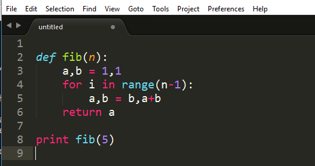

<!--Read in JavaScript function that prints footer bubbles-->
<script src="assets/js/footer_bubbles.js"></script>

<!--Define background image for title slide-->
<style>
.title-slide {
  background-image:url("assets/img/beaker.jpg");
  background-size: cover;
}
</style>

<footer>
  <hr></hr>
  <span style="float:right">ECON 6931 - R Programming</span>
</footer>

<h2 class="content_slide">Welcome to Class!</h2>

I'm pumped for this.

<center></center>

--- .toc_slide &twocol

<footer>
  <hr></hr>
  <span style="float:right">ECON 6931 - R Programming</span>
</footer>

<h2>Contents</h2>

*** =left

<b class="toc_header"> I. Introduction to R </b>
<ol class="toc" type="none">
    <li> Personal Introduction <span style="float:right"> 6 </span></li>
    <li> Syllabus Review       <span style="float:right"> 7 </span></li>
    <li> Course Objectives     <span style="float:right"> 8 </span></li>
</ol>

<b class="toc_header"> II. Setting Up Your Environment </b>
<ol class = "toc" type="none">
    <li> Installing R + RStudio             <span style="float:right"> 10  </span></li>
    <li> Authoring Scripts in RStudio       <span style="float:right"> 11 </span></li>
    <li> Installing Sublime Text            <span style="float:right"> 12 </span></li>
    <li> Authoring Scripts in a Text Editor <span style="float:right"> 13 </span></li>
    <li> Executing R Code                   <span style="float:right"> 14-15 </span></li>
</ol>

*** =right

<b class="toc_header"> III. Introduction to R </b>
<ol class = "toc" type="none">
    <li> R is an interpreted language      <span style="float:right"> 17 </span></li>
    <li> R is dynamically typed language   <span style="float:right"> 18 </span></li>
    <li> R has a few of its own file types <span style="float:right"> 19 </span></li>
</ol>

<b class="toc_header"> IV. Programming Fundamentals </b>
<ol class = "toc" type="none">
    <li> Variables and Namespaces    <span style="float:right"> 21    </span></li>
    <li> Introduction to Types       <span style="float:right"> 22    </span></li>
    <li> Dollarstore Calculator Math <span style="float:right"> 23-25 </span></li>
    <li> Controlling Program Flow    <span style="float:right"> 26-30 </span></li>
</ol>

--- .toc_slide &twocol

<footer>
  <hr></hr>
  <span style="float:right"> ECON 6931 - R Programming </span>
</footer>

<h2>Contents</h2>

*** =left

<b class="toc_header"> V. Functions in R </b>
<ol class="toc" type="none">
    <li> Intro to Functional Programming <span style="float:right"> 32 </span></li>
    <li> Required and Default Arguments  <span style="float:right"> 33-34 </span></li>
    <li> User-Defined Functions          <span style="float:right"> 35 </span></li>
</ol>

<b class="toc_header"> VI. Common R Data Structures </b>
<ol class = "toc" type="none">
    <li> Vectors          <span style="float:right"> 37-38 </span></li>
    <li> Lists            <span style="float:right"> 39-40 </span></li>
    <li> Data Frames      <span style="float:right"> 41-43 </span></li>
</ol>

*** =right

<b class="toc_header"> VII. Additional Resources </b>
<ol class = "toc" type="none">
    <li> Learning More on Your Own<span style="float:right">54</span></li>
</ol>

--- .section_slide

<h2>Section I.</h2>
<hr></hr>
</br></br></br>
<h2>Introduction</h2>

--- .content_slide

<footer>
  <hr>
    <script>FooterBubbles(1,3)</script>I. Introduction<span style="float:right">ECON 6931 - R Programming</span>
</footer>

<h2>Personal Introduction</h2>

>- <b>My Marquette Experience:</b>
    - B.S., Economics & Marketing (2013)
    - M.S.A.E., Marketing Research Specialization (2014)
    
>- <b>Since Marquette:</b>
    - Data Scientist @ [Uptake](https://uptake.com/) in Chicago, IL 2016-Present
    - Co-author and maintainer of [uptasticsearch](https://cran.r-project.org/web/packages/uptasticsearch/index.html) package on CRAN
    - Analyst/Economist @ [Abbott Laboratories](http://www.abbott.com/) in North Chicago, IL 2015-2016
    - Analyst @ [IHS Economics](https://www.ihs.com/industry/economics-country-risk.html) in Lexington, MA 2014-2015
    - Completed 2 Coursera specializations: [JHU Data Science](https://www.coursera.org/specializations/jhu-data-science) | [UMich Python/Web](https://www.coursera.org/specializations/python)
    - Completed 20+ data science and computer science MOOCs
    - Co-wrote an EViews add-in to perform time-series cross validation. [code](https://github.com/jameslamb/ML4EVIEWS) | [blog](http://blog.eviews.com/2016/04/add-in-round-up-for-2016-q1.html)

--- .content_slide

<footer>
  <hr>
    <script>FooterBubbles(2,3)</script>I. Introduction<span style="float:right">ECON 6931 - R Programming</span>
</footer>

<h2>Economics in the Age of Big Data</h2>

**From [Einav & Levin (2014)](http://www.sciencemag.org/content/346/6210/1243089.full.pdf?keytype=ref&siteid=sci&ijkey=Jj7wCy7hhth4M):**

>- Economists increasingly using large data sets (private & administrative)
    > "Economic models bring a simplifying conceptual framework to to help make sense of large data sets"
    
>- A major challenge:
    > "...developing appropriate data management and programming capabilities, as well as designing creative
    > and scalable approaches to summarize, describe, and analyze...data sets"

</br></br></br></br>
>- Other Commentary: [Einav (2013)](http://www.stanford.edu/~leinav/pubs/IPE2014.pdf) | [Varian (2013)](http://people.ischool.berkeley.edu/~hal/Papers/2013/BeyondBigDataPaperFINAL.pdf) | [Varian (2014)](http://people.ischool.berkeley.edu/~hal/Papers/2013/ml.pdf) | [Cagle (2014)](http://blogs.avalonconsult.com/blog/generic/ontology-for-fun-and-profit/)

--- .content_slide

<footer>
  <hr>
    <script>FooterBubbles(3,3)</script>I. Introduction<span style="float:right">ECON 6931 - R Programming</span>
</footer>

<h2>Course Objectives</h2>

In this 5-week course, we are going to install a bunch of software and read/write a bunch of R code.

<br>
The main objectives for the course are as follows:

* Set up a data science software stack on your machine
* Learn how to author and manage a statistical code base
* Learn the basics of manipulating data using R
* Learn how to incorporate external packages to make your scripts more powerful
* Practice solving problems in R and presenting solutions in a code review format

--- .section_slide

<h2>Section II.</h2>
<hr></hr>
</br></br></br>
<h2>Setting Up Your Environment</h2>

--- .content_slide

<footer>
  <hr>
  <script>FooterBubbles(1,6)</script>II. Setting Up Your Environment<span style="float:right">ECON 6931 - R Programming</span>
</footer>

<h2>Installing R + RStudio</h2>

Programming in R begins with installing R! To install R:

* Go to https://cran.r-project.org/
* Choose the appropriate download for your operating system (you'll see links like "Download R for Mac OS")
* Open the file and follow the prompts on the screen

R comes with a command-line client and a default GUI, but most users prefer to use other IDEs (*"integrated development environment"*). The most popular IDE for R, and the one we'll use in this class, is RStudio:

* Go to https://www.rstudio.com/products/rstudio/download/
* Choose the appropriate download under "Installers for Supported Platforms"
* Open the file and follow the prompts on the screen

--- .content_slide

<footer>
  <hr>
  <script>FooterBubbles(2,6)</script>II. Setting Up Your Environment<span style="float:right">ECON 6931 - R Programming</span>
</footer>

<h2>Authoring Scripts in RStudio</h2>

Sequences of R code are typically saved in scripts with the file extension ".R". To open a blank script in RStudio and start editing, you can either go to "File --> New File --> R script" or choose "R Script" from the paper image in RStudio:

<center></center>


--- .content_slide &twocol

<footer>
  <hr>
  <script>FooterBubbles(3,6)</script>II. Setting Up Your Environment<span style="float:right">ECON 6931 - R Programming</span>
</footer>

<h2>Installing Sublime Text</h2>

The world of data science is a world of text files...of many types. For working with other types of text files (e.g. config files, queries, JSON data, READMEs, and more), you'll want to install a full-featured text editor. One possibility is [Sublime Text 3](https://www.sublimetext.com/3), but you are welcome to use whatever works for you.

"Full-featured" text editors do far more than provide a simple window for entering basic text.

*** =left

**Example features**

* [syntax highlighting](https://en.wikipedia.org/wiki/Syntax_highlighting)
* [syntax validation](https://www.google.com/search?q=syntax+validation)
* [pretty printing](https://en.wikipedia.org/wiki/Prettyprint)
* [code execution](https://realpython.com/blog/python/setting-up-sublime-text-3-for-full-stack-python-development/)
* [tab completion](https://en.wikipedia.org/wiki/Command-line_completion)

*** =right

<br>


--- .content_slide &twocol

<footer>
  <hr>
  <script>FooterBubbles(4,6)</script>II. Setting Up Your Environment<span style="float:right">ECON 6931 - R Programming</span>
</footer>

<h2>Authoring Scripts in a Text Editor</h2>

When you author a script in RStudio, the file you create will be stored with the file extension ".R" by default. Out in the wild (i.e. editing in text editors), you are responsible for saving files with the appropriate file extension so the software that uses them can interpret them correctly. Trust me, there are [a lot of them](https://en.wikipedia.org/wiki/List_of_file_formats)

A few common ones you'll want to know for this course:

*** =left

**Scripts and Docs**

- General text files (.md, .txt)
- R scripts (.R, .r)
- SQL queries (.sql)
- Git-specific files (.gitignore, .gitkeep, .gitprofile)
- Slides and reports (.css, .html, .pdf, .rmd)

*** =right

**Data**

- API response data (.csv, .json, .xml)
- R data formats (.rda, .rds, .RData)
- MS Excel (.xls, .xlsx, .xlsm)
- Zip archives (.zip, .tar, .gz, .bzip2)

--- .content_slide  &twocol

<footer>
  <hr>
  <script>FooterBubbles(5,6)</script>II. Setting Up Your Environment<span style="float:right">ECON 6931 - R Programming</span>
</footer>

<h2>Executing R Code: RStudio</h2>

R is an [interpreted language](https://en.wikipedia.org/wiki/Interpreted_language) (more on this later). TL;DR, you need to send your code to some software that knows what to do with it ("R"). RStudio makes this super easy to do. You can excute your code interactively (one line at a time) in the R console or run your .R scripts using the "run" button.

*** =left

**Using Scripts**


*** =right

**The Console**


--- .content_slide  &twocol

<footer>
  <hr>
  <script>FooterBubbles(6,6)</script>II. Setting Up Your Environment<span style="float:right">ECON 6931 - R Programming</span>
</footer>

<h2>Executing R Code: The Command Line</h2>

When R is just one of the tools in your stack, it's often quicker to execute your code from a terminal rather than going into a dedicated application for each type of file.

**The R REPL**

- R comes with a REPL ([read-eval-print loop](https://en.wikipedia.org/wiki/Read%E2%80%93eval%E2%80%93print_loop)) which allows you to quickly turn a terminal command line into an R console.
- To activate: `R` from the command line
- To close: `quit()` or `q()`

**Rscript**

- If your commands are stored in a ".R" script, you can execute that script from the command line with the `Rscript` command.
- This command will run all the lines in the file in the order they've been written and potentially output some messages to the terminal.

--- .section_slide

<h2>Section III.</h2>
<hr></hr>
</br></br></br>
<h2>Introduction to R</h2>

--- .content_slide

<footer>
  <hr>
  <script>FooterBubbles(1,3)</script>III. Introduction to R<span style="float:right">ECON 6931 - R Programming</span>
</footer>

<h2>R is an Interpreted Language</h2>

Interpreted languages are those which break commands down into building blocks called "subroutines" that have already been compiled in machine code (soruce: [Wikipedia](https://en.wikipedia.org/wiki/Interpreted_language)). Much of the R source code (including these subroutines) is actually written in C.

To ensure that that process of breaking down ("interpreting") code goes smoothly, R needs to use a few keywords to identify crucial operations. Like other scripting languages, it has a set of "reserved words" which you cannot use as object names.
<br><br><br>
<center></center>

--- .content_slide

<footer>
  <hr>
  <script>FooterBubbles(2,3)</script>III. Introduction to R<span style="float:right">ECON 6931 - R Programming</span>
</footer>

<h2>R is a Dynamically Typed Language</h2>

- Some languages like Java required you to declare the **types** of objects you create
    - for example: string, numeric, integer, or boolean
    - pros: strong typing makes software faster and more reliable (broadly speaking)
    - cons: code is very verbose, difficult to prototype in and debug

- R is "dynamically typed"
    - this means that you can create objects without explicitly telling R "this is an integer"
    - in addition, you're free to re-assign variable names to different types at any time in scripts

--- .content_slide

<footer>
  <hr>
  <script>FooterBubbles(3,3)</script>III. Introduction to R<span style="float:right">ECON 6931 - R Programming</span>
</footer>

<h2>R has its own File Types</h2>

|Extension    |Description                                                        |
|:-----------:|:-----------------------------------------------------------------:|
|.r, .R       | Text format for scripts.                                          |
|.rda, .RData | R data format. One or many R objects                              |
|.rds         | R data format. Single R object. Can be loaded into a named object |
<br>

```{r fileTypes, eval = FALSE}
# .r and .R scripts can be run inside R with source()
source("my_script.R")

# .rda and .RData files can be loaded into an R session with load()
load("all_of_the_data.rda")

# .rds files can be read directy into an R object
someData <- readRDS("my_data.rds")
```

--- .section_slide

<h2>Section IV.</h2>
<hr></hr>
</br></br></br>
<h2>Programming Fundamentals</h2>

--- .content_slide

<footer>
  <hr>
  <script>FooterBubbles(1,10)</script>IV. Programming Fundamentals<span style="float:right">ECON 6931 - R Programming</span>
</footer>

<h2>Variables and Namespaces</h2>

When you execute a statement like `x <- 5` in R, you are creating an **object** in memory which holds the numeric **value** 5 and is referenced by the **variable name** "x".

If you later ask R to do something like `y <- x + 2`, it will search sequentially through a series of **namespaces** until it finds a variable called "x". Namespaces can be thoguht of as collections of labels pointing to places in memory. You can use R's `search` command to examine the ordered list of namespaces that R will search in for variables.

```{r namespaces, eval = FALSE}
# Check the search path of namespaces
search()

# use ls() to list the objects in one of those namespaces
ls("package:stats")
```

--- .content_slide

<footer>
  <hr>
  <script>FooterBubbles(2,10)</script>IV. Programming Fundamentals<span style="float:right">ECON 6931 - R Programming</span>
</footer>

<h2>Introduction to Types</h2>

Languages like Java and C are more verbose than R partially because they require programmers to explicitly declare *types* for data values. We will not go into the intricacy of typing in this course, but you should be familiar with the following types (this knowledge will serve you well across all languages):

- *integer*: non-complex whole numbers. created with an L like - `anInteger <- 1L`
- *numeric*: all real numbers. Default type for numbers in R - `someNums <- c(1.005, 2)`
- *logical*: TRUE or FALSE. - `someLogicals <- c(TRUE, FALSE, FALSE)`
- *character*: strings of arbitrary characters. Sometimes referred to informally as "text data". - `stringVar <- "noone knows what it means. It's provocative."`

--- .content_slide

<footer>
  <hr>
  <script>FooterBubbles(3,10)</script>IV. Programming Fundamentals<span style="float:right">ECON 6931 - R Programming</span>
</footer>

<h2>Dollarstore Calculator Math (pt 1)</h2>

```{r simpleMath1, eval = TRUE, echo = TRUE}
# Addition with "+"
4 + 5

# Subtraction with "-"
100 - 99
```

--- .content_slide

<footer>
  <hr>
  <script>FooterBubbles(4,10)</script>IV. Programming Fundamentals<span style="float:right">ECON 6931 - R Programming</span>
</footer>

<h2>Dollarstore Calculator Math (pt 2)</h2>

```{r simpleMath2, eval = TRUE, echo = TRUE}
# Multiplication with "*"
4 * 5

# Division with "/"
15 / 3

# Exponentiation with "^"
2^3
```

--- .content_slide

<footer>
  <hr>
  <script>FooterBubbles(5,10)</script>IV. Programming Fundamentals<span style="float:right">ECON 6931 - R Programming</span>
</footer>

<h2>Dollarstore Calculator Math (pt 3)</h2>

```{r simpleMath3, eval = TRUE, echo = TRUE}
# Order of Operations
4 * 5 + 5 / 5

# Control with parentheses
4 * (5 + 5) / 5
```

--- .content_slide

<footer>
  <hr>
  <script>FooterBubbles(6,10)</script>IV. Programming Fundamentals<span style="float:right">ECON 6931 - R Programming</span>
</footer>

<h2>Controlling Program Flow: If-Else</h2>

Soon after you start writing code (in any language), you'll inevitably find yourself saying "I only want to do this thing if certain conditions are met". This type of logic is expressed using [if-else syntax](https://en.wikipedia.org/wiki/Conditional_(computer_programming))

```{r ifElse1, eval = TRUE, echo = TRUE, warning = FALSE, message = FALSE}
x <- 4
if (x > 5){
    print("x is above the threshold")
}
```

See the [Week 1 Code Supplement](jameslamb.github.io/teaching/mu_rprog/code/Week1_Supplement.html) for more examples.

--- .content_slide

<footer>
  <hr>
  <script>FooterBubbles(7,10)</script>IV. Programming Fundamentals<span style="float:right">ECON 6931 - R Programming</span>
</footer>

<h2>Controlling Program Flow: If-Else</h2>

What if you want to express more than two possible outcomes? For this, we could use R's `else if` construct to nest conditions. Note that conditional blocks can have any number of "else if" statements, but only one "else" block.

```{r ifElse2, eval = FALSE, echo = TRUE}
# Try to think through what this will do before you run it yourself:
if (4 > 5){
    print("3")
} else if (6 <= (5/10)) {
    print("1")
} else if (4 + 4 + 4 == 12.0001) {
    print("4")
} else {
    print("2")
}
```

--- .content_slide

<footer>
  <hr>
  <script>FooterBubbles(8,10)</script>IV. Programming Fundamentals<span style="float:right">ECON 6931 - R Programming</span>
</footer>

<h2>Controlling Program Flow: For Loops</h2>

One of the most powerful characteristics of general purpose programming languages is their ability to automate repetitive tasks. When you know that you want to do something a fixed number of times (say, squaring each item in a vector), you can use a `for` loop.

```{r forLoop, eval = FALSE, echo = TRUE}
# Create a vector
x <- c(1,4,6)

# Print the square of each element one at a time
print(1^2)
print(4^2)
print(6^2)

# BETTER: Loop over the vector and print the square of each element
for (some_number in x){
    print(some_number^2)
}
```

--- .content_slide

<footer>
  <hr>
  <script>FooterBubbles(9,10)</script>IV. Programming Fundamentals<span style="float:right">ECON 6931 - R Programming</span>
</footer>

<h2>Controlling Program Flow: While Loops (pt 1)</h2>

For loops are suitable for many applications, but they can be too restrictive in some cases. For example, imagine that you are writing a simple movie search engine and you want to tell R "look through an alphabetized list of movies and tell me if you find Apocalypse Now". A `for` loop can certainly do this, but it will keep running over ALL movies...long after it finds Ace Ventura! This is a great place to use a `while` loop.

Consult the [Week 1 Code Supplement](jameslamb.github.io/teaching/mu_rprog/code/Week1_Supplement.html) for the `for` loop implementation to solve this problem.

--- .content_slide

<footer>
  <hr>
  <script>FooterBubbles(10,10)</script>IV. Programming Fundamentals<span style="float:right">ECON 6931 - R Programming</span>
</footer>

<h2>Controlling Program Flow: While Loops (pt 2)</h2>

The `while` loop implementation can be found in the [Week 1 Code Supplement](jameslamb.github.io/teaching/mu_rprog/code/Week1_Supplement.html). Notice that it stops checking once it finds what it wants, making it potentially more efficient than the `for` implementation.

--- .section_slide

<h2>Section V.</h2>
<hr></hr>
</br></br></br>
<h2>Functions in R</h2>

--- .content_slide

<footer>
  <hr>
  <script>FooterBubbles(1,4)</script>V. Functions in R<span style="float:right">ECON 6931 - R Programming</span>
</footer>

<h2>Intro to Functional Programming</h2>

R is a [functional programming language](http://adv-r.had.co.nz/Functions.html). To write powerful, concise code, you'll need to master the use and creation of functions.

> "If you find yourself copying and pasting the same code more than twice, it's time to write a function." - Hadley Wickham


```{r functionExample, eval = FALSE}
# Function to return only the even numbers from a vector
answers <- c(1, 3, 4, 8, 13, 24)

getPrimes <- function(some_numbahs){
    the_evens <- some_numbahs[some_numbahs %% 2 == 0]
    return(the_evens)
}

getPrimes(answers)
```

--- .content_slide

<footer>
  <hr>
  <script>FooterBubbles(2,4)</script>V. Functions in R<span style="float:right">ECON 6931 - R Programming</span>
</footer>

<h2>Required Arguments</h2>

- R functions take 0 or more arguments...basically named variables that the function uses to do it's work
- Take a look at `?sqrt`. You'll see that it takes one argument, named `x`. You can pass any vector of numeric values to this argument and `sqrt` will return the square root of each element
- In this case, we'd say `x` is a *required argument* of `sqrt`

```{r requiredArgs, eval = FALSE}
# Take the square root of a vector of numbers
sqrt(x = c(1,4,9,16,25))

# Note that calling this function without the argument will throw an error!
sqrt()
### Error in sqrt(): 0 arguments passed to `sqrt` which requires 1
```

--- .content_slide

<footer>
  <hr>
  <script>FooterBubbles(3,4)</script>V. Functions in R<span style="float:right">ECON 6931 - R Programming</span>
</footer>

<h2>Default Argument Values</h2>

- For more complicated functions, passing values to each argument can get burdensome
- To handle this, R allows function authors to specify *default arguments*. These are values that certain arguments will take automatically unless you decide to overwrite them
- Example: look at `?rnorm`. You'll see that this function's signature reads `rnorm(n, mean = 0, sd = 1)`.

```{r normalDraw}
# 100 random draws from a normal distribution w/ mean 0 and standard deviation 1
rand_nums <- rnorm(n = 100)

# 100 random draws from a normal distribution w/ mean 4.5 and standard deviation 1
rand_nums <- rnorm(n = 100, mean = 4.5)
```

--- .content_slide

<footer>
  <hr>
  <script>FooterBubbles(4,4)</script>V. Functions in R<span style="float:right">ECON 6931 - R Programming</span>
</footer>

<h2>User-Defined Functions</h2>

As you saw in the last example, R gives you the ability to define your own functions on the fly for an added level of flexibility. Mastering this technique takes time, but if you can get it you'll be able to do some really powerful stuff. We'll spend more time on functions in the following weeks, but here's a sneak peak of what is possible:

<br>

Head over to the [Week 1 Code Supplement](jameslamb.github.io/teaching/mu_rprog/code/Week1_Supplement.html) to see an example of this.

--- .section_slide

<h2>Section VI.</h2>
<hr></hr>
</br></br></br>
<h2>Common R Data Structures</h2>

--- .content_slide

<footer>
  <hr>
  <script>FooterBubbles(1,7)</script>VI. Common R Data Structures<span style="float:right">ECON 6931 - R Programming</span>
</footer>

<h2>Vectors (pt 1)</h2>

- Because R was designed for use with statistics, most of its operations are [vectorized](http://www.cs.cornell.edu/courses/cs1112/2016sp/Exams/exam2/vectorizedCode.pdf)
- You can create vectors a few ways:

```{r vectors_pt1, eval = FALSE}
# Ordered sequence of integers
1:5

# Counting by 2s
seq(from = 0, to = 14, by = 2)

# Replicate the same values
rep(TRUE, 6)

# Concatenate multiple values with the "c" operator
c("all", "of", "the", "lights")
```

--- .content_slide

<footer>
  <hr>
  <script>FooterBubbles(2,7)</script>VI. Common R Data Structures<span style="float:right">ECON 6931 - R Programming</span>
</footer>

<h2>Vectors (pt 2)</h2>

- Vectors are at the heart of many R operations. Try a few more practice exercises:

```{r vectors_pt2, eval = FALSE}
# Watch out! Mixing types wil lead to silent coercion
c(1, TRUE, "hellos")

# Some functions, when applied over a vector, return a single value
is.numeric(rnorm(100))

# Others will return a vector of results
is.na(c(1, 5, 10, NA, 8))

# Vectors can be named
batting_avg <- c(youkilis = 0.300, ortiz = 0.355, nixon = 0.285)

# You can combine two vectors with c()
x <- c("a", "b", "c")
y <- c("1", "2", "3")
c(x, y)
```

--- .content_slide

<footer>
  <hr>
  <script>FooterBubbles(3,7)</script>VI. Common R Data Structures<span style="float:right">ECON 6931 - R Programming</span>
</footer>

<h2>Lists (pt 1)</h2>

Vectors are the first multi-item data structure all R programmers learn. Soon, though, you may find yourself frustrated with the fact that they can only hold a single type. To handle casses where you want to package multiple types (and even multiple objects!) together, we will turn to a data structure called a `list`.

|Capabilities                        |Vectors |Lists   |
|:----------------------------------:|:------:|:------:|
|Optional use of named elements      |&#x2714;|&#x2714;|
|Support math operations like mean() |&#x2714;|        |
|Hold multiple types                 |        |&#x2714;|
|Hold multiple objects               |        |&#x2714;|


```{r lists_pt1, eval = FALSE}
# Create a list with list()
myList <- list(a = 1, b = rep(TRUE, 10), x = c("shakezoola", "mic", "rulah"))

# Examine it with str()
str(myList)
```


--- .content_slide

<footer>
  <hr>
  <script>FooterBubbles(4,7)</script>VI. Common R Data Structures<span style="float:right">ECON 6931 - R Programming</span>
</footer>

<h2>Lists (pt 2)</h2>

We saw earlier how you can use `for` loops to walk over a vector and do something with each element. You can certainly do the same thing with a list, but it can be a bit tedious.
```{r listLoop}
# Create a list
studentList <- list(kanye = c(80, 90, 100), talib = c(95, 85, 99), common = c(100, 100, 99))

# Get average grades with a for loop
grades <- vector(mode = "list", length = 3)
for (i in 1:length(studentList)){
    grades[[i]] <- mean(studentList[[i]])
}
```
Luckily, R provides a built-in function called `lapply` to handle this more expressively. We'll cover R's [apply family of functions](https://www.datacamp.com/community/tutorials/r-tutorial-apply-family#gs.ER5hbLU) later in the course. Here's a sneak peek:
```{r listLapply}
# Better way with lapply
grades <- lapply(studentList, mean)
```

--- .content_slide

<footer>
  <hr>
  <script>FooterBubbles(5,7)</script>VI. Common R Data Structures<span style="float:right">ECON 6931 - R Programming</span>
</footer>

<h2>Data Frames (pt 1)</h2>

Vectors and lists are crucial data structures in R, but you may find that they're difficult to work with in model training and other data science tasks. It is now time to introduce a third foundational data structure: the data frame.

Data frames are tables of data. Each column of a dataframe can be a different type, but all values within a column must be the same type.

```{r dataFrame, eval = FALSE}
# Create a dataframe!
myDF <- data.frame(time_period  = c(1, 2, 3, 4, 5),
                   temperature  = c(25.6, 38.7, 31.4, 40.0, 29.20),
                   station      = c("A", "B", "A", "A", "B"),
                   is_gov_owned = c(TRUE, FALSE, TRUE, TRUE, FALSE)
                   )

# Check out the structure of this thing
str(myDF)
```

--- .content_slide

<footer>
  <hr>
  <script>FooterBubbles(6,7)</script>VI. Common R Data Structures<span style="float:right">ECON 6931 - R Programming</span>
</footer>

<h2>Data Frames (pt 2)</h2>

R comes with some sample data sets you can experiment with. Let's load the `mtcars` data.frame and test out some new commands!

```{r dateFrame2, eval = FALSE}
# Load the mtcars dataframe
data("mtcars")

# Check out its structure
str(mtcars)

# View the top 10 rows
head(mtcars, n = 10) # could use "tail" for the bottom 10

# Find all the unique values of "cyl" (the number of engine cylinders)
unique(mtcars$cyl)
```

--- .content_slide

<footer>
  <hr>
  <script>FooterBubbles(7,7)</script>VI. Common R Data Structures<span style="float:right">ECON 6931 - R Programming</span>
</footer>

<h2>Data Frames (pt 3)</h2>

We will be working with data frames throughout this class, given their importance to data science and statistics. A more thorough treatment of this data structure will be given in Week 2. For now, I'd like to introduce you to one more looping function: `apply`.

`apply` allows you to loop over the rows or columns of a data frame and execute an arbitrary function. The code below holds some examples of what can be accomplished with `apply`.

```{r apply_on_a_DF, eval = FALSE}
# Get the mean of each column
apply(mtcars, MARGIN = 2, FUN = mean)

# Get the mean of each row (nonsensical, just illustrating
apply(mtcars, MARGIN = 1, FUN = mean)
```

--- .section_slide

<h2>Section VII.</h2>
<hr></hr>
</br></br></br>
<h2>Additional Resources</h2>

--- .content_slide &twocol

<footer>
  <hr>
  VII. Additional Resources<span style="float:right">ECON 6931 - R Programming</span>
</footer>

<h2>Learning More on Your Own</h2>

We covered a lot of stuff this week, and will have to be selective about which things we delve deeper into in the following weeks. For the brave and curious, I've included a few online free resources for learning more about the technologies we discussed.

**Bash**: [Codecademy](https://www.codecademy.com/learn/learn-the-command-line) | [Learn Bash](https://www.cyberciti.biz/open-source/learning-bash-scripting-for-beginners/)

**R**: [DataCamp](https://www.datacamp.com/) | [swirl](http://swirlstats.com/) | [JHU Data Science](https://www.coursera.org/specializations/jhu-data-science)

**RStudio**: [RStudio blog](https://blog.rstudio.org/)

**Sublime Text**: [Sublime Text 3 docs](https://www.sublimetext.com/docs/3/) | [Package Control](https://www.sitepoint.com/10-essential-sublime-text-plugins-full-stack-developer/)
