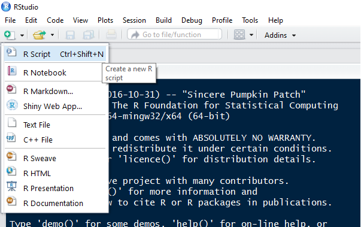
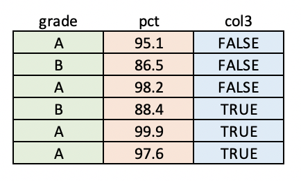

<!--Define background image for title slide-->
<style>
.title-slide {
  background-image:url("assets/img/beaker.jpg");
  background-size: cover;
}
</style>

<footer>
  <hr></hr>
  <span style="float:right">R Programming</span>
</footer>

<h2 class="content_slide">Welcome to Class!</h2>

--- .toc_slide &twocol

<footer>
  <hr></hr>
  <span style="float:right">R Programming</span>
</footer>

<h2>Contents</h2>

*** =left

<b class="toc_header"> Introduction </b>
<ol class="toc" type="none">
    <li> Introduction <span style="float:right"> 6 </span></li>
    <li> Syllabus Review <span style="float:right"> 7 </span></li>
    <li> Course Objectives <span style="float:right"> 8 </span></li>
</ol>

<b class="toc_header"> Setting Up Your Environment </b>
<ol class = "toc" type="none">
    <li> Installing R + RStudio <span style="float:right"> 10  </span></li>
    <li> Authoring Scripts in RStudio <span style="float:right"> 11 </span></li>
    <li> Authoring Scripts in a Text Editor <span style="float:right"> 12 </span></li>
    <li> Executing R Code <span style="float:right"> 13-14 </span></li>
</ol>

*** =right

<b class="toc_header"> Introduction to R </b>
<ol class = "toc" type="none">
    <li> R is an interpreted language <span style="float:right"> 16 </span></li>
    <li> R is dynamically typed language <span style="float:right"> 17 </span></li>
    <li> R has a few of its own file types <span style="float:right"> 18 </span></li>
</ol>

<b class="toc_header"> Programming Fundamentals </b>
<ol class = "toc" type="none">
    <li> Variables and Namespaces <span style="float:right"> 20 </span></li>
    <li> Introduction to Types <span style="float:right"> 21 </span></li>
    <li> Dollarstore Calculator Math <span style="float:right"> 22-24 </span></li>
</ol>

--- .toc_slide &twocol

<footer>
  <hr></hr>
  <span style="float:right"> R Programming </span>
</footer>

<h2>Contents</h2>

*** =left


<b class="toc_header"> R Data Structures </b>
<ol class="toc" type="none">
    <li> Vectors <span style="float:right"> 26-27 </span></li>
    <li> Lists <span style="float:right"> 28 </span></li>
    <li> Factors <span style="float:right"> 29 </span></li>
    <li> Data Frames <span style="float:right"> 30 </span></li>
</ol>

<b class="toc_header"> Logical Operators </b>
<ol class="toc" type="none">
    <li> Logical Operators <span style="float:right"> 32-34 </span></li>
</ol>

*** =right

<b class="toc_header"> Subsetting </b>
<ol class="toc" type="none">
    <li> Subsetting Vectors <span style="float:right"> 36 </span></li>
    <li> Subsetting Lists <span style="float:right"> 37 </span></li>
    <li> Subsetting Data Frames <span style="float:right"> 38 </span></li>
    <li> Using Logical Vectors <span style="float:right"> 39 </span></li>
</ol>

<b class="toc_header"> Controlling Program Flow </b>

<ol class = "toc" type="none">
    <li> If-Else <span style="float:right"> 40-42 </span></li>
    <li> For Loops <span style="float:right"> 43 </span></li>
    <li> While Loops <span style="float:right"> 44 </span></li>
</ol>

<b class="toc_header"> Additional Resources </b>
<ol class = "toc" type="none">
    <li> Learning More on Your Own<span style="float:right"> 46 </span></li>
</ol>

--- .section_slide

</br></br></br>
<h2>Introduction</h2>

--- .content_slide

<footer>
  <hr>
    Introduction<span style="float:right">R Programming</span>
</footer>

<h2>Personal Introduction</h2>

>- <b>My Marquette Experience:</b>
    - B.S., Economics & Marketing (2013), M.S.A.E. (2014)

>- <b>Since Marquette:</b>
    - Software Engineer @ [NVIDIA](https://www.nvidia.com/), 2023-present
    - Data Scientist/Engineer @ [Uptake](https://uptake.com/), [AWS](https://aws.amazon.com/), [Saturn Cloud](https://www.saturncloud.io/s/), [SpotHero](https://spothero.com/) 2016-2023
    - M.I. in Data Science, University of California - Berkeley ([MIDS](https://datascience.berkeley.edu/))
    - Co-author and maintainer of [`{uptasticsearch}`](https://github.com/UptakeOpenSource/uptasticsearch) and [`{pkgnet}`](https://github.com/UptakeOpenSource/pkgnet) packages on CRAN
    - Maintainer on [`LightGBM`](https://lightgbm.readthedocs.io/en/latest/FAQ.html#critical-issues)
    - Created "Timeseries with data.table in R" DataCamp course
    - Analyst/Economist @ IHS Economics, Abbott Laboratories, 2014-2015

--- .content_slide

<footer>
  <hr>
    Introduction<span style="float:right">R Programming</span>
</footer>

<h2>Syllabus review</h2>

<center></center>

--- .content_slide

<footer>
  <hr>
    Introduction<span style="float:right">R Programming</span>
</footer>

<h2>Course Objectives</h2>

<br>
The main objectives for the course are as follows:

* Set up a data science software stack on your machine
* Learn how to author and manage a statistical code base
* Learn the basics of manipulating data using R
* Learn how to incorporate external packages to make your scripts more powerful
* Practice solving problems in R and presenting solutions in a code review format

--- .section_slide

</br></br></br>
<h2>Setting Up Your Environment</h2>

--- .content_slide

<footer>
  <hr>
  Setting Up Your Environment<span style="float:right">R Programming</span>
</footer>

<h2>Installing R + RStudio</h2>

Programming in R begins with installing R!

* Go to https://cran.r-project.org/
* Choose the appropriate download for your operating system (you'll see links like "Download R for Mac OS")
* Open the file and follow the prompts on the screen

R comes with a command-line client and a default GUI, but most users prefer to use other IDEs (*"integrated development environment"*). The most popular IDE for R, and the one we'll use in this class, is RStudio:

* Go to https://posit.co/products/open-source/rstudio/
* Choose the appropriate download under "All Installers"
* Open the file and follow the prompts on the screen

--- .content_slide

<footer>
  <hr>
  Setting Up Your Environment<span style="float:right">R Programming</span>
</footer>

<h2>Authoring Scripts in RStudio</h2>

Sequences of R code are typically saved in scripts with the file extension ".R". To open a blank script in RStudio and start editing, you can either go to "File --> New File --> R script" or choose "R Script" from the paper image in RStudio:

<center></center>

--- .content_slide &twocol

<footer>
  <hr>
  Setting Up Your Environment<span style="float:right">R Programming</span>
</footer>

<h2>Authoring Scripts in a Text Editor</h2>

When you author a script in RStudio, the file you create will be stored with the file extension ".R" by default. Out in the wild (i.e. editing in text editors), you are responsible for saving files with the appropriate file extension so the software that uses them can interpret them correctly. Trust me, there are [a lot of them](https://en.wikipedia.org/wiki/List_of_file_formats)

A few common ones you'll want to know for this course:

*** =left

**Scripts and Docs**

- General text files (.md, .txt)
- R scripts (.R, .r)
- SQL queries (.sql)
- Slides and reports (.css, .html, .pdf, .rmd)

*** =right

**Data**

- API response data (.csv, .json, .xml)
- R data formats (.rda, .rds, .RData)
- MS Excel (.xls, .xlsx, .xlsm)
- Zip archives (.zip, .tar, .gz, .bzip2)

--- .content_slide  &twocol

<footer>
  <hr>
  Setting Up Your Environment<span style="float:right">R Programming</span>
</footer>

<h2>Executing R Code: RStudio</h2>

R is an [interpreted language](https://en.wikipedia.org/wiki/Interpreted_language) (more on this later). TL;DR, you need to send your code to some software that knows what to do with it ("R"). RStudio makes this super easy to do. You can execute your code interactively (one line at a time) in the R console or run your .R scripts using the "run" button.

*** =left

**Using Scripts**


*** =right

**The Console**


--- .content_slide  &twocol

<footer>
  <hr>
  Setting Up Your Environment<span style="float:right">R Programming</span>
</footer>

<h2>Executing R Code: The Command Line</h2>

When R is just one of the tools in your stack, it's often quicker to execute your code from a terminal rather than going into a dedicated application for each type of file.

**The R REPL**

- R comes with a REPL ([read-eval-print loop](https://en.wikipedia.org/wiki/Read%E2%80%93eval%E2%80%93print_loop)) which allows you to quickly turn a terminal command line into an R console.
- To activate: `R` from the command line
- To close: `quit()` or `q()`

**Rscript**

- If your commands are stored in a ".R" script, you can execute that script from the command line with the `Rscript` command.
- This command will run all the lines in the file in the order they've been written and potentially output some messages to the terminal.

--- .section_slide

</br></br></br>
<h2>Introduction to R</h2>

--- .content_slide

<footer>
  <hr>
  Introduction to R<span style="float:right">R Programming</span>
</footer>

<h2>R is an Interpreted Language</h2>

Interpreted languages are those which break commands down into building blocks called "subroutines" that have already been compiled in machine code (source: [Wikipedia](https://en.wikipedia.org/wiki/Interpreted_language)). Much of the R source code (including these subroutines) is actually written in C.

To ensure that that process of breaking down ("interpreting") code goes smoothly, R needs to use a few keywords to identify crucial operations. Like other scripting languages, it has a set of "reserved words" which you cannot use as object names.
<br><br>

**Run `?reserved` in RStudio**

**Run `TRUE = 4` in RStudio**

--- .content_slide

<footer>
  <hr>
  Introduction to R<span style="float:right">R Programming</span>
</footer>

<h2>R is a Dynamically Typed Language</h2>

- Some languages like Java required you to declare the **types** of objects you create
    - for example: string, numeric, integer, or boolean
    - pros: strong typing makes software faster and more reliable (broadly speaking)
    - cons: code is very verbose, difficult to prototype in and debug

- R is "dynamically typed"
    - this means that you can create objects without explicitly telling R "this is an integer"
    - in addition, you're free to re-assign variable names to different types at any time in scripts

--- .content_slide

<footer>
  <hr>
  Introduction to R<span style="float:right">R Programming</span>
</footer>

<h2>R has its own File Types</h2>

|Extension    |Description                                                        |
|:-----------:|:-----------------------------------------------------------------:|
|.r, .R       | Text format for scripts.                                          |
|.rda, .RData | R data format. One or many R objects                              |
|.rds         | R data format. Single R object. Can be loaded into a named object |
<br>

```{r fileTypes, eval = FALSE}
# .r and .R scripts can be run inside R with source()
source("my_script.R")

# .rda and .RData files can be loaded into an R session with load()
load("all_of_the_data.rda")

# .rds files can be read directly into an R object
someData <- readRDS("my_data.rds")
```

--- .section_slide

</br></br></br>
<h2>Programming Fundamentals</h2>

--- .content_slide

<footer>
  <hr>
  Programming Fundamentals<span style="float:right">R Programming</span>
</footer>

<h2>Variables and Namespaces</h2>

When you execute a statement like `x <- 5` in R, you are creating an **object** in memory which holds the numeric **value** 5 and is referenced by the **variable name** "x".

If you later ask R to do something like `y <- x + 2`, it will search through a series of **namespaces** until it finds a variable called "x". Namespaces can be thought of as collections of labels pointing to places in memory. You can use R's `search()` command to examine the ordered list of namespaces that R will search in for variables.

```{r namespaces, eval = FALSE}
# Check the search path of namespaces
search()

# use ls() to list the objects in one of those namespaces
ls("package:stats")
```

--- .content_slide

<footer>
  <hr>
  Programming Fundamentals<span style="float:right">R Programming</span>
</footer>

<h2>Introduction to Types</h2>

Languages like Java and C are more verbose than R partially because they require programmers to explicitly declare *types* for data values. We will not go into the intricacy of typing in this course, but you should be familiar with the following types (this knowledge will serve you well across all languages):

- *integer*: non-complex whole numbers. created with an L like `anInteger <- 1L`
- *numeric*: all real numbers. Default type for numbers in R `someNums <- c(1.005, 2)`
- *logical*: TRUE or FALSE. `someLogicals <- c(TRUE, FALSE, FALSE)`
- *character*: strings of arbitrary characters. Sometimes referred to informally as "text data". `stringVar <- "Chicago Heights"`

--- .content_slide

<footer>
  <hr>
  Programming Fundamentals<span style="float:right">R Programming</span>
</footer>

<h2>Dollarstore Calculator Math (pt 1)</h2>

```{r simpleMath1, eval = TRUE, echo = TRUE}
# Addition with "+"
4 + 5

# Subtraction with "-"
100 - 99
```

--- .content_slide

<footer>
  <hr>
  Programming Fundamentals<span style="float:right">R Programming</span>
</footer>

<h2>Dollarstore Calculator Math (pt 2)</h2>

```{r simpleMath2, eval = TRUE, echo = TRUE}
# Multiplication with "*"
4 * 5

# Division with "/"
15 / 3

# Exponentiation with "^"
2^3
```

--- .content_slide

<footer>
  <hr>
  Programming Fundamentals<span style="float:right">R Programming</span>
</footer>

<h2>Dollarstore Calculator Math (pt 3)</h2>

```{r simpleMath3, eval = TRUE, echo = TRUE}
# Order of Operations
4 * 5 + 5 / 5

# Control with parentheses
4 * (5 + 5) / 5
```

--- .section_slide

</br></br></br>
<h2>Data Structures</h2>

--- .content_slide

<footer>
  <hr>
  Data Structures<span style="float:right">R Programming</span>
</footer>

<h2>Vectors (pt 1)</h2>

- Because R was designed for use with statistics, most of its operations are [vectorized](http://www.cs.cornell.edu/courses/cs1112/2016sp/Exams/exam2/vectorizedCode.pdf)
- You can create vectors a few ways:

```{r vectors_pt1, eval = FALSE}
# Ordered sequence of integers
1:5

# Counting by 2s
seq(from = 0, to = 14, by = 2)

# Replicate the same values
rep(TRUE, 6)

# Concatenate multiple values with the "c" operator
c("all", "of", "the", "lights")
```

--- .content_slide

<footer>
  <hr>
  Data Structures<span style="float:right">R Programming</span>
</footer>

<h2>Vectors (pt 2)</h2>

- Vectors are at the heart of many R operations. Try a few more practice exercises:

```{r vectors_pt2, eval = FALSE}
# Watch out! Mixing types will lead to silent coercion
c(1, TRUE, "hellos")

# Some functions, when applied over a vector, return a single value
is.numeric(rnorm(100))

# Others will return a vector of results
is.na(c(1, 5, 10, NA, 8))

# Vectors can be named
batting_avg <- c(youkilis = 0.300, ortiz = 0.355, nixon = 0.285)

# You can combine two vectors with c()
x <- c("a", "b", "c")
y <- c("1", "2", "3")
c(x, y)
```

--- .content_slide

<footer>
  <hr>
  Data Structures<span style="float:right">R Programming</span>
</footer>

<h2>Lists</h2>

Vectors are the first multi-item data structure all R programmers learn. Soon, though, you may find yourself frustrated with the fact that they can only hold a single type. To handle cases where you want to package multiple types (and even multiple objects!) together, we will turn to a data structure called a `list`.

|Capabilities                        |Vectors |Lists   |
|:----------------------------------:|:------:|:------:|
|Optional use of named elements      |&#x2714;|&#x2714;|
|Support math operations like mean() |&#x2714;|        |
|Hold multiple types                 |        |&#x2714;|
|Hold multiple objects               |        |&#x2714;|


```{r lists_pt1, eval = FALSE}
# Create a list with list()
myList <- list(a = 1, b = rep(TRUE, 10), x = c("shakezoola", "mic", "rulah"))

# Examine it with str()
str(myList)
```

--- .content_slide

<footer>
  <hr>
    R Data Structures<span style="float:right">R Programming</span>
</footer>

<h2>Factors</h2>

R comes with a special type called a "factor" for modelling categorical variables. To save memory, internally R will convert factor values to integers and then keep around a single table that says, for example, 1 = "Africa", 2 = "Asia", etc.

```{r factorExample}
regions <- as.factor(c("Africa", "Asia", "Europe", "Asia"))
region_fac <- as.factor(regions)
print(region_fac)
print(as.integer(region_fac))
```

See ["Factors"](../code/programming-supplement.html#Factors) in the programming supplement for an example.

--- .content_slide

<footer>
  <hr>
  Data Structures<span style="float:right">R Programming</span>
</footer>

<h2>Data Frames</h2>

Data frames are tables of data. Each column of a data frame can be a different type, but all values within a column must be the same type.

<center></center>

See ["Data Frames"](../code/programming-supplement.html#Data_Frames) in the programming supplement for some examples.

--- .section_slide

</br></br></br>
<h2>Logical Operators</h2>

--- .content_slide

<footer>
  <hr>
    Logical Operators<span style="float:right">R Programming</span>
</footer>

<h2>Logical Operators</h2>

Often in your code, you'll want to do/not do something or select / not select some data based on a logical condition (a statement that evaluates to TRUE or FALSE).

```{r logicalCond1, echo = TRUE, eval = FALSE}
# "and" logic is expressed with "&"
TRUE & TRUE   # TRUE
TRUE & FALSE  # FALSE
FALSE & FALSE # FALSE
-5 < 5 & 3 > 2 # TRUE

# "or" logic is expressed with "|"
TRUE | TRUE    # TRUE
TRUE | FALSE   # TRUE
FALSE | FALSE  # FALSE
3 < 8 | 8 > 19 # TRUE
```

--- .content_slide

<footer>
  <hr>
    Logical Operators<span style="float:right">R Programming</span>
</footer>

<h2>Logical Operators (continued)</h2>

The most common operators used to generate logicals are `>`, `<`, `==`, and `!=`

```{r logicalCond2, echo = TRUE, eval = FALSE}
# "equality" logic is specified with "=="
3 == 3   # TRUE
4 == 4.1 # FALSE

# "not" logic is specified with !. In a special case, != signifies "not equal"
!TRUE            # FALSE
!FALSE           # TRUE
! (TRUE | FALSE) # FALSE
4 != 5           # TRUE

# "greater than" and "less than" logic are specified in the way you might expect
5 < 5  # FALSE
6 <= 6 # TRUE
4 > 2  # TRUE
3 >= 3 # TRUE
```

--- .content_slide

<footer>
  <hr>
    Logical Operators<span style="float:right">R Programming</span>
</footer>

<h2>Logical Operators (continued)</h2>

As a general rule, when you put a vector on the left-hand side of a logical condition like `==` or `>`, you will get back a vector as a result.

```{r logicalCond3, eval = FALSE, echo = TRUE}
vehicleSizes <- c(1, 5, 5, 2, 4)

# Create a logical index. Note that we get a VECTOR of logicals back
bigCarIndex <- vehicleSizes > 4

# Taking the SUM of a logical vector tells you the number of TRUEs.
sum(bigCarIndex)

# Taking the MEAN of a logical vector tells you the proportion of TRUEs
mean(bigCarIndex)
```

--- .section_slide

</br></br></br>
<h2>Subsetting</h2>

--- .content_slide

<footer>
  <hr>
    Subsetting<span style="float:right">R Programming</span>
</footer>

<h2>Subsetting Vectors</h2>

**Subsetting** is the act of retrieving a portion of an object, usually based on some logical condition (e.g. "all elements greater than 5"). In R, this is done with the `[` operator.

```{r subsetVecs}
# Create a vector to work with
myVec <- c(var1 = 10, var2 = 15, var3 = 20, av4 = 6)

# "the first element"
myVec[1]

# "second to fourth elements"
myVec[2:4]

# "the element named var3"
myVec["var3"]
```

--- .content_slide

<footer>
  <hr>
    Subsetting<span style="float:right">R Programming</span>
</footer>

<h2>Subsetting Lists</h2>

Lists, arbitrary collections of R objects, support three subsetting operators.

* `[` = returns a 1-element list
    - `someList["grades"]`
    - `someList[1]`
* `[[` = returns the object in its natural form (whatever it would look like if it wasn't in a list)
    - `someList[["grades"]]`
    - `someList[[1]]`
* `$` = similar to `[[`, but uses unquoted keys and cannot use positions
    - `someList$grades`

<br>

Please see ["Subsetting Lists"](../code/programming-supplement.html#Subsetting_Lists) in the programming supplement.

--- .content_slide

<footer>
  <hr>
    Subsetting<span style="float:right">R Programming</span>
</footer>

<h2>Subsetting Data Frames</h2>

Data frames are the workhorse data structure of statistics in R. The best way to learn data frame subsetting is to just walk through the examples below:

```{r subsetDF, eval = FALSE}
# Create a data frame
someDF <- data.frame(
    , conference  = c("Big East", "Big Ten", "Big East", "ACC", "SEC")
    , school_name = c("Villanova", "Minnesota", "Marquette", "Duke", "LSU")
    , wins        = c(18, 14, 19, 24, 12)
    , ppg         = c(71.5, 45.8, 66.9, 83.4, 58.7)
)

# Grab the wins column (NOTE: will give you back a vector)
someDF[, "wins"]

# Grab the first 3 rows and the two numeric columns
someDF[1:3, c("wins", "ppg")]
```

--- .content_slide

<footer>
  <hr>
    Subsetting<span style="float:right">R Programming</span>
</footer>

<h2>Using Logical Vectors</h2>

So far, we've seen how to subset R objects using numeric indices and named elements. These are useful approaches, but both require you to know something about the contents of the object you're working with.

Using these methods (especially numeric indices like saying *give me columns 2-4*) can make your code confusing and hard for others to reason about. Wherever possible, I strongly recommend using logical vectors for subsetting. This makes your code intuitive and more flexible to change.

Please see ["Using Logical Vectors"](../code/programming-supplement.html#Using_Logical_Vectors) in the programming supplement for an example.

--- .section_slide

</br></br></br>
<h2>Controlling Program Flow</h2>

--- .content_slide

<footer>
  <hr>
  Programming Fundamentals<span style="float:right">R Programming</span>
</footer>

<h2>Controlling Program Flow: If-Else</h2>

Soon after you start writing code (in any language), you'll find yourself saying "I only want to do this thing if certain conditions are met". This type of logic is expressed using [if-else syntax](https://en.wikipedia.org/wiki/Conditional_(computer_programming))

<br>

```{r ifElse1, eval = TRUE, echo = TRUE, warning = FALSE, message = FALSE}
x <- 4
if (x > 5){
    print("x is above the threshold")
}
```

See ["If-Else"](../code/programming-supplement.html#Controlling_Program_Flow) in the programming supplement for more examples.

--- .content_slide

<footer>
  <hr>
  Controlling Program Flow<span style="float:right">R Programming</span>
</footer>

<h2>If-Else (continued)</h2>

What if you want to express more than two possible outcomes? For this, we could use R's `else if` construct to nest conditions. Note that conditional blocks can have any number of "else if" statements, but only one "else" block.

```{r ifElse2, eval = FALSE, echo = TRUE}
# Try to think through what this will do before you run it yourself
if (4 > 5){
    print("3")
} else if (6 <= (5/10)) {
    print("1")
} else if (4 + 4 + 4 == 12.0001) {
    print("4")
} else {
    print("2")
}
```

--- .content_slide

<footer>
  <hr>
  Controlling Program Flow<span style="float:right">R Programming</span>
</footer>

<h2>For Loops</h2>

One of the most powerful characteristics of general purpose programming languages is their ability to automate repetitive tasks. When you know that you want to do something a fixed number of times (say, squaring each item in a vector), you can use a `for` loop.

```{r forLoop, eval = FALSE, echo = TRUE}
# Create a vector
x <- c(1, 4, 6)

# Print the square of each element one at a time
print(1^2)
print(4^2)
print(6^2)

# BETTER: Loop over the vector and print the square of each element
for (some_number in x){
    print(some_number^2)
}
```

--- .content_slide

<footer>
  <hr>
  Controlling Program Flow<span style="float:right">R Programming</span>
</footer>

<h2>While Loops</h2>

For loops are suitable for many applications, but they can be too restrictive in some cases. When you want to say "run this code until some condition is met", a `while` loops is more appropriate.

```{r, whileExample}
i <- 1
while (i < 5) {
    print(i)
    i <- i + 1
}
```

See ["While Loops"](../code/programming-supplement.html#While_Loops) in the programming supplement for a hands-on example.

--- .section_slide

</br></br></br>
<h2>Additional Resources</h2>

--- .content_slide &twocol

<footer>
  <hr>
  Additional Resources<span style="float:right">R Programming</span>
</footer>

<h2>Learning More on Your Own</h2>

For the brave and curious, I've included a few online free resources for learning more about the technologies we discussed.

**R**: [swirl](http://swirlstats.com/) | [JHU Data Science](https://www.coursera.org/specializations/jhu-data-science)

**RStudio**: [RStudio blog](https://blog.rstudio.org/)

**Subsetting**: [Quick-R](http://www.statmethods.net/management/subset.html) | [R-bloggers](https://www.r-bloggers.com/taking-a-subset-of-a-data-frame-in-r/) | [Advanced R book](http://adv-r.had.co.nz/Subsetting.html)
