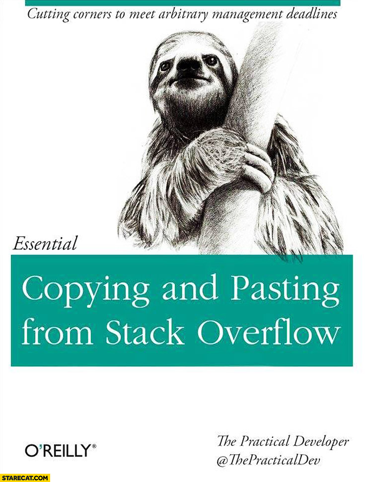

<!--Define background image for title slide-->
<style>
.title-slide {
  background-image:url("assets/img/animal.jpg");
  background-size: cover;
}
</style>

<footer>
  <hr></hr>
  <span style="float:right">R Programming</span>
</footer>

<h2>Welcome back!</h2>

<center></center>

--- .toc_slide &twocol

<footer>
  <hr></hr>
  <span style="float:right">R Programming</span>
</footer>

<h2>Contents</h2>

*** =left

<b class="toc_header"> Review and Catchup </b>
<ol class="toc" type="none">
    <li> Quiz 1 Review <span style="float:right"> 6 </span></li>
</ol>

<b class="toc_header"> Functions </b>
<ol class="toc" type="none">
    <li> Intro to Functional Programming <span style="float:right"> 8 </span></li>
    <li> Intro to Functional Positional and Keyword Arguments <span style="float:right"> 9 </span></li>
    <li> Required and Default Arguments <span style="float:right"> 10-11 </span></li>
    <li> Functions That Return Stuff <span style="float:right"> 12 </span></li>
    <li> Functions That Return Nothing <span style="float:right"> 13 </span></li>
    <li> Scoping <span style="float:right"> 14 </span></li>
    <li> The "apply" family of functions <span style="float:right"> 15-17 </span></li>
</ol>

*** =right

<b class="toc_header"> Debugging Strategies </b>
<ol class = "toc">
    <li> Print Debugging <span style="float:right"> 19 </span></li>
    <li> Googling Around <span style="float:right"> 20-21 </span></li>
    <li> Stack Overflow <span style="float:right"> 22 </span></li>
    <li> Building an MWE  <span style="float:right"> 23 </span></li>
    <li> Built-in Docs with "?" <span style="float:right"> 24 </span></li>
    <li> Package Vignettes <span style="float:right"> 25 </span></li>
    <li> Looking at Source Code <span style="float:right"> 26 </span></li>
</ol>

--- .toc_slide &twocol

<footer>
  <hr></hr>
  <span style="float:right"> R Programming </span>
</footer>

<h2>Contents</h2>

*** =left

<b class="toc_header"> Using External Packages </b>
<ol class="toc" type="none">
    <li> Loading Installed Packages <span style="float:right"> 28 </span></li>
    <li> Installing from CRAN <span style="float:right"> 29 </span></li>
    <li> Installing from GitHub <span style="float:right"> 30 </span></li>
    <li> Installing Local Code <span style="float:right"> 31 </span></li>
    <li> Namespacing Calls <span style="float:right"> 32 </span></li>
    <li> library() vs. require() <span style="float:right"> 33 </span></li>
    <li> Using Local Code with source() <span style="float:right"> 34 </span></li>
</ol>

*** =right

<b class="toc_header"> Working with Files </b>
<ol class = "toc" type="none">
    <li> File Paths <span style="float:right"> 36-37 </span></li>
    <li> Downloading files from the internet <span style="float:right"> 38 </span></li>
    <li> Delimited Files <span style="float:right"> 39 </span></li>
    <li> CSV <span style="float:right"> 40 </span></li>
    <li> Excel <span style="float:right"> 41 </span></li>
    <li> JSON <span style="float:right"> 42 </span></li>
    <li> Unstructured Text Files <span style="float:right"> 43 </span></li>
</ol>

<b class="toc_header"> Additional Resources </b>
<ol class="toc" type="none">
    <li> Learning More on Your Own <span style="float:right"> 45 </span></li>
</ol>

--- .section_slide

</br></br></br>
<h2>Review and Catchup</h2>

--- .content_slide

<footer>
  <hr>
    Review and Catchup<span style="float:right">R Programming</span>
</footer>

<h2>Quiz 1 Review</h2>

I will show the questions from quiz 1 that some students struggled with. Not including them in these slides in case I teach the course again in the future.

If you're arriving at this slide and are disappointed not to find quiz answers, I'm sorry but I'll at least give you this bit of entertainment. Go check out [A Day in the Life of Americans](https://flowingdata.com/2015/12/15/a-day-in-the-life-of-americans/)

--- .section_slide

</br></br></br>
<h2>Functions</h2>

--- .content_slide

<footer>
  <hr>
  Functions<span style="float:right">R Programming</span>
</footer>

<h2>Intro to Functional Programming</h2>

R is a [functional programming language](http://adv-r.had.co.nz/Functions.html). To write powerful, concise code, you'll need to master the use and creation of functions.

> "If you find yourself copying and pasting the same code more than twice, it's time to write a function." - Hadley Wickham


```{r functionExample, eval = FALSE}
# Function to return only the numbers smaller than 10
nums <- c(1, 3, 4, 8, 13, 24)

getLittleNumbers <- function(some_numbahs){
    lil_ones <- some_numbahs[some_numbahs < 10]
    return(lil_ones)
}

getLittleNumbers(nums)
```

--- .content_slide

<footer>
  <hr>
  Functions<span style="float:right">R Programming</span>
</footer>

<h2>Positional and Keyword Arguments</h2>

When you call a function with arguments in R, you can provide those arguments two ways:

* "positional" = based on the order
* "keyword" = matching a specific argument by name

```{r argExample, eval = FALSE, echo = TRUE}
# all positional
rnorm(10, 0, 0.5)

# all keyword
rnorm(n = 10, mean = 0, sd = 0.5)

# mix
rnorm(10, mean = 0, sd = 0.5)
```

--- .content_slide

<footer>
  <hr>
  Functions<span style="float:right">R Programming</span>
</footer>

<h2>Required Arguments</h2>

- R functions take 0 or more arguments...basically named variables that the function uses to do it's work
- Take a look at `?sqrt`. You'll see that it takes one argument, named `x`. You can pass any vector of numeric values to this argument and `sqrt()` will return the square root of each element
- In this case, we'd say `x` is a *required argument* of `sqrt()`

```{r requiredArgs, eval = FALSE}
# Take the square root of a vector of numbers
sqrt(x = c(1, 4, 9, 16, 25))

# Note that calling this function without the argument will throw an error!
sqrt()
### Error in sqrt(): 0 arguments passed to `sqrt` which requires 1
```

--- .content_slide

<footer>
  <hr>
  Functions<span style="float:right">R Programming</span>
</footer>

<h2>Default Argument Values</h2>

- For more complicated functions, passing values to each argument can get burdensome
- To handle this, R allows function authors to specify *default arguments*. These are values that certain arguments will take automatically unless you decide to overwrite them
- Example: look at `?rnorm`. You'll see that this function's signature reads `rnorm(n, mean = 0, sd = 1)`.

```{r normalDraw}
# 100 random draws from a normal distribution w/ mean 0 and standard deviation 1
rand_nums <- rnorm(n = 100)

# 100 random draws from a normal distribution w/ mean 4.5 and standard deviation 1
rand_nums <- rnorm(n = 100, mean = 4.5)
```

--- .content_slide

<footer>
  <hr>
    Functions<span style="float:right">R Programming</span>
</footer>

<h2>Functions That Return Stuff</h2>

As you've seen in previous examples, the R special word `return` tells a function to "give back" some value. When you execute an expression like `x <- someFunction()`, that function's return value (an R object) is stored in a variable called "x".

Unlike in some other programming languages, R allows you to use multiple `return` values inside the body of a function. The first time that the code inside the function reaches a `return` value, it will pass that value back out of the function and immediately stop executing the function.

<br>

See ["Functions That Return Stuff"](../code/programming-supplement.html#Functions_That_Return_Stuff) in the programming supplement.

--- .content_slide

<footer>
  <hr>
    Functions<span style="float:right">R Programming</span>
</footer>

<h2>Functions That Return Nothing</h2>

Not all functions have to return something! Sometimes you may want to create a function that just has some side effect like creating a plot, writing to a file, or print to the console.

These are called "null functions" and they're common in scripting languages like R. By default, these functions return the R special value `NULL`.

```{r nullFunc, eval = FALSE}
printSentence <- function(theSentence){
    words <- strsplit(x = theSentence, split = " ")
    for (word in words){
        print(word)
    }
}

# Assigning to an object is irrelevant...this function doesn't return anything
x <- printSentence("Hip means to know, it's a form of intelligence")
x
```

--- .content_slide

<footer>
  <hr>
    Functions<span style="float:right">R Programming</span>
</footer>

<h2>Scoping</h2>

Remember when we talked about namespaces and how R searches for objects? It's time to extend that logic to functions...which is where things get a bit weird and hard to understand.

R uses a search technique called [lexical scoping](http://bit.ly/2DlfkDi)

<br>

See ["Scoping"](../code/programming-supplement.html#Scoping) in the programming supplement.

--- .content_slide

<footer>
  <hr>
    Functions<span style="float:right">R Programming</span>
</footer>

<h2>Looping with lapply()</h2>

R's `*apply` family of functions are a bit difficult to understand at first, but soon you'll come to love them. They make your code more expressive, flexible, and parallelizable (more on that final point later). One of the most popular is `lapply()` ("list apply"), which loops over a thing (e.g. vector, list) and returns a 1-level list. Let's try it out:

```{r lapplyExample, eval = FALSE}
data("ChickWeight")
weights <- ChickWeight$weight

# Loop over and encode "above mean" and "below mean"
the_mean <- mean(weights)
meanCheck <- function(val, ref_mean){
    if (val > ref_mean){return("above mean")}
    if (val < ref_mean){return("below mean")}
    return("equal to the mean")
}
check_vec <- lapply(weights, FUN = function(x){meanCheck(val = x, ref_mean = the_mean)})
```

--- .content_slide

<footer>
  <hr>
    Functions<span style="float:right">R Programming</span>
</footer>

<h2>Looping with sapply()</h2>

On the previous slide, you saw how to loop over a vector/list and get back a list of function results. This may not be appropriate for some settings. Remember that you cannot execute statistical operations like `mean()` over a list. For that, we'd probably prefer to have a *vector* of results. This is where R's `sapply()` ("simplified apply") comes in. `sapply()` works the same way that `lapply()` does but returns a vector. Try it for yourself:

```{r sapplyExample, eval = FALSE}
data("ChickWeight")
weights <- ChickWeight$weight

# Loop over and encode "above mean" and "below mean"
the_mean <- mean(weights)
meanCheck <- function(val, ref_mean){
    if (val > ref_mean){return("above mean")}
    if (val < ref_mean){return("below mean")}
    return("equal to the mean")
}
check_vec <- sapply(weights, FUN = function(x){meanCheck(val = x, ref_mean = the_mean)})
```

--- .content_slide

<footer>
  <hr>
    Functions<span style="float:right">R Programming</span>
</footer>

<h2>Looping with apply()</h2>

When analyzing real-world datasets, you may want to use the same looping convention we've been discussing, but apply it over many items and the get some summary (such as the median) of the results. This is where R's `apply()` function comes in! Check it out

```{r applyExample, eval = FALSE}
data("ChickWeight")

# Calculate column-wise range
apply(ChickWeight, MARGIN = 2, FUN = function(x){range(as.numeric(x))})

# Calculate row-wise range
apply(ChickWeight, MARGIN = 1, FUN = function(blah){range(as.numeric(blah))})
```

--- .section_slide

</br></br></br>
<h2>Debugging Strategies</h2>

--- .content_slide

<footer>
  <hr>
    Debugging Strategies<span style="float:right">R Programming</span>
</footer>

<h2>Print Debugging</h2>

As you've probably already learned, writing code involves a never-ending process of trying this, fixing errors, trying other things, fixing new errors, etc. The process of identifying and fixing errors/bugs is called **debugging**.

The simplest way to debug an issue in your code is to use **print debugging**. This approach involves forming expectations about the state of the objects in your environment at each point in your code, then printing those states at each point to find where things broke.

Please see ["Print Debugging"](../code/programming-supplement.html#Print_Debugging) in the programming supplement for an example of this approach.

--- .content_slide

<footer>
  <hr>
    Debugging Strategies<span style="float:right">R Programming</span>
</footer>

<h2>Googling Around</h2>

The second most popular debugging strategy:

<center></center>

--- .content_slide

<footer>
  <hr>
    Debugging Strategies<span style="float:right">R Programming</span>
</footer>

<h2>Googling Around (continued)</h2>

But really...Google is your best friend. It will be particularly useful in the cases where your code is returning an error or warning. Simple pasting that output into google (in quotes to get an exact match) will typically get you to an answer within 5 minutes.

Let's try an example.

<br>

Imagine that you got this error:

`Error in sum(c(1, 2, "5")) : invalid 'type' (character) of argument`.

Try to figure out what went wrong. HINT: it often helps to type the function name outside quotes. e.g. `function "this is some error text"`

--- .content_slide

<footer>
  <hr>
    Debugging Strategies<span style="float:right">R Programming</span>
</footer>

<h2>Stack Overflow</h2>

You'll find yourself at http://stackoverflow.com/ REGULARLY.

<center></center>

--- .content_slide

<footer>
  <hr>
    Debugging Strategies<span style="float:right">R Programming</span>
</footer>

<h2>Building an MWE</h2>

If print debugging doesn't work, you may want to ask someone (a colleague, a package author, your teach) for help in debugging the issue. Before asking for someone's help, you owe it to them to try to reduce the problem to a **Minimum Working Example (MWE)**, the simplest possible code that reproduces the error.

* [this is bad](https://github.com/uptake/uptasticsearch/issues/140)
* [this is good](https://github.com/uptake/pkgnet/issues/70)

<br>

In many instances, you'll find that just doing this exercise will reveal the problem before you even have to ask for anyone's help.

<br>

For more on building an MWE, see: [the Stack Overflow guidelines on MWE construction](http://stackoverflow.com/help/mcve)

--- .content_slide

<footer>
  <hr>
    Debugging Strategies<span style="float:right">R Programming</span>
</footer>

<h2>Built-in Docs with "?"</h2>

As we've covered before, R packages have a built-in documentation system. All packages submitted to CRAN must supply some basic documentation for each function they contain. If a function is behaving strangely, it's often useful to look at the documentation under `?function_name`.

For example, you may be surprised to learn that `sum(c(1,2,NA,3))` evaluates to `NA`. You might have thought it would be 6. If we call `?sum` in R, you'll see the answer...the default behavior of this function is to leave `NA` values in when calculating the sum, but there is an option argument `na.rm` that allows you to remove them if you wish.

Many IDEs (including RStudio) offer automatic [code completion](https://support.rstudio.com/hc/en-us/articles/205273297-Code-Completion) that will suggest these other arguments in the UI as you type!

--- .content_slide

<footer>
  <hr>
    Debugging Strategies<span style="float:right">R Programming</span>
</footer>

<h2>Package Vignettes</h2>

So far, we've talked about cases where you know exactly which functions are behaving strangely and want to just learn more about their behavior. But what about fuzzier cases where you just want to figure out what other functionality a package has? At least one source for this information is the package vignettes.

<br>

Let's take a look at the online documentation for the `{stringr}` package:

- CRAN docs: https://cran.r-project.org/web/packages/stringr/index.html
- package vignette: https://cran.r-project.org/web/packages/stringr/stringr.pdf

--- .content_slide

<footer>
  <hr>
    Debugging Strategies<span style="float:right">R Programming</span>
</footer>

<h2>Looking at Source Code</h2>

If you try all the strategies we just discussed and STILL don't know why your code isn't working, there is at least one option left to you: look at the source code! Recall the following facts:

- R is open-source, which means that all R source code can be found online (typically on GitHub) and visually inspected
- Errors thrown by programs are not magical...they had to be written into the source code by a developer

For example, let's search for the error: `each element of valids must have a name` in the `{lightgbm}` source code. Please visit:

https://github.com/microsoft/LightGBM

--- .section_slide

</br></br></br>
<h2>Installing and Using External Packages</h2>

--- .content_slide

<footer>
  <hr>
    Using External Packages<span style="float:right">R Programming</span>
</footer>

<h2>Loading Installed Packages</h2>

As you advance in R, you will find that the functions provided by packages like `{base}`, `{stats}`, and `{utils}` are not sufficient. For example, you may want to use `{rbokeh}` to make interactive plots.

```{r makePlots, echo = TRUE, eval = FALSE, message = FALSE, warning = FALSE}
# Load dependencies
library(data.table); library(quantmod); library(rbokeh);

# Get data and plot it
quantmod::getSymbols('CPIAUCSL', src = 'FRED', auto.assign = TRUE)
cpiDT <- data.table::data.table(CPIAUCSL, keep.rownames = TRUE)

# Plot it!
rbokeh::figure(data = cpiDT, title = "U.S. CPI",
               ylab = "Index (1982-1984 = 100)", xlab = "date") %>%
        ly_lines(x = cpiDT$index, y = cpiDT$CPIAUCSL, color = "blue")
```

--- .content_slide

<footer>
  <hr>
    Using External Packages<span style="float:right">R Programming</span>
</footer>

<h2>Installing from CRAN</h2>

**[CRAN](https://cran.r-project.org/)**, "The Comprehensive R Archive Network", is the main server from which you'll download external packages. It provides an easy framework for distributing code (way better than passing around hundreds of links to GitHub repos).

To download and install packages, do the following:

```{r cranInstall, eval = FALSE, echo = TRUE, message = FALSE, warning = FALSE}
# Install packages + their dependencies with install.packages()
install.packages(c("data.table", "jsonlite"),
                 dependencies = c("Depends", "Imports"))

# Load package namespace with library()
library(data.table)

# (A few months later...) Check CRAN for new versions of your packages
utils::update.packages()
```

--- .content_slide

<footer>
  <hr>
    Using External Packages<span style="float:right">R Programming</span>
</footer>

<h2>Installing from GitHub</h2>

While there are [many many packages available from CRAN](https://cran.r-project.org/), you may sometimes want to install directly from a source control site like GitHub. R developers will often release bleeding-edge ("dev") features on GitHub before they make it to CRAN.

```{r ghInstall, eval = FALSE, echo = TRUE, message = FALSE, warning = FALSE}
# Load deps
library(remotes)

# Install from GitHub
remotes::install_github("terrytangyuan/dml")

# Check where R put this package on your machine
find.package("dml")
```

--- .content_slide

<footer>
  <hr>
    Using External Packages<span style="float:right">R Programming</span>
</footer>

<h2>Installing Local Code</h2>

On professional data science teams, you may find yourself passing around R packages on an internal file system.
    - see, for example: ["Using R packages and education to scale Data Science at Airbnb"](https://medium.com/airbnb-engineering/using-r-packages-and-education-to-scale-data-science-at-airbnb-906faa58e12d#.c3qbgjtdr)

To install R packages sitting on your file system, you can use `install_local()` from the `{remotes}` package.

<center><a href="https://hilaryparker.com/2014/04/29/writing-an-r-package-from-scratch/"></a></center>

```{r install_local, eval = FALSE, echo = TRUE, warning = FALSE, message = FALSE}
remotes::install_local(path = "path/to/package")
```

--- .content_slide

<footer>
  <hr>
    Using External Packages<span style="float:right">R Programming</span>
</footer>

<h2>Namespacing Calls</h2>

You may have noticed that I use `::` frequently in my code. Remember when we used `search()` to print the ordered list of namespaces that R searches for objects? `::` is used to circumvent this process. `lubridate::ymd_hms()` tells R *"Use the function ymd_hms from the 'lubridate' package"*

Without namespacing, R will search through the list of namespaces until it finds what it wants. When you load a new package that has a function with the same name as one already loaded in your session, R will warn you that that version has been "masked".

```{r eval = FALSE, echo = TRUE, warning = TRUE}
library(lubridate)
```

```
Attaching package: 'lubridate'

The following object is masked from 'package:base':

    date
```

--- .content_slide

<footer>
  <hr>
    Using External Packages<span style="float:right">R Programming</span>
</footer>

<h2>library() vs. require()</h2>

In this course, I've been using the `library()` command to load package namespaces. If you look around online, you will probably see many examples where people use `require()` instead.

**what's the difference?**
- `library()` is used in scripts. It will throw an *error* if you do not have the package
- `require()` is used in functions. It will throw a *warning* if you don't have the package
- <TEXT COLOR="red">Errors</TEXT> will break your code immediately, while <TEXT COLOR="purple">warnings</TEXT> will print a note but allow the code to keep running

```{r library_v_require, eval = FALSE, echo = TRUE, warning = FALSE, message = FALSE, error = TRUE}
library(some_package_that_does_not_exist)

my_func <- function(n){
    require(some_package_that_does_not_exist)
    return("JaVale McGee!!!!")
}
```

--- .content_slide &twocol

<footer>
  <hr>
    Using External Packages<span style="float:right">R Programming</span>
</footer>

<h2>Using Local Code with source()</h2>

There is one other option we have not discussed yet, in part because it doesn't technically involve the use of packages. Many analysts working in R prefer to define a file with their function and use `source()` to make those functions available to other scripts.

<br>

**my_script.R**

```{r echo = TRUE, eval = FALSE}
# load function
source("helper_functions.R")

myData <- createRandomData(100, "norm")

head(myData)
```

See ["Sourcing Helper Functions"](../code/programming-supplement.html#Sourcing_Helper_Functions) in the programming supplement for an example.

--- .section_slide

</br></br></br>
<h2>Working with Files</h2>

--- .content_slide

<footer>
  <hr>
    Working with Files<span style="float:right">R Programming</span>
</footer>

<h2>File Paths</h2>

Whenever you find yourself reading data into R or writing data out of it, you will need to work with file paths. File paths are just addresses on your computer's file system. These paths can either be *relative* (expressed as steps above/below your current location) or *absolute* (full addresses).

All relative paths in R are relative to your **working directory**, a single location that you can set and reset any time in your session.

<br>

**relative path**: `"file.txt"`

**absolute path**: `"/Users/jlamb/repos/some-project/data/file.txt"`

<br>

<br>

See ["File Paths"](../code/programming-supplement.html#Working_with_Files) in the programming supplement.

--- .content_slide

<footer>
  <hr>
    Working with Files<span style="float:right">R Programming</span>
</footer>

<h2>File Paths</h2>

R provides a few other utilities for working with file paths and directory structures.

<br>

* `file.path()`: create a filepath from multiple parts
* `file.exists()`: returns `TRUE` is a file exists and  `FALSE` if it doesn't
* `list.files()`: get a character vector with names of all files found in a directory
* `dir.exists()`: returns `TRUE` is a directory exists and  `FALSE` if it doesn't
* `dir.create()`: create a new directory

<br>

See ["File Paths"](../code/programming-supplement.html#Working_with_Files) in the programming supplement.

--- .content_slide

<footer>
  <hr>
    Working with Files<span style="float:right">R Programming</span>
</footer>

<h2>Downloading files from the internet</h2>

To download files hosted on the internet, you can use `download.file()`.

```{r, eval = FALSE, echo = TRUE}
iris_url <- paste(
    c(
         "https://raw.githubusercontent.com/jameslamb"
        , "teaching/main/mu_rprog/sample-data"
        , "iris.csv"
    )
    , collapse = "/"
)

download.file(
  url = iris_url
  , destfile = "iris.csv"
)
```

--- .content_slide

<footer>
  <hr>
    Working with Files<span style="float:right">R Programming</span>
</footer>

<h2>Delimited Files</h2>

Out in the wild, one of the most common types of flat file you will find is a delimited file. In these files, bits of data are separated by a common character ("delimiter"). Common types include comma separated values (CSV), tab-separated values, and space-delimited. When these files are opened by a program like R, SAS, or Excel, those programs can figure out what the delimiter is and use it to split data into columns.

* Download some stock data from Quandl
  - https://www.quandl.com/api/v3/datasets/WIKI/AAPL.csv
* Navigate to wherever you stored the file
* Right click on the file, and use "Open With" to open it with a text editor like Sublime or Notepad

--- .content_slide

<footer>
  <hr>
    Working with Files<span style="float:right">R Programming</span>
</footer>

<h2>CSV</h2>

CSV ("comma-separated values") is a really common format to share small datasets because it is just a text file, and can be ready by many different types of programs. R has several options for reading this type of file.

* `read.csv()`: base R function for reading CSVs into a `data.frame`
* `read.delim()`: similar to `read.csv()`, but can read files with any delimiter
* `arrow::read_csv_arrow()`: fast CSV reader using a high-performance data frame library called Apache Arrow
* `data.table::fread()`: super-fast CSV reader that creates a special type of `data.frame` called a `data.table`
* `readr::read_csv()`: CSV reader from RStudio

<br>

See ["CSV"](../code/programming-supplement.html#CSV) in the programming supplement for an example of working with CSVs.

--- .content_slide

<footer>
  <hr>
    Working with Files<span style="float:right">R Programming</span>
</footer>

<h2>Excel</h2>

In the Economics / Business world (and many other areas!), Microsoft Excel is pretty much unavoidable. You'll get data from the internet, your colleagues, clients, etc. in Excel format and may want to work with it in R.

There are a few packages for reading (and writing!) Excel files.

* `{openxlsx}`
* `{readxl}`
* `{xlsx}`

<br>

See ["Excel"](../code/programming-supplement.html#Excel) in the programming supplement for an example with `{openxlsx}`.

--- .content_slide

<footer>
  <hr>
    Working with Files<span style="float:right">R Programming</span>
</footer>

<h2>JSON</h2>

JSON ("Javascript Object Notation") is a standard format for "semi-structured" or "nested" data. It's a plain-text format that can be used by many programs and programming languages.

<br>

```json
{
  "status": 200,
  "data": [
    {"customer_name": "Lupe", "purchases": 10},
    {"customer_name": "Wale", "purchases": 30}
  ]
}
```

<br>

This type of data is commonly represented as an R `list`. See the ["JSON"](../code/programming-supplement.html#JSON) in the programming supplement for an example using some JSON data describing a tweet.

--- .content_slide

<footer>
  <hr>
    Working with Files<span style="float:right">R Programming</span>
</footer>

<h2>Unstructured Text Files</h2>

Text files that are "unstructured" don't cleanly map to an R data structure like a data frame, matrix, or list. An example might be a collection of court transcripts.

Working with these types of files typically involves reading them into R line-by line and then using something called [regular expression](https://stat.ethz.ch/R-manual/R-devel/library/base/html/regex.html) (basically just pattern-matching on strings) to extract relevant features like word counts. For example:

See ["Unstructured Text Files"](../code/programming-supplement.html##Unstructured_Text_files) in the programming supplement for some hands-on experience with this approach.

--- .section_slide

</br></br></br>
<h2>Additional Resources</h2>

--- .content_slide &twocol

<footer>
  <hr>
  Additional Resources<span style="float:right">R Programming</span>
</footer>

<h2>Learning More on Your Own</h2>

See the links below to learn more about some of the topics we covered this week

**Debugging R code**: [RStudio debug mode](https://support.rstudio.com/hc/en-us/articles/205612627-Debugging-with-RStudio) | [R-bloggers](https://www.r-bloggers.com/debugging-in-r/) | [Stack Overflow](http://stackoverflow.com/questions/4442518/general-suggestions-for-debugging-in-r)

**External R Packages**: [econometrics packages](https://cran.r-project.org/web/views/Econometrics.html) | [finance packages](https://cran.r-project.org/web/views/Finance.html) | [time series packages](https://cran.r-project.org/web/views/TimeSeries.html)

**Lexical Scoping**: [JHU Coursera](https://www.coursera.org/learn/r-programming/lecture/FkTgn/scoping-rules-r-scoping-rules)
