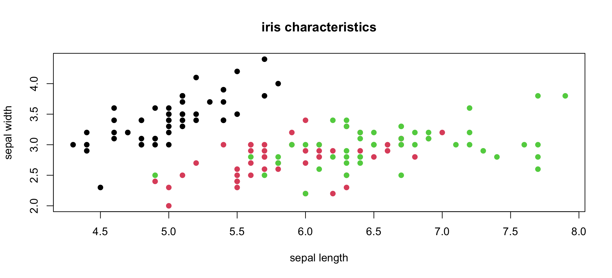
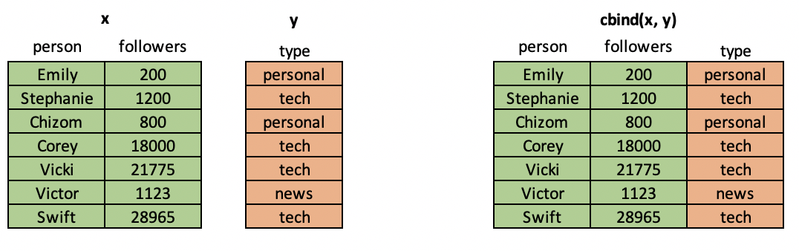
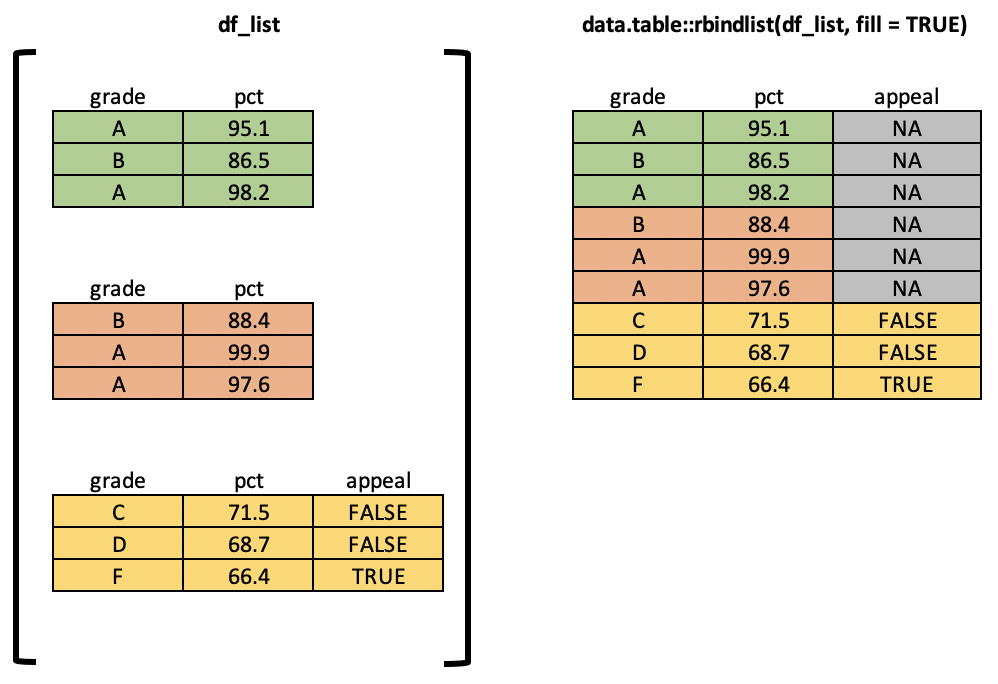

<!--Define background image for title slide-->
<style>
.title-slide {
  background-image:url("assets/img/statler-waldorf.jpeg");
  background-size: cover;
}
</style>

<footer>
  <hr></hr>
  <span style="float:right">R Programming</span>
</footer>

<h2>Welcome back!</h2>

<center></center>

--- .toc_slide &twocol

<footer>
  <hr></hr>
  <span style="float:right">R Programming</span>
</footer>

<h2>Contents</h2>

*** =left

<b class="toc_header"> Programming Assignment 1 Review</b>
<ol class="toc" type="none">
    <li> In-class Walkthrough <span style="float:right"> 5 </span></li>
</ol>

<b class="toc_header"> Dealing with Missing Data </b>
<ol class = "toc" type="none">
    <li> Specialness of NAs <span style="float:right"> 7 </span></li>
    <li> You Should Care About NA s<span style="float:right"> 8 </span></li>
    <li> Strategy 1: Total Eradication <span style="float:right"> 9 </span></li>
    <li> Strategy 2: Handle on Subsets <span style="float:right"> 10 </span></li>
    <li> Strategy 3: Imputation <span style="float:right"> 11 </span></li>
</ol>

*** =right

<b class="toc_header"> Visualizing Data </b>
<ol class = "toc" type="none">
    <li> Base Plotting System <span style="float:right"> 13-17 </span></li>
    <li> Other Plotting Systems in R <span style="float:right"> 18 </span></li>
    <li> Graphics Devices <span style="float:right"> 19 </span></li>
</ol>

<b class="toc_header"> Combining and Transforming Data Frames</b>
<ol class = "toc" type="none">
    <li> Columnwise Combination <span style="float:right"> 21-22 </span></li>
    <li> Rowwise Combination <span style="float:right"> 23-24 </span></li>
</ol>

<b class="toc_header"> Final Project Discussion </b>
<ol class = "toc" type="none">
    <li> Project Proposal Guidelines <span style="float:right"> 26 </span></li>
    <li> Final Project Outline <span style="float:right"> 27 </span></li>
</ol>

--- .section_slide

</br></br></br>
<h2>Programming Assignment 1 Review</h2>

--- .content_slide

<footer>
  <hr>
    Programming Assignment 1 Review <span style="float:right">R Programming</span>
</footer>

<h2>Assignment 1 Discussion</h2>

IMHO, [this assignment](../assignments/programming_assignment1.html) was the single hardest thing you'll be asked to do in this class.

<center></center>

--- .section_slide

</br></br></br>
<h2>Dealing with Missing Data</h2>

--- .content_slide

<footer>
  <hr>
    Dealing with Missing Data<span style="float:right">R Programming</span>
</footer>

<h2>Specialness of NAs</h2>

`NA` is a special object in R, used to capture the idea of "a value whose value is unknown".
See `?NA` for R's documentation on the nuances of `NA`

```{r introToNAs, eval - FALSE, echo = TRUE}
# Create a vector w/ missing data
some_nums <- c(1,2,NA, 6, NA, 8)
print(some_nums)

# Use is.na() to get a vector of TRUE/FALSE for the question "is this element NA?"
is.na(some_nums)

# Confirm that even w/ NAs, R still knows this is a numeric vector
class(some_nums)
```

--- .content_slide

<footer>
  <hr>
    Dealing with Missing Data<span style="float:right">R Programming</span>
</footer>

<h2>You Should Care About NAs</h2>

`NA` values are not necessarily problems!

NA` can actually hold valuable information. For example, imagine that you get a dump of data from Salesforce or some other CRM system with information like customer_name, date_of_first_contact, and date_of_second_contact.

<br>

Depending on how the system was set up, `date_of_second_contact1` may have dates only for customers who have been contacted at least twice, and be `NA` everywhere else. This is valuable information! If you want to build a model of 1-contact conversion, you could use the presence/absence of `NA` to help you identify the 1-contact customers that belong in your model.

--- .content_slide

<footer>
  <hr>
    Dealing with Missing Data<span style="float:right">R Programming</span>
</footer>

<h2>Strategy 1: Total Removal</h2>

The first approach you may take to dealing with `NA` values is to simply drop them from your data. If you don't think these missing data have any business value and your dataset is big enough that you can afford to drop some rows / columns, this is the right move for you.

```{r removeNAs, echo = TRUE, eval = FALSE}
# Removing NAs for vectors
top5 <- c("Wale", "Chance", NA, "Lupe Fiasco", "Shad", "Kanye", NA)
print(top5)
top5cleaned <- top5[!is.na(top5)]
print(top5cleaned)

# Removing rows with ANY NAs for data.frames
myDF <- data.frame(x = c(1, 2, NA, 4), y = c(NA, TRUE, FALSE, TRUE),
                   z = c("hey", "there", NA, "friends"))
cleanDF <- myDF[complete.cases(myDF), ]
```

--- .content_slide

<footer>
  <hr>
    Dealing with Missing Data<span style="float:right">R Programming</span>
</footer>

<h2>Strategy 2: Handle on Subsets</h2>

You may find the "remove all the NAs everywhere" strategy a bit too aggressive for your use case. If you have a 100-variable dataset and a single variable (column) is 90\% NA values, do you really want to drop every row where that variable is NA? A better approach might be to selectively subset out columns where missing values are most severe before using `complete.cases()` to remove rows.

```{r subsetNAwisely, echo = TRUE, eval = FALSE}
# Create a data frame where some variable have more NAs than others
testDF <- data.frame(var1 = sample(c(rnorm(99), NA), 200, replace = TRUE),
                     var2 = sample(c(rnorm(50), rep(NA, 50)), 200, replace = TRUE),
                     var3 = sample(c(rnorm(5), rep(NA, 95)), 200, replace = TRUE))

# Find columns that are more than 90% missing values
.percent_na <- function(a_vector){return(sum(is.na(a_vector)/length(a_vector)))}
colsToDrop <- apply(testDF, MARGIN = 2, .percent_na) > 0.9
cleanDF <- testDF[, !colsToDrop]

# Remove rows w/ remaining NAs
cleanDF <- cleanDF[complete.cases(cleanDF),]
```

--- .content_slide

<footer>
  <hr>
    Dealing with Missing Data<span style="float:right">R Programming</span>
</footer>

<h2>Strategy 3: Imputation</h2>

A final strategy, particularly useful in modeling contexts, is to use some [imputation strategy](https://www.analyticsvidhya.com/blog/2016/03/tutorial-powerful-packages-imputing-missing-values/) to replace `NA` values with reasonable alternatives. One common approach (and my favorite), the `roughfix` method. It works like this:
- For numeric columns, replace NAs with the column median
- For categorical columns, replace NAs with the most common value

```{r imputation, eval = FALSE, echo = TRUE}
# Create a data frame where some variable have more NAs than others
testDF <- data.frame(var1 = sample(c(rnorm(99), NA), 500, replace = TRUE),
                     var2 = sample(c(rnorm(70), rep(NA, 30)), 500, replace = TRUE),
                     var3 = sample(c(rnorm(85), rep(NA, 15)), 500, replace = TRUE))

# Clean up w/ roughfix
library(randomForest)
cleanDF <- randomForest::na.roughfix(testDF)
```

--- .section_slide

</br></br></br>
<h2>Visualizing Data</h2>

--- .content_slide

<footer>
  <hr>
    Visualizing Data<span style="float:right">R Programming</span>
</footer>

<h2>Base Plotting System</h2>

R's built-in plotting tools, called "the base plotting system", is one of its most popular features.

<br>

The essential idea of the base plotting system is to build up plots in layers. You first create a simple plot, then "add on" a legend, more variables, other plot types, etc.

See ["The Base Plotting System"](../code/programming-supplement.html#The_Base_Plotting_System) in the programming supplement.

--- .content_slide

<footer>
  <hr>
    Visualizing Data<span style="float:right">R Programming</span>
</footer>

<h2>Creating a Scatter Plot</h2>

Let's start with a simple scatter plot to answer the question *are sepal length and sepal width related?*

<center></center>

See ["The Base Plotting System"](../code/programming-supplement.html#The_Base_Plotting_System) in the programming supplement.

--- .content_slide

<footer>
  <hr>
    Visualizing Data<span style="float:right">R Programming</span>
</footer>

<h2>Histograms and Densities</h2>

Histograms and densities are useful for examining distributions.

<center></center>

See ["The Base Plotting System"](../code/programming-supplement.html#The_Base_Plotting_System) in the programming supplement.

--- .content_slide

<footer>
  <hr>
    Visualizing Data<span style="float:right">R Programming</span>
</footer>

<h2>Multi-variable line charts</h2>

You can add more than one variable to these plots!

<center></center>

--- .content_slide

<footer>
  <hr>
    Visualizing Data<span style="float:right">R Programming</span>
</footer>

<h2>Creating a Grid of plots</h2>

You can combine multiple plots in a grid layout. See ["The Base Plotting System"](../code/programming-supplement.html#The_Base_Plotting_System) for an example.

<center></center>

--- .content_slide

<footer>
  <hr>
    Visualizing Data<span style="float:right">R Programming</span>
</footer>

<h2>Other Plotting Systems in R</h2>

We don't have time in this short class to go into great depth on data visualization, but I want you to know that there are a bunch of cool visualization libraries a short `install.packages()` away!

- [dygraphs](https://rstudio.github.io/dygraphs/): high-level library for creating interactive charts that can be embedded directly in HTML
- [ggplot2](https://r-graph-gallery.com/ggplot2-package.html): One of the most popular packages in the R world. Based on the "grammar of graphics" approach to building plots
- [googleVis](https://cran.r-project.org/web/packages/googleVis/vignettes/googleVis_examples.html): Send your data to the google charts API to make fancy interactive visualizations
- [plotly](https://plotly.com/r/): easy-to-use library for creating interactive data visualizations and dashboards

--- .content_slide

<footer>
  <hr>
    Visualizing Data<span style="float:right">R Programming</span>
</footer>

<h2>A Note On Graphics Devices</h2>

When R (or any other program!) creates plots, it needs to know where to put them! When you call `plot()` or other commands from within and RStudio session, the default is to just display the resulting figure in the "Plots" pane. However, you can use other **graphics devices** (places to put visual output) to tell R to put your figures elsewhere.

<center></center>

--- .section_slide

</br></br></br>
<h2>Combining and Transforming Data Frames</h2>

--- .content_slide

<footer>
  <hr>
    Combining and Transforming Data Frames<span style="float:right">R Programming</span>
</footer>

<h2>Columnwise Combination With cbind</h2>

In situations where you have multiple data frames with the same rows but different columns, you can combine them column-wise with R's `cbind()` command. Note that this command will only work if the two data frames to be joined have the same number of rows AND those rows refer to the same observation.

**cbind = "column-wise bind"**

<center></center>

--- .content_slide

<footer>
  <hr>
    Combining and Transforming Data Frames<span style="float:right">R Programming</span>
</footer>

<h2>Column Matching with merge</h2>

It's common in data science workflows to have two mismatched tables of data from different sources and to want to combine them by matching on one or more keys. Think `JOIN` in SQL or `VLOOKUP` in Excel. To perform this operation in R, you can use the `merge()` command.

<center></center>

--- .content_slide

<footer>
  <hr>
    Combining and Transforming Data Frames<span style="float:right">R Programming</span>
</footer>

<h2>Rowwise Combination With rbind</h2>

So far we've talked about merging columns from different tables. But what if you want to merge rows? For example, imagine that you are a researcher in a lab studying some natural phenomenon. You may take multiple samples (measuring the same variables) and then want to put them together into a single data frame to build a model. For this case, we can use R's `rbind()` function.

**rbind = "row-wise bind"**

<center></center>

--- .content_slide

<footer>
  <hr>
    Combining and Transforming Data Frames<span style="float:right">R Programming</span>
</footer>

<h2>Rowwise Combination of Many Tables with rbindlist</h2>

What if you have 5 tables? 10? 1000? Use `data.table::rbindlist()`.

<center></center>

--- .section_slide

</br></br></br>
<h2>Final Project Discussion</h2>

--- .content_slide

<footer>
  <hr>
    Final Project Discussion<span style="float:right">R Programming</span>
</footer>

<h2>Your Final Project Proposal is Due in Week 4</h2>

**Choosing External Packages**

- You need to choose one data retrieval package, one statistics package, and one visualization package from [this list](../assignments/final_project_packages.md)
- Don't stress! You can do all of the following:
    - Change which packages you actually use in the final project
    - Use a package that isn't on the list (as long as you clear it with me)
    - Use more than just 3 external packages

**What Your Proposal Should Cover**
- What data set do you plan to use? Where can others find it? What variables does it contain?
- What is the question you're trying to answer?
- What packages do you plan to use?

--- .content_slide

<footer>
  <hr>
    Final Project Discussion<span style="float:right">R Programming</span>
</footer>

<h2>Your Final Project is Due in Week 5</h2>

- let's go through the [Final Project description](../assignments/final_project.html)

<center></center>

--- .section_slide

</br></br></br>
<h2>Additional Resources</h2>

--- .content_slide

<footer>
  <hr>
    Additional Resources<span style="float:right">R Programming</span>
</footer>

<h2>Additional Resources</h2>

**Plotting in R**: [graphics devices](https://stat.ethz.ch/R-manual/R-devel/library/grDevices/html/Devices.html)

**Paths:** [Relative vs absolute](http://www.geeksengine.com/article/absolute-relative-path.html) | [listing files in a directory in R](https://stat.ethz.ch/R-manual/R-devel/library/base/html/list.files.html)
