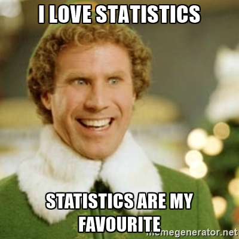
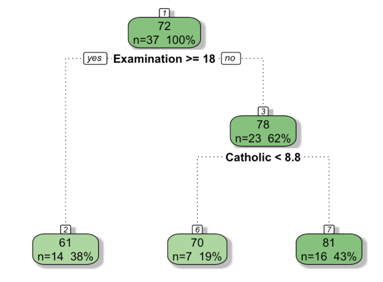
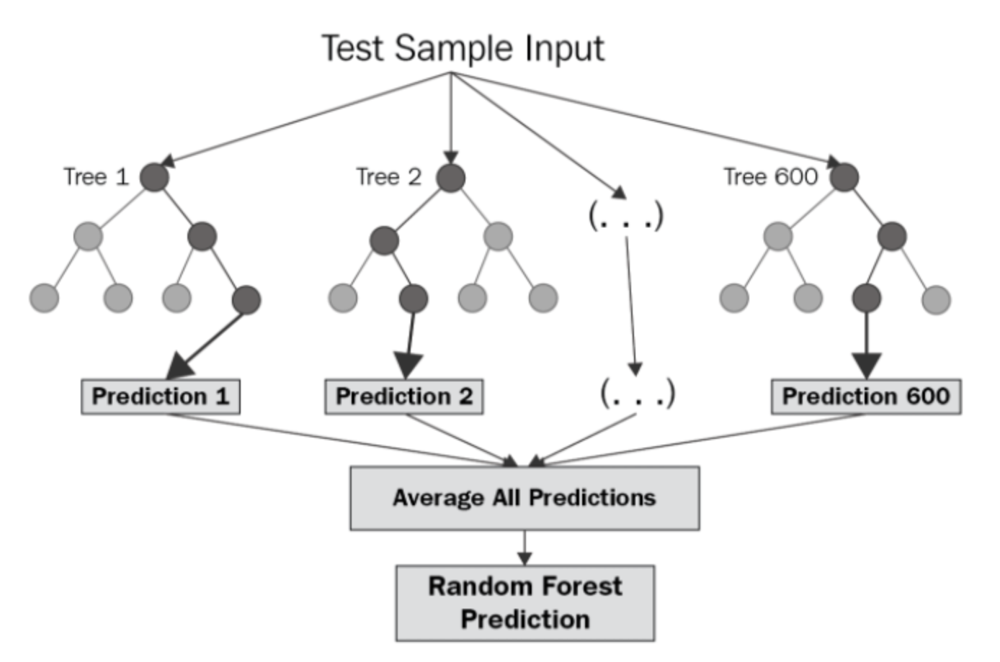
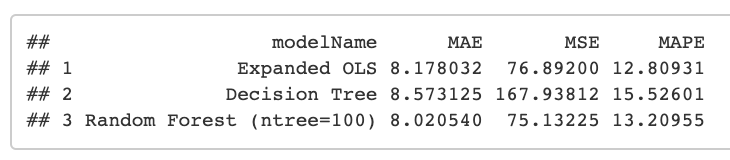
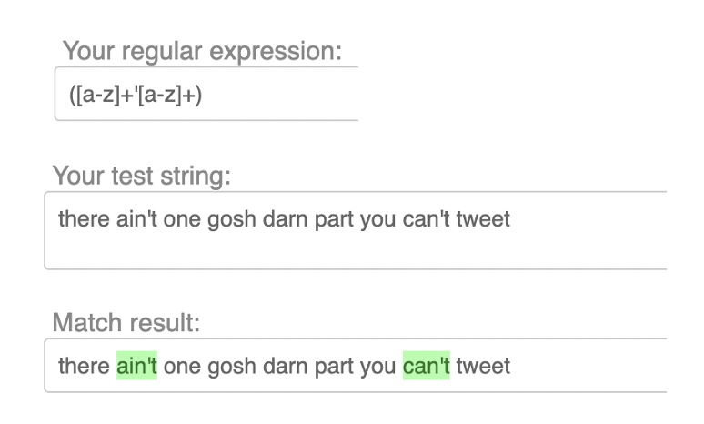
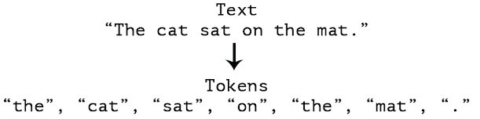

<!--Define background image for title slide-->
<style>
.title-slide {
  background-image:url("assets/img/gonzo.png");
  background-size: cover;
}
</style>

<footer>
  <hr></hr>
  <span style="float:right">R Programming</span>
</footer>

<h2>R + Statistics = Best Friends</h2>

<center></center>

--- .toc_slide &twocol

<footer>
  <hr></hr>
  <span style="float:right">R Programming</span>
</footer>

<h2>Contents</h2>

*** =left

<b class="toc_header"> Statistical Analysis in R </b>
<ol class = "toc" type="none">
    <li> R Was Made for Statistics!<span style="float:right"> 6 </span></li>
    <li> Exploring the Data <span style="float:right"> 7-9 </span></li>
    <li> Simple OLS Model <span style="float:right"> 10 </span></li>
    <li> Functionalizing Your Pipeline <span style="float:right"> 11 </span></li>
    <li> OLS With Multiple RHS Variables <span style="float:right"> 12 </span></li>
    <li> Tree-Based Methods <span style="float:right"> 13-14 </span></li>
    <li> Model Evaluation <span style="float:right"> 15 </span></li>
</ol>

*** =right

<b class="toc_header"> Working with Strings </b>
<ol class = "toc" type="none">
    <li> Common Preprocessing Steps <span style="float:right"> 17 </span></li>
    <li> Regular Expressions <span style="float:right"> 18 </span></li>
    <li> Tokenization <span style="float:right"> 19 </span></li>
</ol>

--- .toc_slide &twocol

<footer>
  <hr></hr>
  <span style="float:right">R Programming</span>
</footer>

<h2>Contents</h2>

*** =left

<b class="toc_header"> How to Build Software</b>
<ol class = "toc" type="none">
    <li> Getting Your Project Off the Ground <span style="float:right"> 21 </span></li>
    <li> Step 1: Build a Comment Skeleton <span style="float:right"> 22 </span></li>
    <li> Step 2: Define Functions <span style="float:right"> 23 </span></li>
    <li> Step 3: Fill in Your Code! <span style="float:right"> 24 </span></li>
</ol>

*** =right

<b class="toc_header"> Final Project Discussion </b>
<ol class = "toc" type="none">
    <li> Code Review Tips <span style="float:right"> 26 </span></li>
    <li> Scripting: Style Notes <span style="float:right"> 27 </span></li>
    <li> Lingering Questions <span style="float:right"> 28 </span></li>
</ol>

--- .section_slide

</br></br></br>
<h2>Statistical Analysis in R</h2>

--- .content_slide

<footer>
  <hr>
    Statistical Analysis in R<span style="float:right">R Programming</span>
</footer>

<h2>R Was Made for Statistics!</h2>

In this section, we're going to walk through all the steps of basic statistical analysis: getting data, exploring it, creating feature, building models, evaluating models, and comparing those models' performance.

<center></center>

--- .content_slide

<footer>
  <hr>
    Statistical Analysis in R<span style="float:right">R Programming</span>
</footer>

<h2>Getting and Splitting the Data</h2>

We're going to work with R's [swiss](https://stat.ethz.ch/R-manual/R-devel/library/datasets/html/swiss.html) dataset. This cross-sectional dataset contains measures of fertility and some economic indicators collected in Switzerland in 1888. Our first task will be to load the data and immediately hold out a piece of it as [testing data](http://info.salford-systems.com/blog/bid/337783/Why-Data-Scientists-Split-Data-into-Train-and-Test). The idea here is that when we evaluate the performance of our models later on, it will be better to do it on data that the models haven't seen. This will give a more honest picture of how well they might perform on new data.

In this exercise, we're going to evaluate the following question: **Can we predict fertility based on regional socioeconomic characteristics?**

<br>
Please follow along in ["Statistical Analysis"](../code/programming-supplement.html#Statistical_Analysis), in the programming supplement.

--- .content_slide

<footer>
  <hr>
    Statistical Analysis in R<span style="float:right">R Programming</span>
</footer>

<h2>Examine Your Training Data</h2>

Once you've split your data into training and test, you should start poking it a bit to see if you find anything interesting. You can use `str()` to view the contents of your data objects, `summary()` to view some basic summary statistics on data frame columns, and `cor()` to get a correlation matrix between all pairs of numeric variables.

```{r eda}
# Look at the structure
str(swiss)
```

--- .content_slide

<footer>
  <hr>
    Statistical Analysis in R<span style="float:right">R Programming</span>
</footer>

<h2>Hypothesis Testing</h2>

Hypothesis tests can be enormously valuable tools for discovering differences in datasets and evaluates relationships between variables.

One approach to looking for statistically interesting features (right-hand-side variables) involves binning those variables into "above median" and "below median", and using a paired t-test to see whether or not the variable is statistically related to the target.

```{r hypothesisTests, eval = FALSE}
# 1. Is fertility very different in provinces with above-median % of men in Agriculture
swiss$majority_agg <- swiss$Agriculture > median(swiss$Agriculture)
t.test(
  Fertility ~ majority_agg
  , data = swiss
)
```

<br>
For more, see ["Hypothesis Testing"](../code/programming-supplement.html#Hypothesis_Testing) in the programming supplement.

--- .content_slide

<footer>
  <hr>
    Statistical Analysis in R<span style="float:right">R Programming</span>
</footer>

<h2>Simple OLS Model</h2>

OK now that we've done some basic preprocessing and exploration, it's time to start fitting models! Let's begin with a simple one-variable OLS regression, estimated using the `lm()` command.

```{r simpleOLS, eval = FALSE}
# Simple regression: Fertility = f(Agriculture)
mod1 <- lm(
  Fertility ~ Agriculture
  , data = swiss
)
```

Once you have the fitted model, you can pass it and some new data to `predict()` to generate predictions. Model evaluation metrics commonly used in regression problems:
- [mean absolute error](https://en.wikipedia.org/wiki/Mean_absolute_error)
- [mean squared error](https://en.wikipedia.org/wiki/Mean_squared_error)
- [mean absolute percent error](https://en.wikipedia.org/wiki/Mean_absolute_percentage_error)

--- .content_slide

<footer>
  <hr>
    Statistical Analysis in R<span style="float:right">R Programming</span>
</footer>

<h2>Wrap Parts of Your Pipeline in Functions</h2>

The error metric calculations and plotting we just did seem general enough to apply to other models of this phenomenon. Since we could reuse the code for other models, we should just wrap it in a function so it's easy to call downstream.

Wrapping your analytics pipeline in a function has a few other benefits:
- Easy to test many different configurations
- Easy to change the code if needed
- Code is expressive, understandable

<br>
For more, see the ["Wrap Parts of Your Pipeline in Functions"](../code/programming-supplement.html#Wrap_Parts_of_Your_Pipeline_in_Functions) in the programming supplement.

--- .content_slide

<footer>
  <hr>
    Statistical Analysis in R<span style="float:right">R Programming</span>
</footer>

<h2>OLS With Multiple RHS Variables</h2>

To add more variables to a model in R, you have to use formula notation. I've specified specific right-hand side variables in this case, but if you want to express the idea "all of the X variables", you can use a statement like `Fertility ~ .`.

```{r olsMoreVars, eval = FALSE}
# Fit
mod2 <- lm(
  Fertility ~ Education + Infant.Mortality + Examination_above_median
  , data = swiss
)

# Predict + Evaluate
regPreds2 <- EvaluateModel(
  mod2
  , testDF = swissTestDF
  , modelName = "Expanded OLS"
)
```

--- .content_slide

<footer>
  <hr>
    Statistical Analysis in R<span style="float:right">R Programming</span>
</footer>

<h2>Regression Trees</h2>

Linear regressions aren't the right tool when the relationships between the independent variables and the target are non-linear. In this situation, regression trees might perform better.

<center></center>

See  [A Visual Introduction to Machine Learning](http://www.r2d3.us/visual-intro-to-machine-learning-part-1/) for a nice visual overview of the key concepts.

--- .content_slide

<footer>
  <hr>
    Statistical Analysis in R<span style="float:right">R Programming</span>
</footer>

<h2>Random Forests</h2>

For larger datasets, you may find that a single decision tree does not perform well. It's common to use a "forest" of decision trees.

<center></center>

image credit: Vern Greenholt

See the ["Random Forests"](../code/programming-supplement.html#Random_Forests) in the programming supplement for an example.

--- .content_slide

<footer>
  <hr>
    Statistical Analysis in R<span style="float:right">R Programming</span>
</footer>

<h2>Model Evaluation</h2>

For a prediction tasks, you want the model that you think will perform best on new data. To get at this, you can compare how well different models perform on the held-out "test" dataset.

<br><br>
<center></center>
<br><br>

See the ["Model Evaluation"](../code/programming-supplement.html#Model_Evaluation) in the programming supplement for an example.

--- .section_slide

</br></br></br>
<h2>Working With Strings</h2>

--- .content_slide

<footer>
  <hr>
    Working with Strings<span style="float:right">R Programming</span>
</footer>

<h2>Common Preprocessing Steps</h2>

In this section, we'll combine many of the techniques you've learned so far to show how R can be used to explore text data.

See ["Text Processing"](../code/programming-supplement.html#Text_Processing)  in the programming supplement.

--- .content_slide

<footer>
  <hr>
    Working with Strings<span style="float:right">R Programming</span>
</footer>

<h2>Regular Expressions</h2>

Working with text often involves searching for patterns. Many programming languages can understand "regular expressions", a special format for expressing the pattern you want to find.

<center></center>

See ["Regular Expressions"](../code/programming-supplement.html#Regular_Expressions) in the programming supplement.

<!-- created with https://pythex.org/ -->

--- .content_slide

<footer>
  <hr>
    Working with Strings<span style="float:right">R Programming</span>
</footer>

<h2>Tokenization</h2>

The next task we need to accomplish is **tokenizing** our text, i.e. splitting lines and sentences into individual words. These individual words can then be used downstream to build a language model and identify key terms.

<br><br>

<center></center>

<br><br>

See ["Tokenization"](../code/programming-supplement.html#Regular_Expressions) in the programming supplement.

--- .section_slide

</br></br></br>
<h2>How to Build Software</h2>

--- .content_slide

<footer>
  <hr>
    How to Build Software<span style="float:right">R Programming</span>
</footer>

<h2>Getting Your Project Off the Ground</h2>

OK so you have a business question, you've chosen your toolchain (presumably with R), and you have some data in hand. You sit down to write code and, well...

<center></center>

In this section, we'll to walk through the process of building a non-trivial script from scratch.

--- .content_slide

<footer>
  <hr>
    How to Build Software<span style="float:right">R Programming</span>
</footer>

<h2>Step 1: Build a Comment Skeleton</h2>

Resist the urge to just start writing code. Investing a few minutes upfront in thinking through the structure of your code will pay off in a big way as the project evolves and grows more complicated. Trust me.

First, just write down the main things you want to do. In this exercise, we're going to write some R code that can generate n-page "books" or random sentences in English.

```{r fromScratch}
#=== Write an R script that writes a book! ===#

# Function to create random sentences

# Function to create a "page" with n sentences

# Function to create a "book" with m pages

# Call the book function and create a 5-page book
```

--- .content_slide

<footer>
  <hr>
    How to Build Software<span style="float:right">R Programming</span>
</footer>

<h2>Step 2: Define Functions</h2>

Next, fill in the high-level outline with slightly more specifics. Try to strategize about the functions you'll need to implement and the individual steps that will have to happen inside each of those functions. This will probably change once you start writing code, but in my experience it's always easier to have a plan and change it.

<center></center>

--- .content_slide

<footer>
  <hr>
    How to Build Software<span style="float:right">R Programming</span>
</footer>

<h2>Step 3: Fill in Your Code!</h2>

You'll spend the most time on this and you will have to go through it many times before you're feeling comfortable with the code.

<br><br><br>

See ["Pirate Book Example"](../code/code/programming-supplement.html#Pirate_Book_Example) in the programming supplement for an example.

--- .section_slide

</br></br></br>
<h2>Final Project Discussion</h2>

--- .content_slide

<footer>
  <hr>
    Final Project Discussion<span style="float:right">R Programming</span>
</footer>

<h2>Code Review Tips</h2>

For your final project, you'll be presenting your code to your classmates in a "code review" style presentation. This should be an informal conversation, not a formal presentation with slides.

Try to hit these main points:

- Introduce the problem you investigated
- Explain the data set
- Show your code and explain the choices you made:
    - Why did you choose the packages you chose?
    - What data structures (data frames, lists, vectors) did you use? Why?
- Give us your general thoughts on how well it went, what you would do if you had more time

--- .content_slide

<footer>
  <hr>
    Final Project Discussion<span style="float:right">R Programming</span>
</footer>

<h2>Scripting: Style Notes</h2>

Use this slide as a general reference of coding best practices.

- Declare all the dependencies you need in a bunch of `library()` calls at the top of your script(s)
- Set global variables (like file paths) in all-caps near the top of your script(s)
- Use comments like `#===== Section 1 - Do Stuff =====#` to separate major sections of the code
- Namespace any calls to external functions with `::` (e.g. `lubridate::ymd_hms()`)

A sample script following these prescriptions is provided in ["R Programming Best Practices"](../code/programming-supplement.html#R_Programming_Best_Practices), in the programming supplement.

--- .content_slide

<footer>
  <hr>
    Final Project Discussion<span style="float:right">R Programming</span>
</footer>

<h2>Project Q&A</h2>

<br>

<center></center>
