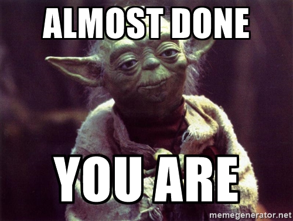
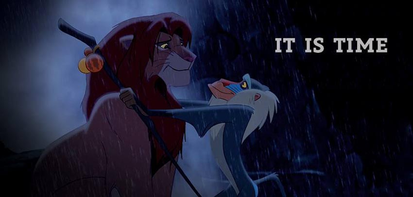
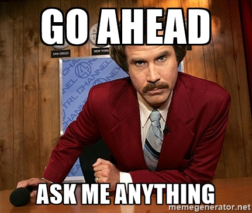

<!--Define background image for title slide-->

<footer>
  

  R Programming
</footer>

<h2>The Final Week is Upon Us!</h2>

--- .toc_slide &twocol

<footer>
  

  R Programming
</footer>

<h2>Contents</h2>

*** =left

<b class="toc_header"> Final Project Code Reviews</b>
<ol class="toc" type="none">
    <li> Code Reviews Today!  5 </li>
</ol>

<b class="toc_header"> R/Data Science AMA </b>
<ol class = "toc" type="none">
    <li> Ask Me Anything  7 </li>
</ol>

*** =right

--- .section_slide

   
<h2>Final Project Code Reviews</h2>

--- .content_slide

<footer>
  

    Final Project Code ReviewsR Programming
</footer>

<h2>It is Time.</h2>

 

--- .section_slide

   
<h2>R/Data Science AMA</h2>

--- .content_slide

<footer>
  

    Data Science AMAR Programming
</footer>

<h2>Data Science AMA</h2>

 

